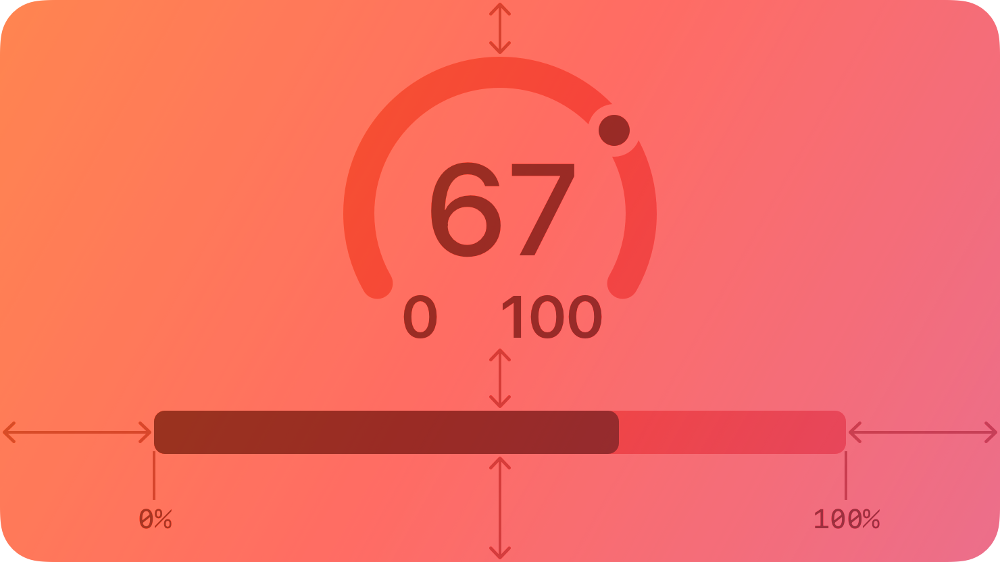
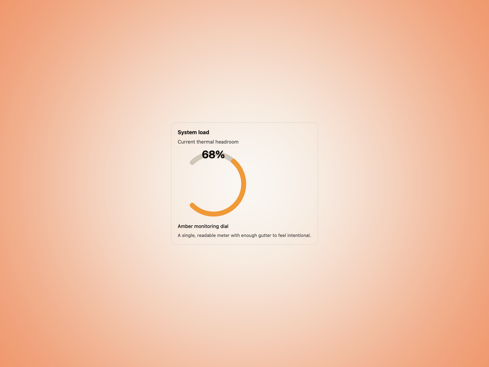
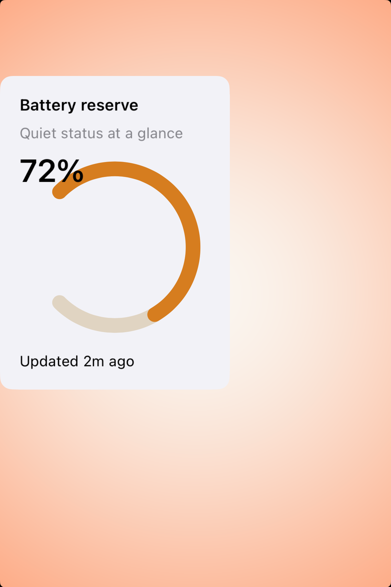

# Gauges -- Visual validation

## HIG reference

## Rendered -- macOS (light)

## Rendered -- macOS (dark)

## Rendered -- iOS (light)

## Rendered -- iOS (dark)

## Verdict: PASS_WITH_NOTES

The ring now renders natively in the host captures instead of disappearing into
the placeholder `Canvas` path, which means the study finally reads like an
instrument instead of a card full of text. Both platforms now show a clean,
single-meter surface with enough amber gutter to stay calm in frame.

### What improved

- The gauge arc is now visible in native captures on macOS and iOS.
- The host studies are compact and focused, so the ring reads as the primary
  signal instead of getting buried in fake dashboard chrome.
- The value label and supporting copy are short enough to keep the component
  feeling tool-like rather than decorative.

### Why this is still notes-only

1. The native ring rendering currently comes from a narrow arc-detection path in
   the host renderer rather than a fully general `Canvas` implementation.
2. The iOS study still sits a little high and left in the viewport, even though
   the component itself is now legible and balanced.
3. This batch validates a single quiet dial state, not a richer family of gauge
   styles or multi-meter compositions.

### Result

Promote this row to `PASS_WITH_NOTES`. The default taste is now strong enough to
count as a clean baseline, with the renderer-path and framing caveats recorded
honestly.
