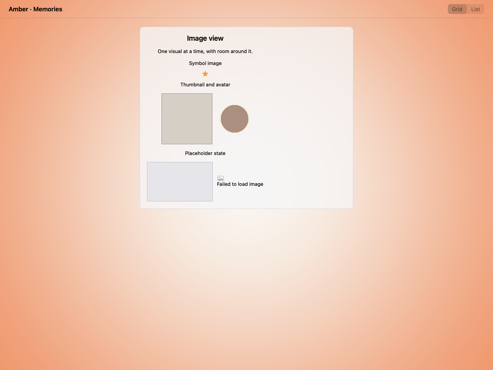
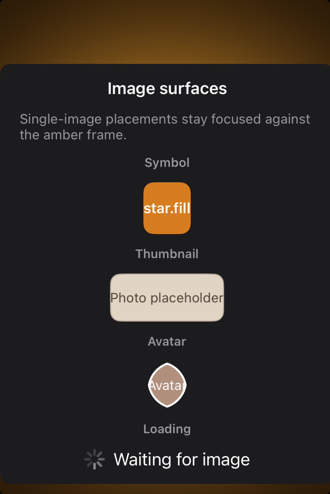

# Image views -- Visual validation

## HIG reference

## Rendered -- macOS (light)

## Rendered -- macOS (dark)

## Rendered -- iOS (light)

## Rendered -- iOS (dark)

## Verdict: PASS_WITH_NOTES

This is a cleaner, more believable study now. Both platforms show a small set
of image-view states with enough surrounding air that the image surfaces read
as the focal point instead of getting buried in a long placeholder gallery.

### What improved
- iOS no longer clips half the gallery below the fold; the study is compact and
  centered.
- macOS uses a restrained card with clearer grouping between hero, thumbnail,
  avatar, and placeholder states.
- The amber backdrop is now consistent again across the refreshed evidence.

### Why this is still notes-only
- These are still synthetic placeholders rather than real photographic assets,
  which is good enough for geometry and spacing but not a full-fidelity media
  showcase.
- The iOS symbol state remains a styled text stand-in rather than a true SF
  Symbol image surface sourced from an asset-backed pipeline.

### Result
Promote this row to `PASS_WITH_NOTES`. The image-view default taste is now
organized and reviewable, with the placeholder-vs-real-media caveat recorded.
