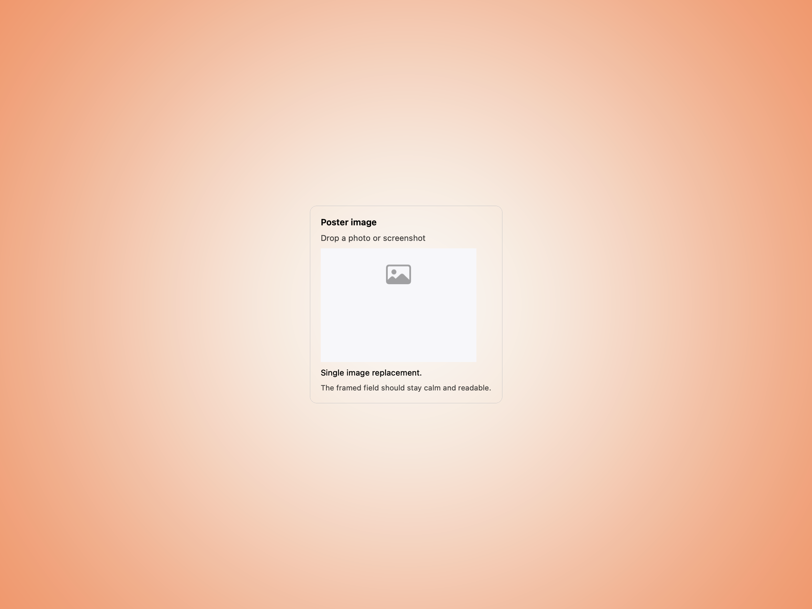
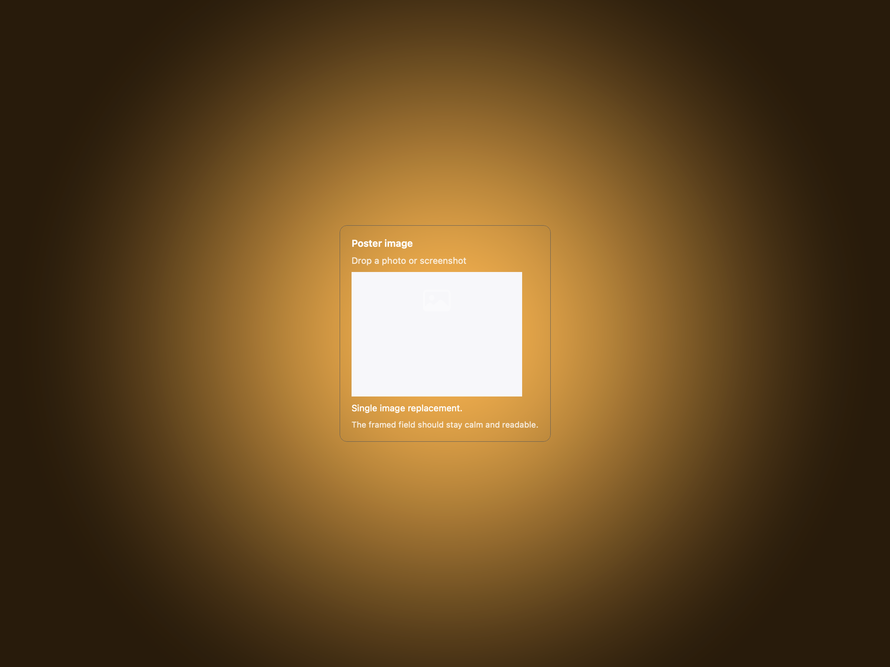
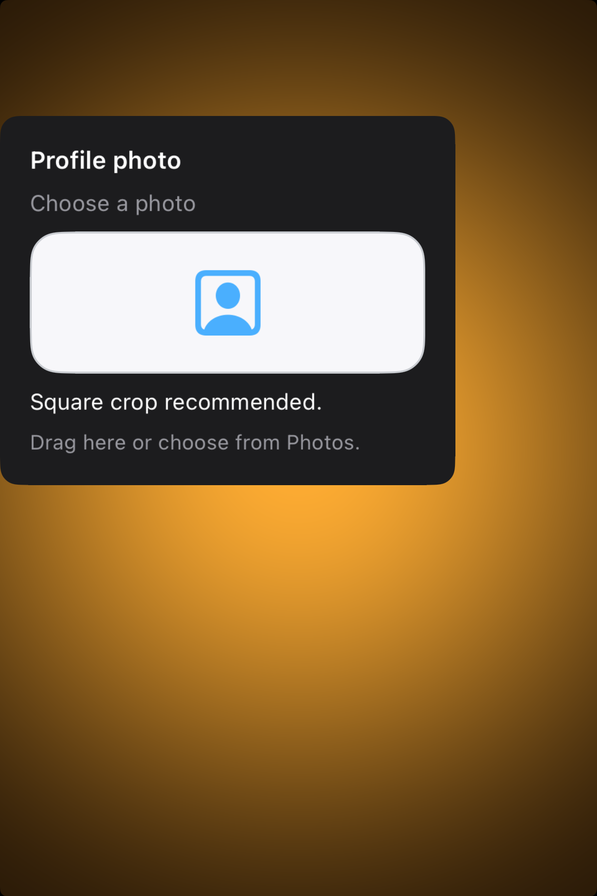

# Image wells -- Visual validation

## HIG reference

## Rendered -- macOS (light)

## Rendered -- macOS (dark)

## Rendered -- iOS (light)

## Rendered -- iOS (dark)

## Verdict: PASS_WITH_NOTES

The study now reads like a real framed image-replacement surface instead of a
missing slug placeholder. Both hosts show a compact field with a clear boundary
and enough surrounding amber gutter to keep the control readable as a single
object.

### What improved

- The component now has explicit studies on both platforms instead of placeholder
  host output.
- The framed well boundary is visible and calm in all four captures, so the
  control reads as a field rather than a loose image.
- The surrounding copy is short enough now that the component stays legible
  without turning into a fake preference pane.

### Why this is still notes-only

1. The studies are empty-state examples; they prove the replacement surface more
   than they prove a filled preview workflow.
2. The iOS study is still a little high and left in the viewport, even though it
   now has enough gutter to feel deliberate.
3. macOS dark keeps the field shape, but the placeholder glyph is subtler than
   ideal against the brighter empty well.

### Result

Promote this row to `PASS_WITH_NOTES`. The default taste is now clean and
useful enough to count as a baseline, with the remaining empty-state and dark-
mode caveats documented honestly.
