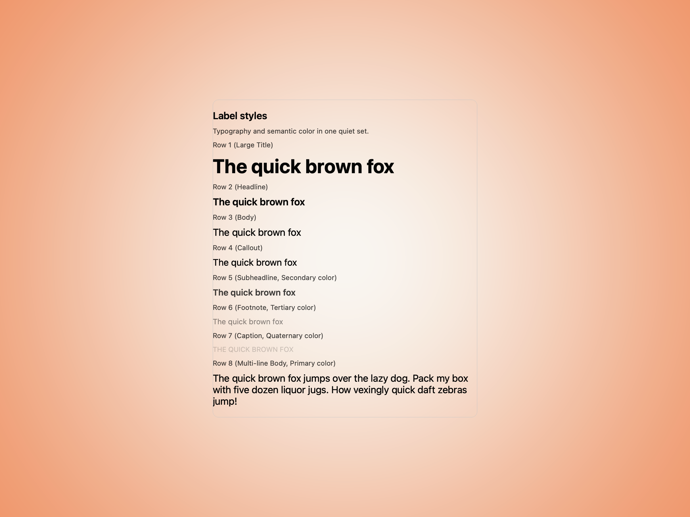
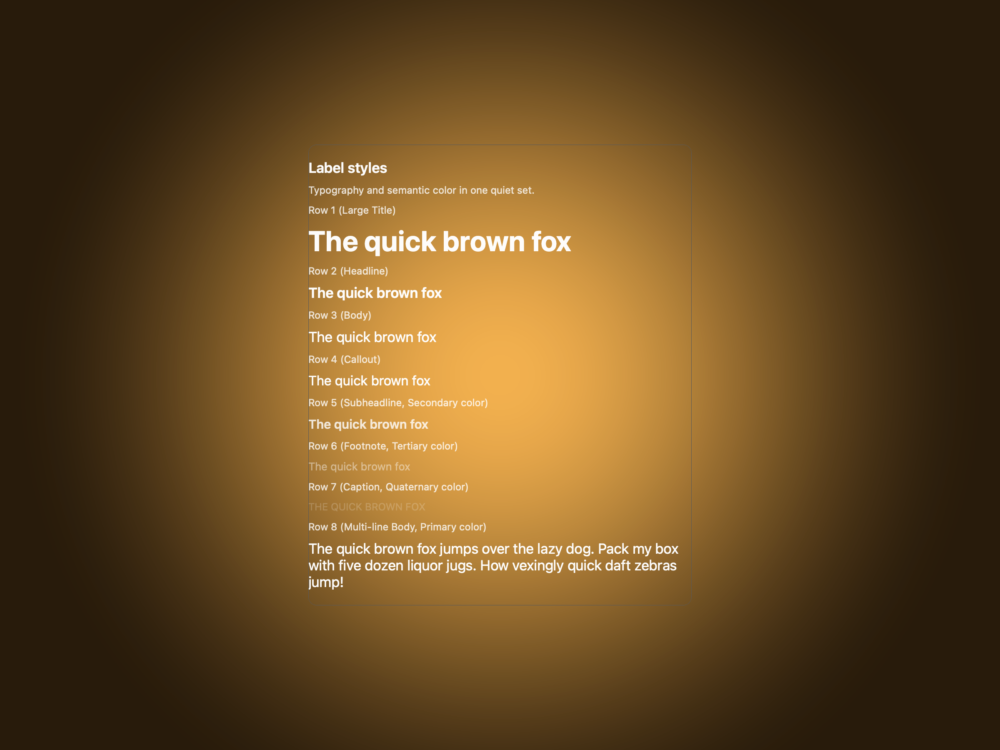
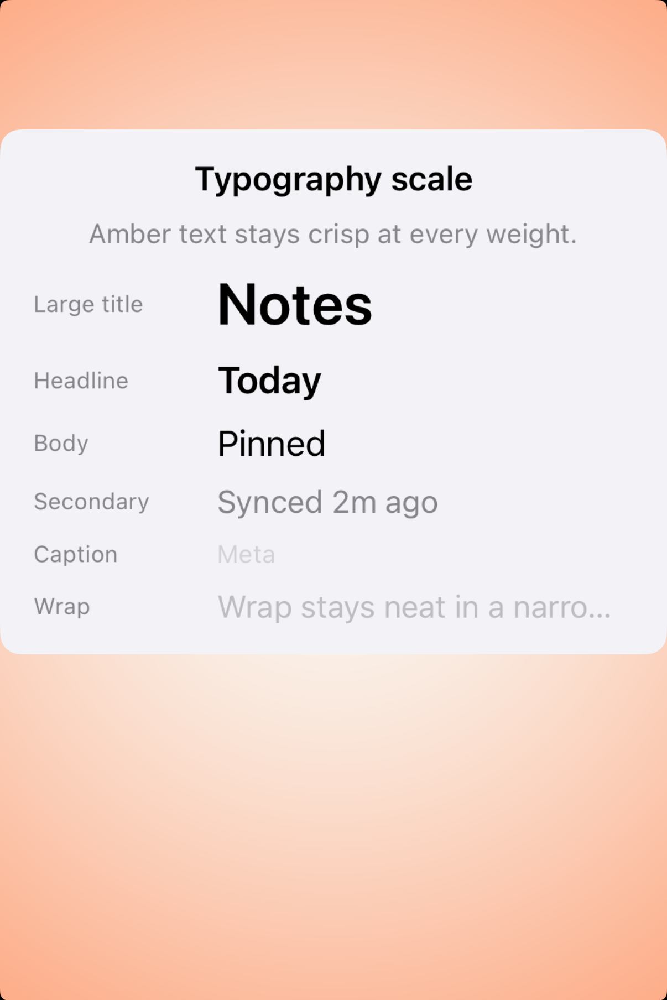
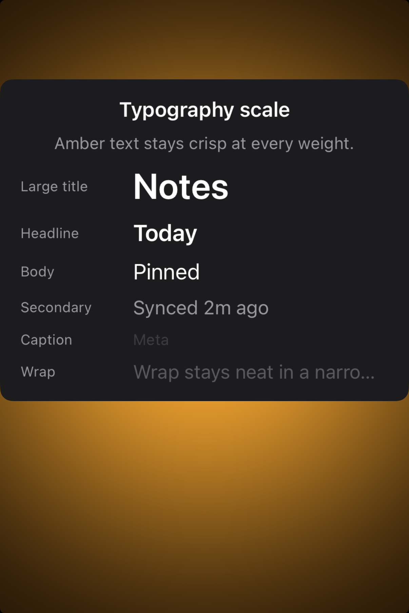

# Labels -- Visual validation

## HIG reference

## Rendered -- macOS (light)

## Rendered -- macOS (dark)

## Rendered -- iOS (light)

## Rendered -- iOS (dark)

## Verdict: PASS_WITH_NOTES

This is in much better shape than the old clipped gallery. Both platforms now
show the label hierarchy inside a smaller, quieter study, so the typography and
semantic color contrast read first instead of the host chrome.

### What improved
- iOS now keeps the full study on screen with honest gutters instead of cutting
  off half the scale below the fold.
- macOS presents the label ladder inside a restrained card, which makes the
  text styles easier to compare at a glance.
- Primary, secondary, tertiary, and quaternary roles remain clearly distinct in
  both appearances.

### Why this is still notes-only
- The macOS study still uses generic sample copy, so it reads more like a type
  specimen than a product-specific UI fragment.
- The final wrapped line on iOS still truncates at the trailing edge, so the
  narrow-width behavior is improved but not fully polished.

### Result
Promote this row to `PASS_WITH_NOTES`. The default label taste is now stable
and reviewable, with one remaining compact-width note on iOS.
