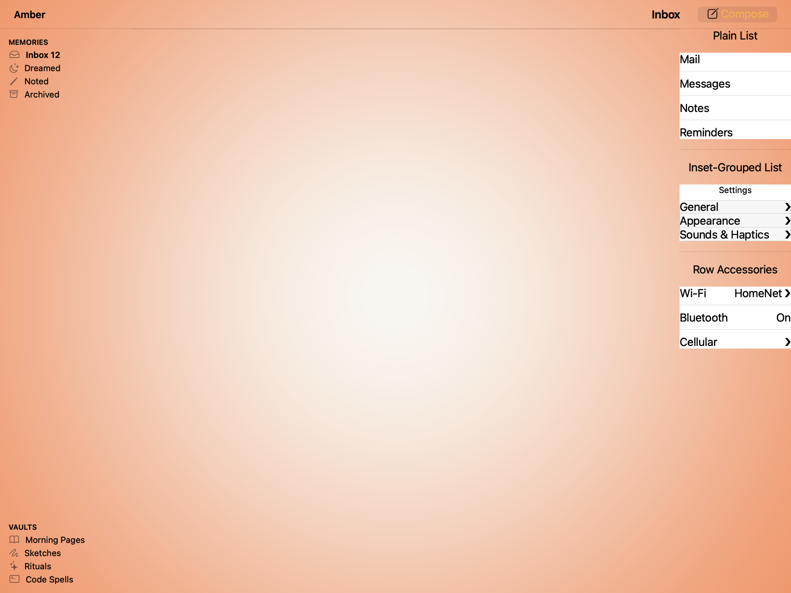
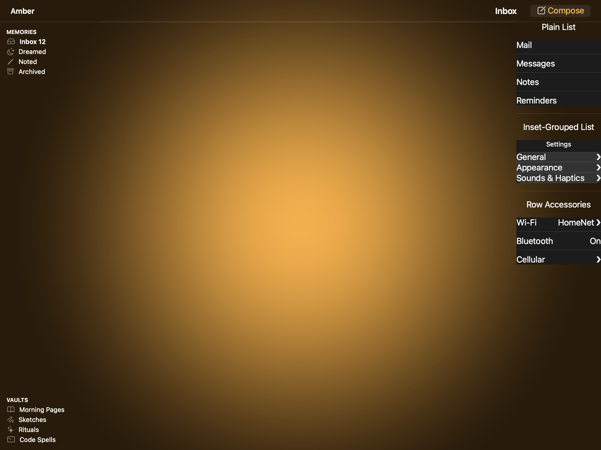
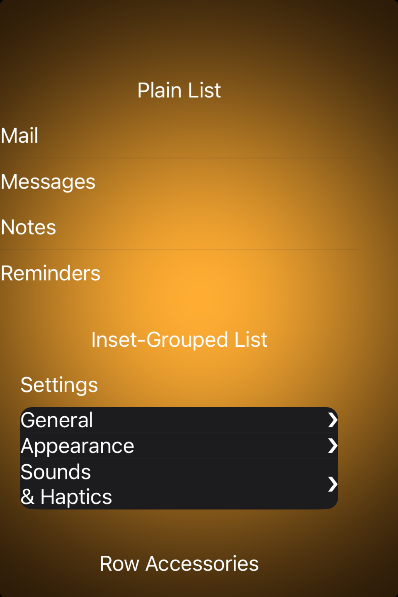

# Lists and tables -- Visual validation

## HIG reference

## Rendered -- macOS (light)

## Rendered -- macOS (dark)

## Rendered -- iOS (light)

## Rendered -- iOS (dark)

## Verdict: PASS_WITH_NOTES

The row-level verdict stays PASS_WITH_NOTES because the captures are structurally correct and legible, but the iOS gallery still has a small framing tradeoff: the lower rows sit near the bottom of the available viewport, so the composition feels a little crowded even though the content itself is valid. macOS reads cleanly in both appearances.

### Liquid Glass check
- **Required for this slug:** No. Lists and tables are standard content surfaces, not glass presentation surfaces.
- **Observed:** No Liquid Glass material is expected or present. The list and inset-grouped treatments use the right flat card and separator language for this category.

### Light appearance observations

**macOS light (77010 bytes):**
The plain list and inset-grouped sections both read clearly, with the expected separators, row spacing, and hierarchy. Nothing is clipped and the desktop composition feels straightforward.

**iOS light (177495 bytes):**
The list content is legible and the inset-grouped rows are correctly styled, but the gallery frame leaves the lower section close to the bottom edge. The content is still valid; the presentation could use a touch more breathing room.

### Dark appearance observations

**macOS dark (78737 bytes):**
Dark mode preserves the same hierarchy and separator clarity. The desktop list surfaces remain easy to scan.

**iOS dark (178543 bytes):**
Dark mode keeps the rows legible and the card styling correct. The remaining issue is still about framing density, not about text or structure.

### Deviations

1. **The iOS gallery frame still feels a bit tight vertically.**
   The list content is all present and readable, but the full composition would benefit from a little more air so the lower section does not sit so close to the edge of the screenshot.

2. **The iOS inset-grouped example still uses a longer row label that wraps.**
   That is readable and not broken, but it is a reminder that the demo content is slightly more verbose than ideal for a polished HIG screenshot.

### Source citations
- HIG "Lists and tables -- Overview": content and table surfaces are standard structural components, not presentation chrome.

### Remediation (if NEEDS_WORK)
Verdict remains PASS_WITH_NOTES. The remaining work is about composition polish, not correctness.
