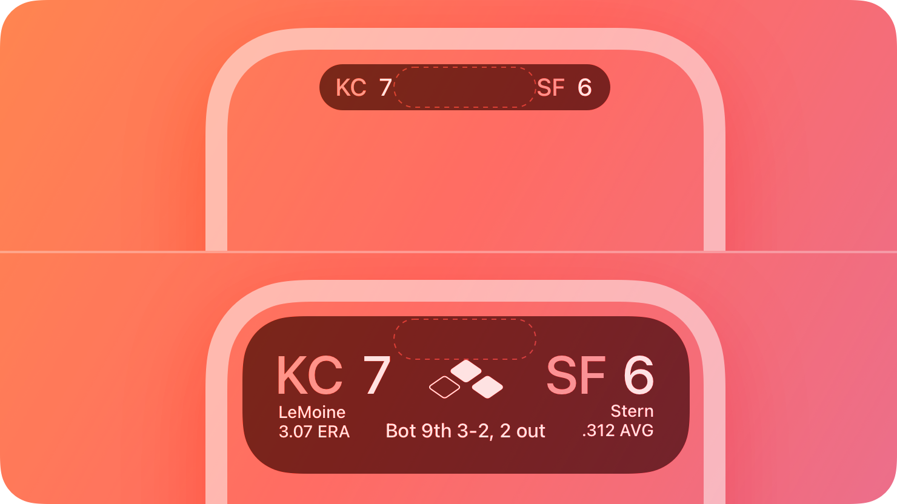

# Live Activities -- Validation note

## HIG reference

## Verdict: SKIPPED

`UI::LiveActivities` is now an export-oriented ActivityKit metadata surface, not
a drawable in-app component. The shard can model activity attributes, content
state, and update intents, but the rendered Lock Screen and Dynamic Island
surfaces remain system-owned.

### What is implemented

- live activity catalog metadata
- attribute payload export
- content-state payload export
- optional update-intent metadata
- deterministic ActivityKit scaffold export

### Why validation stays skipped

The HIG row is about a system presentation surface. The useful implementation
work here is in the exported metadata contract, not in faking the Live Activity
card inside an app-owned screenshot.
