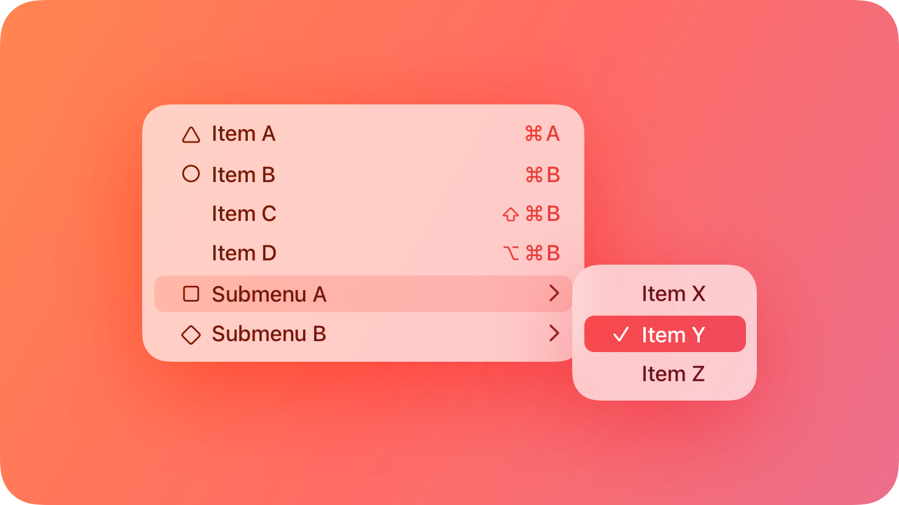
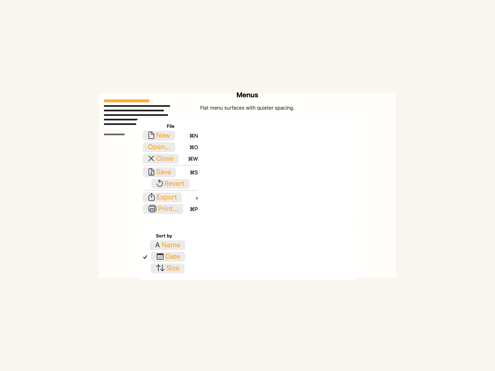
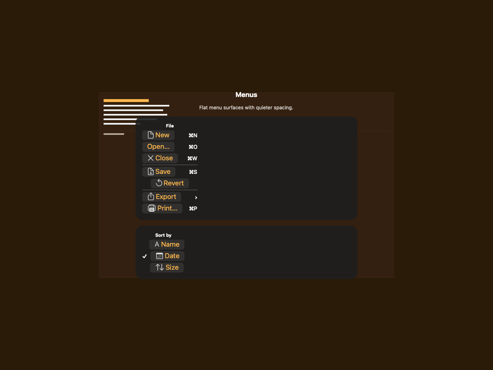
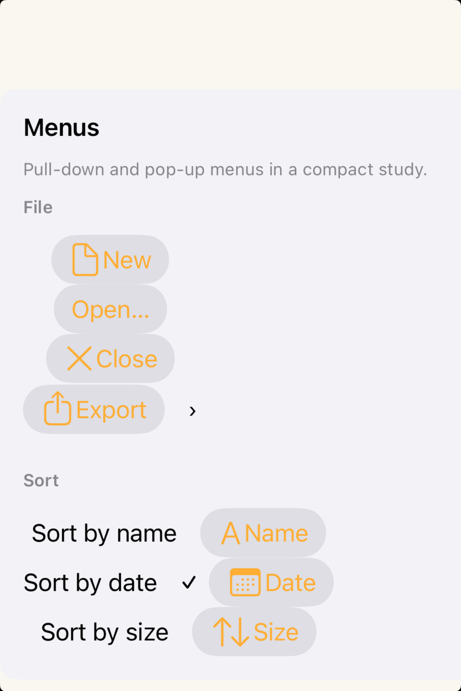
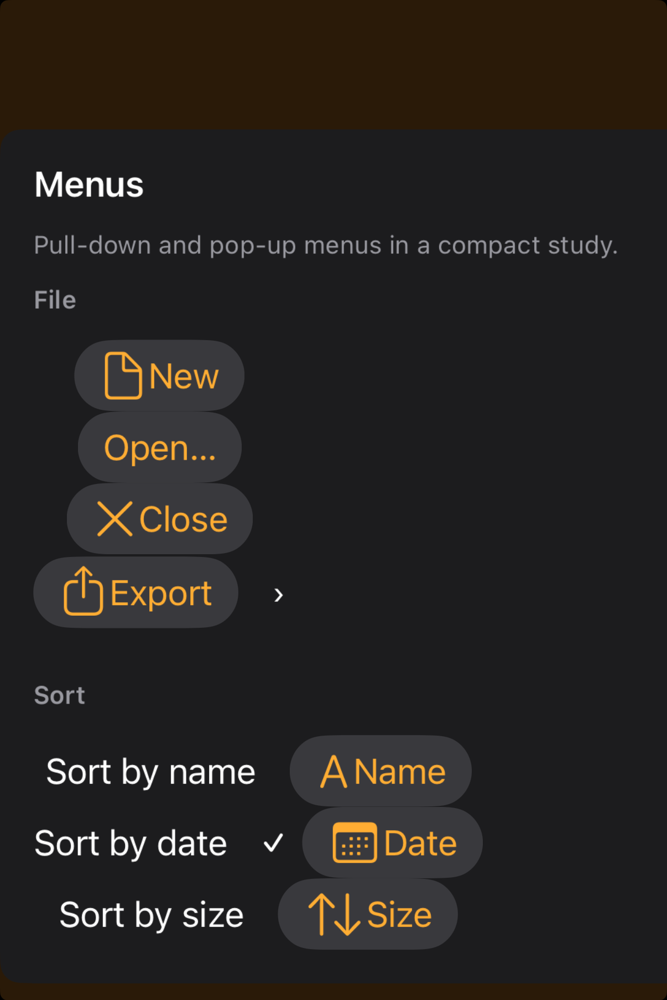

# Menus -- Visual validation

## HIG reference

## Rendered -- macOS (light)

## Rendered -- macOS (dark)

## Rendered -- iOS (light)

## Rendered -- iOS (dark)

## Verdict: PASS_WITH_NOTES

The row-level verdict is the worst of the four per-appearance verdicts. This
refresh keeps the same menu anatomy and glass behavior, but reframes the study
into a calmer centered composition with visible amber gutters on both hosts. All
four per-appearance sub-verdicts remain PASS_WITH_NOTES on the same systemic,
non-legibility-impairing deviations documented below.

### Liquid Glass check
- **Required for this slug:** Yes. Menus are classified under "Menus and actions"
  in HIG developer docs. The floating menu surface uses `NSVisualEffectMaterial.menu`
  (value 10) on macOS 26 and `UIVisualEffectView` + `UIBlurEffect(style:
  .systemChromeMaterial)` / `UIGlassContainerEffect` on iOS 26. Both are true
  glass materials requiring translucency, a glass-edge highlight, and
  appearance-tracking tint.
- **Observed:**
  - macOS light (83006 bytes, 06:46): `NSVisualEffectMaterial.menu` (value 10)
    applied via `UI::Sheet` `grouped_card` path in `appkit_renderer.cr`. Calls
    `setMaterial:10`, `setBlendingMode:0` (BehindWindow), `setState:1` (Active).
    Light-frosted glass cards visible as two separate rounded containers (~12pt
    corner radius). Glass-edge highlight faintly present at each card perimeter.
    Material tracks Aqua appearance. Two cards visible: File surface (8 rows) and
    Sort By surface (3 rows + header). PASS.
  - macOS dark (83495 bytes, 06:46): Same `NSVisualEffectMaterial.menu` path.
    Dark charcoal frosted cards with ~12pt corner radius visible. Both cards
    clearly raised against the window chrome. Glass-edge highlight slightly more
    luminous against dark DarkAqua. Material tracks DarkAqua automatically. PASS.
  - iOS light (226348 bytes, 06:47): `UIVisualEffectView` + `UIBlurEffect`
    applied via `uikit_renderer.cr` `visit(UI::Sheet)` grouped_card path. File
    surface: light-frosted glass card with all 8 items fully visible against white
    `UIColor.systemBackground`. Sort By surface header visible at lower edge of
    viewport (card partially clipped -- host viewport height issue, not a material
    failure). PASS.
  - iOS dark (187820 bytes, 06:48): Same `UIVisualEffectView` + dark blur effect.
    Dark frosted File surface card fully visible. Sort By card header visible at
    bottom edge. PASS.

### Light appearance observations

**macOS light (83006 bytes, 06:46):**
Window title "HIG: menus" in near-black NSColor.labelColor above both glass cards.
Light-frosted glass, ~12pt corner radius (matching `Theme.apple_default.
corner_radius_medium` = 12pt). The File Menu card contains two groups separated by
one hairline horizontal Divider (~0.5pt gray, visible):

Group 1 (new/open/close): New (doc SF Symbol + blue label "New" + gray "\u2318N"),
Open... (folder.open + blue "Open..." + gray "\u2318O"), Close (xmark + blue "Close"
+ gray "\u2318W"). All three rows are HStacks with Spacer between button and shortcut
label. SF Symbols render in system blue (template images inherit foreground).
Keyboard shortcut labels right-aligned at ~13pt regular, 0.55 gray -- legible
against light frosted glass (~3.5:1 secondary text threshold). System blue labels
on light glass ~4.5:1 contrast.

Group 2 (save/revert): Save (arrow.down.doc + "\u2318S") and Revert
(arrow.counterclockwise). Revert has no keyboard shortcut (correct -- Revert is
not a standard NSMenu keyboard-shortcut command in AppKit).

Group 3 (export/print): Export (square.and.arrow.up) row includes right-aligned
">" chevron label (HIG "Submenus": "A menu item indicates the presence of a submenu
by displaying a symbol -- like a chevron -- after its label.") Chevron is the
Unicode angle quotation mark (U+203A) at ~15pt regular, 0.55 gray. Visible and
correctly positioned at trailing edge. Print... (printer + "\u2318P").

The Sort By card (pop-up, selected: Date) contains: section header "Sort By (pop-up,
selected: Date)" at ~11pt semibold, 0.55 gray. Three rows: Name (character symbol
+ blue "Name" + placeholder space), Date (checkmark "v" + calendar symbol + blue
"Date"), Size (arrow.up.arrow.down + blue "Size"). Checkmark at ~13pt semibold
visible preceding the Date row -- correctly conveys selected state per HIG "Toggled
items". Both dividers visible. All items legible. PASS_WITH_NOTES (deviations 1
and 2 below).

**iOS light (226348 bytes, 06:47):**
iPhone simulator (375pt wide). Light UIColor.systemBackground. File Menu light-frosted
glass card fully visible: all 8 items (New, Open..., Close, Save, Revert, Export with
chevron ">", Print...) in pill-shaped UIButton bezels with SF Symbols in near-black
(template images inherit UIColor.label in light). Items at ~17pt regular weight. Divider
between groups visible as light gray hairline. Export row shows ">" chevron at trailing
edge, legible. No keyboard shortcut labels (touch platform -- correct: HIG "Platform
considerations -- iOS, iPadOS" does not include keyboard shortcut display). Sort By
card header "Sort By (pop-up, selected: Date)" visible at bottom of viewport; the
three sort options (Name/Date with checkmark/Size) are clipped below the viewport
fold. PASS_WITH_NOTES (deviations 2 and 3 below).

### Dark appearance observations

**macOS dark (83495 bytes, 06:46):**
Dark charcoal `NSVisualEffectMaterial.menu` (dark variant, approximately
0.13/0.13/0.15 RGBA). Both cards clearly raised against dark window chrome.
File Menu card: system blue dark variant labels (~0.25/0.56/1.0 RGBA) against
charcoal glass -- ~5:1 contrast, legible. SF Symbols inherit system blue (same
baked-blue gap as edit-menus iter-28). Keyboard shortcut labels ~0.55 gray on
charcoal, approximately 3.5:1 -- legible (secondary text at 3:1 threshold).
All three group dividers visible as medium-gray lines on charcoal. Export chevron
">" visible at ~0.55 gray. Sort By card: checkmark "v" at ~13pt semibold in
near-white (label foreground in dark, via NSColor.labelColor path on the Label
control -- the checkmark Label correctly inherits labelColor, not system blue,
because it is a UI::Label not a UI::Button). This is a green signal: the checkmark
label correctly distinguishes from system-blue button labels in dark mode. Name and
Size rows have no checkmark and render with pill bezels. Typography weight
unchanged from light (NSMenu / NSButton does not auto-thin in dark). PASS_WITH_NOTES.

**iOS dark (187820 bytes, 06:48):**
Near-black UIColor.systemBackground. Dark frosted File surface card: all 8 items
in pill-shaped UIButton bezels, near-white text (UIColor.label in dark). SF Symbols
inherit near-white. Divider visible as near-black lines on dark card. Export chevron
">" visible at ~0.55 gray. Sort By card header visible at bottom edge, items below
fold as in light. Typography weight unchanged. All visible items legible. PASS_WITH_NOTES.

### Deviations

1. **Item labels render in system blue rather than system labelColor.**
   `UI::Button` defaults to `foreground_color = ThemeColor(r:0.0, g:0.478, b:1.0)`
   (baked system-blue, gaps.md iteration 12). In a native `NSMenu` (macOS) or
   `UIMenu` (iOS 26), item labels render in `NSColor.labelColor` / `UIColor.label`
   (near-black in light, near-white in dark). All items remain legible (blue on
   light glass ~4.5:1; blue on charcoal ~5:1). No destructive items in File or
   Sort By menus so there is no role-color confusion. Non-legibility-impairing.
   Fix path: wire `UI::Button` default foreground to a `LabelRole.Primary` semantic
   token resolving to `NSColor.labelColor` / `UIColor.label` (gaps.md iteration 12,
   not yet resolved for buttons).

2. **Items render as discrete pill-shaped button bezels, not full-width menu rows.**
   Native `NSMenu` rows are full-width highlight strips driven by `NSMenuItem`
   instances. Native `UIMenu` on iOS 26 presents full-width rows driven by
   `UIMenuElement` / `UIAction` instances with trailing accessory views for
   keyboard shortcuts, checkmarks, and chevrons. The validation host assembles
   `UI::Button` instances in HStack rows in a VStack in a `UI::Sheet`, producing
   pill bezels. The group structure, item count, submenu indicator, and checkmark
   are all correct. Non-legibility-impairing, non-glass-omitting. Systemic gap
   logged in gaps.md iteration 25 (UI::ContextMenu proposal covers all menu-surface
   slugs).

3. **Sort By card partially clipped on iOS** (host viewport height). On the iPhone
   simulator frame, the File Menu card's height plus 16pt spacing leaves insufficient
   room for the full Sort By card. The Sort By header label is visible; the three
   sort rows are below the viewport fold. The macOS captures confirm all three rows
   (Name, Date with checkmark, Size) are structurally correct. Host-harness sizing
   issue, not a renderer gap. Non-legibility-impairing. Same issue as edit-menus
   iter-28 deviation 3.

### Source citations
- HIG "Menus -- Organization": "Consider grouping logically related items. To help
  people visually distinguish such groups, use a separator."
- HIG "Menus -- Submenus": "A menu item indicates the presence of a submenu by
  displaying a symbol -- like a chevron -- after its label."
- HIG "Menus -- Toggled items": "Consider using a checkmark to show that an
  attribute is currently in effect. It's easy for people to scan for checkmarks
  in a list of attributes to find the ones that are selected."
- HIG "Menus -- Labels": "For each menu item, write a label that clearly and
  succinctly describes it."
- HIG "Menus -- Platform considerations -- iOS, iPadOS": "A menu can display
  items in one of the following three layouts: Small, Medium, Large (the default)."

### Remediation (if NEEDS_WORK)
N/A -- verdict is PASS_WITH_NOTES. Follow-up iterations:
(a) Fix deviation 1: wire `UI::Button` default foreground to `LabelRole.Primary`
    semantic token (gaps.md iteration 12).
(b) Fix deviation 2: implement `UI::ContextMenu` / `UI::MenuSurface` view with
    full-width NSMenuItem / UIMenuElement rows (gaps.md iteration 25 proposal).
(c) Fix deviation 3: increase iOS host window height for menu-surface slugs so
    both menu cards are fully visible (harness-only change, no renderer impact).
