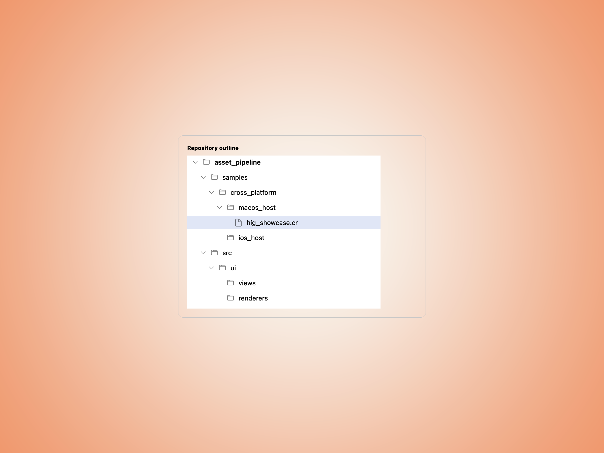
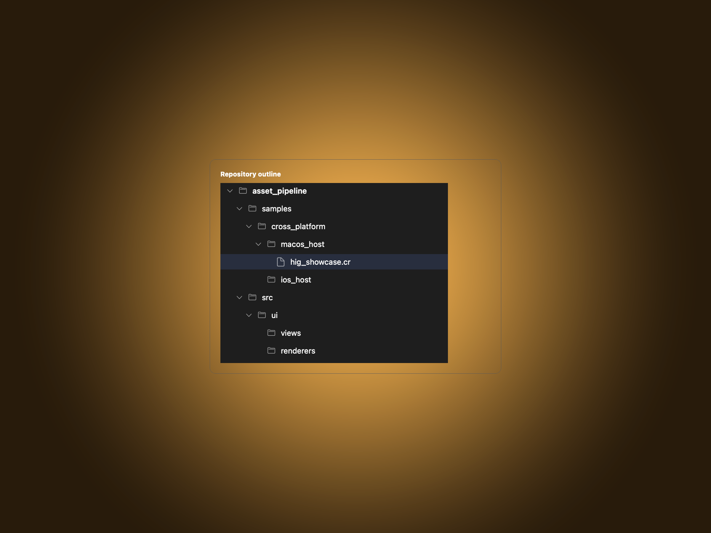
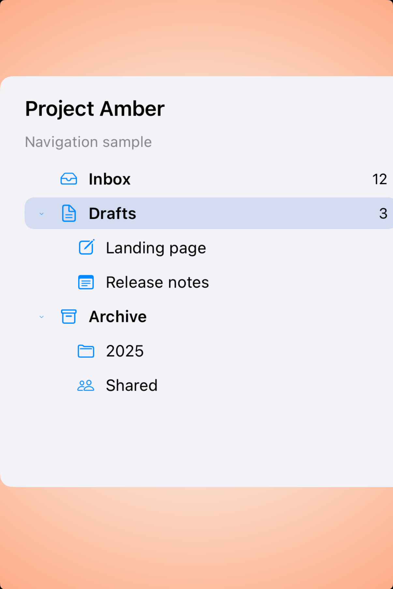
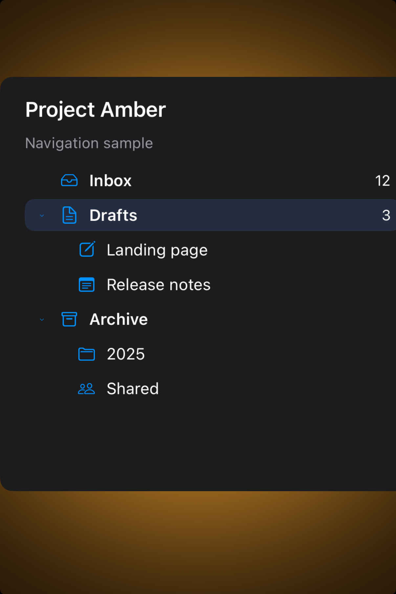

# Outline views -- Visual validation

## HIG reference
See the Apple HIG outline-views page: `apple-hig/pages/outline-views.md`

## Rendered -- macOS (light)

## Rendered -- macOS (dark)

## Rendered -- iOS (light)

## Rendered -- iOS (dark)

## Verdict: PASS_WITH_NOTES

This row is now real. The showcase studies render a compact hierarchical tree on
both platforms, with clear indentation, disclosure rhythm, and an obvious
selection state instead of the previous missing-slug / missing-report gap.

### What improved
- macOS now shows a believable repository-style tree with enough gutter and a
  quiet sidebar proportion.
- iOS has a proper study built around `UI::OutlineView` instead of an unknown
  slug or blank canvas.
- The selected row, expanded branches, and nested children all read correctly
  at a glance.

### Why this is still notes-only
- The primitive currently renders through the composed fallback tree, not a true
  native `NSOutlineView` bridge on macOS.
- The study is intentionally isolated and taste-focused; it proves the default
  hierarchy treatment, not a full production split-view flow yet.

### Result
Promote this row to `PASS_WITH_NOTES`. The component is implemented, the study is
valid, and the remaining caveat is about future native depth rather than broken
presentation.
