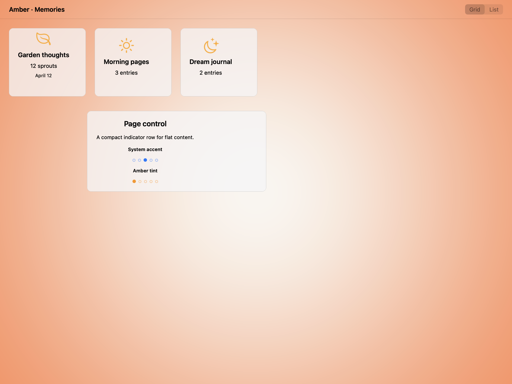
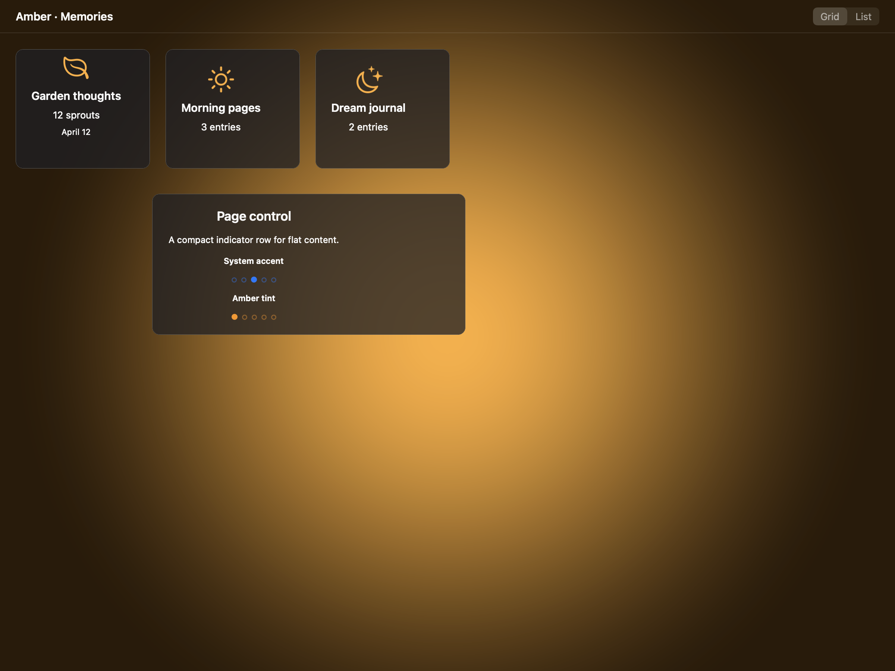

# Page controls -- Visual validation

## HIG reference

## Rendered -- macOS (light)

## Rendered -- macOS (dark)

## Rendered -- iOS (light)

## Rendered -- iOS (dark)

## Verdict: PASS_WITH_NOTES

This is now a much better component study. The dots sit inside a compact,
centered composition with enough surrounding gutter that the page-control rhythm
is the thing being judged instead of a lot of empty backdrop.

### What improved
- The indicator rows are now framed as a disciplined study rather than floating
  labels in open space.
- The default and amber-tinted variants keep the same shape language and read at
  a glance in both appearances.
- iOS and macOS both present the control as a restrained indicator, not a fake
  navigation strip.

### Why this is still notes-only
- macOS still uses the synthetic page-control fallback, because AppKit has no
  native `NSPageControl`.
- The study is intentionally isolated and compact; it proves the default taste
  of the indicator, not its behavior inside a full paging flow.

### Result
Promote this row to `PASS_WITH_NOTES`. It is now clean, legible, and focused
enough to count as the default baseline.
