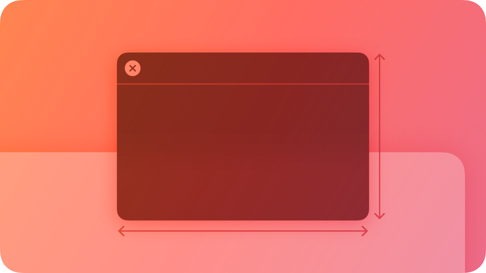
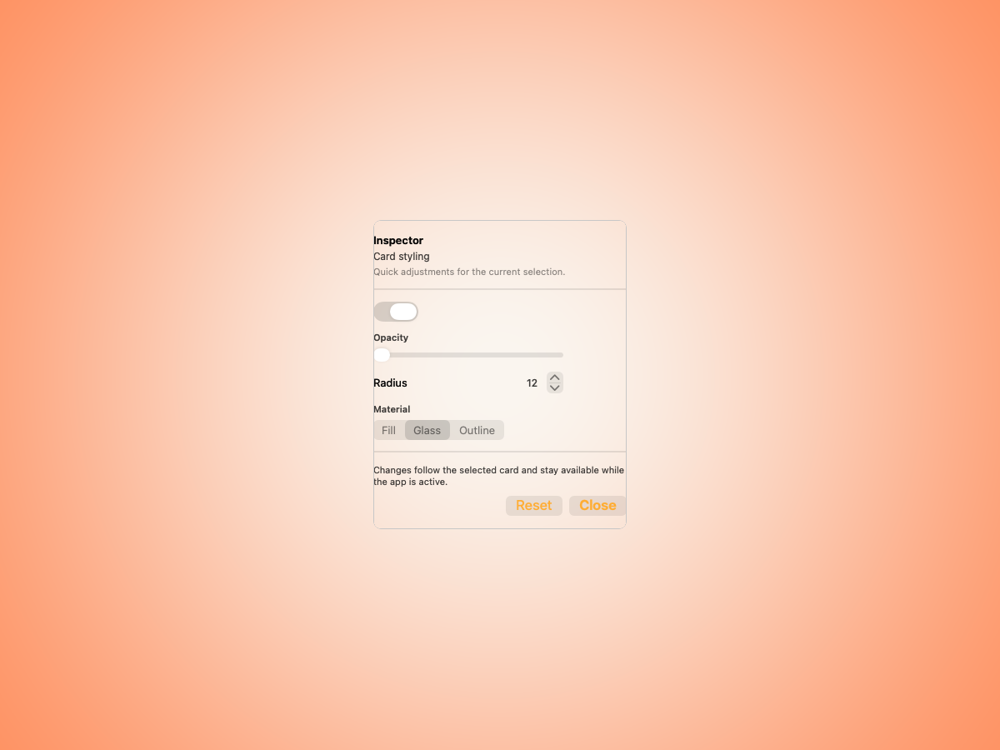
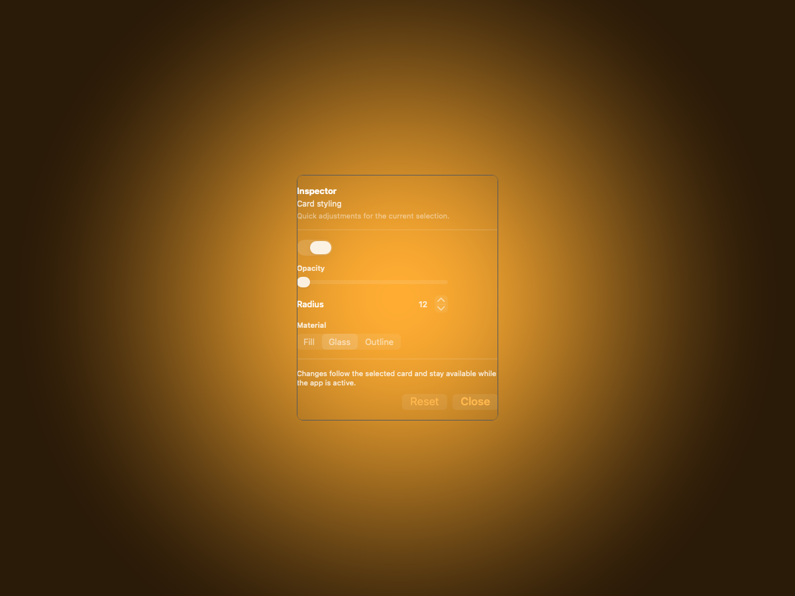
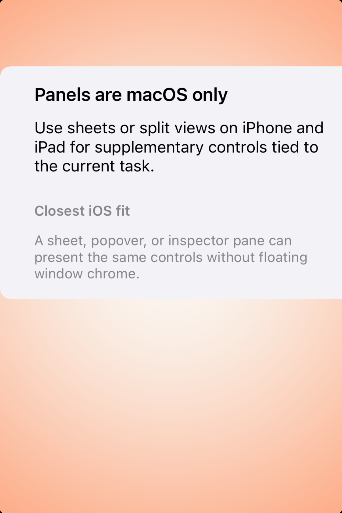
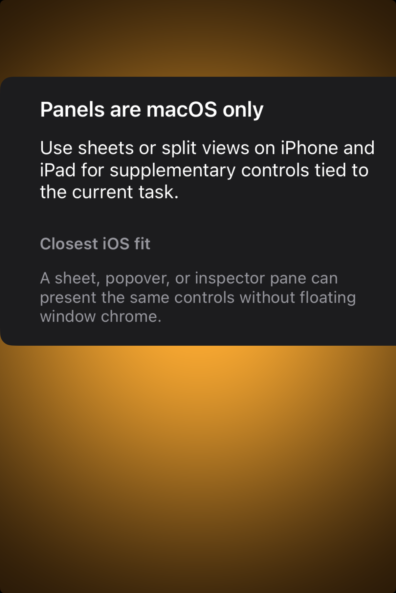

# Panels -- Visual validation

## HIG reference

## Rendered -- macOS (light)

## Rendered -- macOS (dark)

## Rendered -- iOS (light)

## Rendered -- iOS (dark)

## Verdict: PASS_WITH_NOTES

The row-level verdict is PASS_WITH_NOTES. macOS light and dark both show a
clear, compact inspector-style auxiliary surface with short controls,
supporting copy, and quiet footer actions. iOS light and dark are explicitly
"n/a (platform)" because HIG panels are macOS-only; the iOS captures
intentionally show a legible placeholder explaining the closest platform fit
instead of pretending floating panel chrome exists there.

### Glass check
- **Required for this slug:** No. Standard panels are auxiliary windows, not a
  Liquid Glass surface class. The HIG also discusses HUD-style panels, but that
  darker translucent treatment is optional and context-specific rather than the
  default requirement for the component family.
- **Observed:** The macOS study uses a quiet supporting surface against the
  amber backdrop; the iOS placeholder uses the same calm grouped-card language
  to document the platform exclusion. No missing-glass issue is present.

### Platform-exclusion decision
Panels are explicitly called out by HIG as a macOS pattern. The iOS captures
therefore use an intentional explanatory placeholder card:

- title: "Panels are macOS only"
- supporting copy explaining that sheets or split views are the iOS/iPadOS fit
- a short secondary note describing the closest equivalent without floating
  window chrome

This keeps the dual-host validation loop uniform while staying honest about the
platform boundary.

### Light appearance observations

**macOS light:** A centered inspector panel floats as a compact study against
the warm amber backdrop, leaving clear gutters on every side. The title
"Inspector" is brief and noun-led, matching the HIG guidance. Supporting copy
stays secondary, while the body uses simple adjustment controls: one toggle, one
slider, one stepper row, and one segmented control. The footer explanation and
two trailing actions keep the panel task-focused instead of document-like.

**iOS light:** The placeholder card is centered, legible, and explicit about the
macOS-only status. The body copy remains easy to scan and does not collapse into
a generic "not supported" dead end.

### Dark appearance observations

**macOS dark:** The same inspector study remains centered and readable in dark
appearance. The auxiliary hierarchy stays quiet, with controls carrying the
visual interest rather than the chrome.

**iOS dark:** The placeholder card remains legible and clear, with the same
platform-exclusion message preserved in dark appearance.

### Deviations

1. **macOS study uses an in-app auxiliary surface, not a true floating
   `NSPanel`.** The new `UI::Panel` primitive is an honest shared fallback
   surface, but it does not yet implement window-level NSPanel behavior like
   titlebar chrome, hide-when-inactive, or app-level float ordering.
   Non-legibility-impairing and acceptable for PASS_WITH_NOTES.

### Source citations
- HIG "Panels -- Abstract": "In a macOS app, a panel typically floats above
  other open windows providing supplementary controls, options, or information
  related to the active window or current selection."
- HIG "Panels -- Best practices": "Consider using a panel to present inspector
  functionality."
- HIG "Panels -- Best practices": "Prefer simple adjustment controls in a
  panel."
- HIG "Panels -- Best practices": "Write a brief title that describes the
  panel's purpose."
- HIG "Panels -- Platform considerations": "Not supported in iOS, iPadOS, tvOS,
  visionOS, or watchOS."

### Remediation (if NEEDS_WORK)
N/A -- verdict is PASS_WITH_NOTES. The next meaningful step is a true NSPanel
bridge, not more screenshot tuning.
