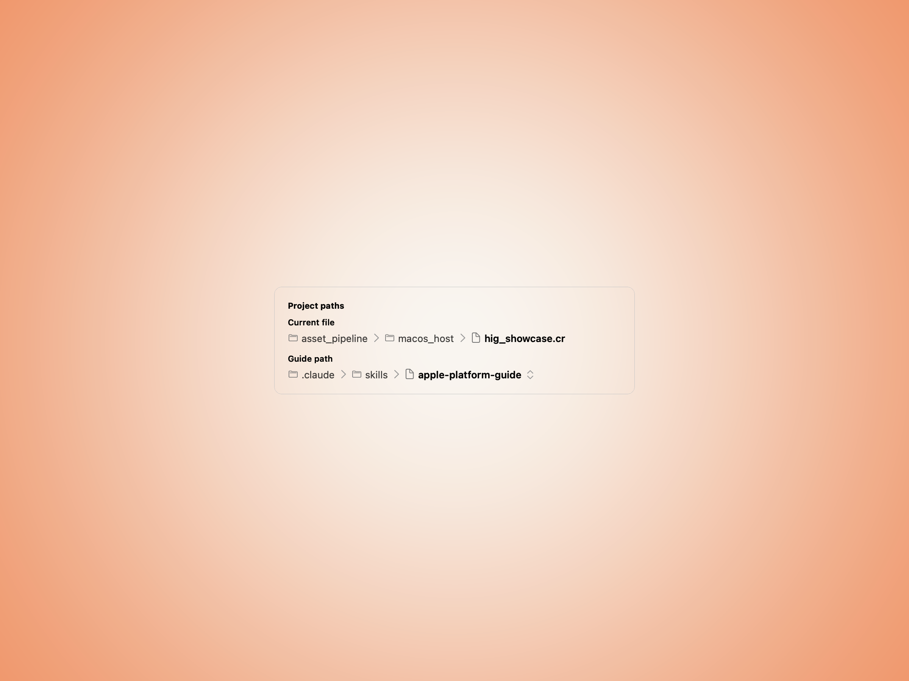
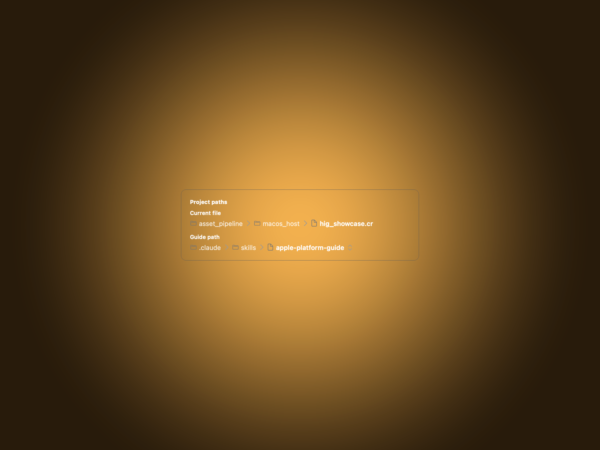
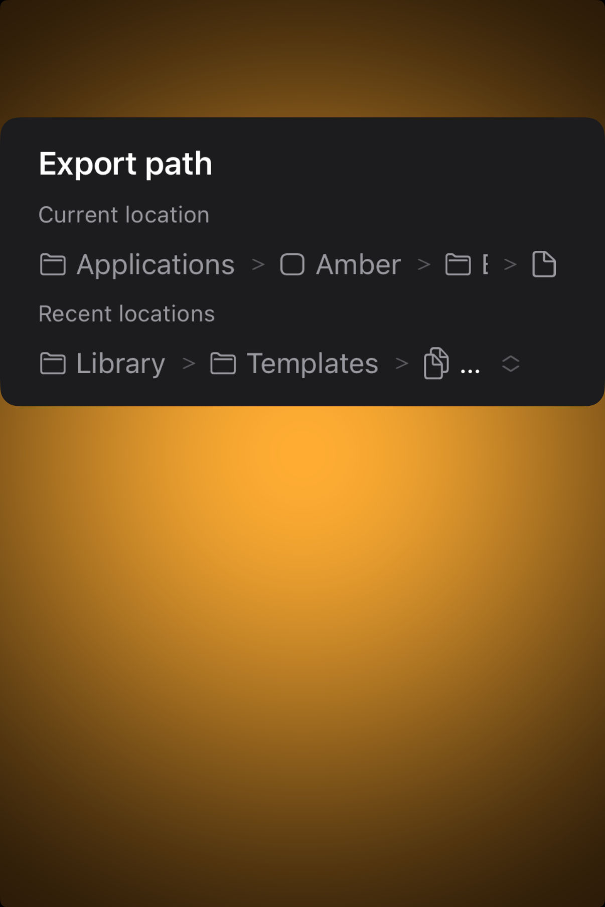

# Path controls -- Visual validation

## HIG reference

## Rendered -- macOS (light)

## Rendered -- macOS (dark)

## Rendered -- iOS (light)

## Rendered -- iOS (dark)

## Verdict: PASS_WITH_NOTES

This now reads like a real path-control study instead of a broken or oversized
placeholder. The macOS composition is compact and Finder-like, while the iOS
fallback is at least calm enough to communicate the anatomy without pretending
the platform has a native equivalent.

### What improved
- macOS now presents the path as a restrained breadcrumb card with clear icon,
  chevron, and terminal-segment rhythm.
- Both platforms keep enough surrounding gutter for the amber backdrop to stay
  visible and support the component instead of fighting it.
- The popup-style variant is readable now; it no longer feels like a second
  arbitrary row of text.

### Why this is still notes-only
- Apple explicitly does not support path controls on iOS, so the iOS study is a
  documented fallback rather than a native control.
- The macOS study is visually right, but validation still relies on a composed
  showcase treatment rather than proving the raw native control inside a richer
  product scene.

### Result
Promote this row to `PASS_WITH_NOTES`. The default taste is now disciplined
enough to count as a clean baseline, with the iOS fallback caveat recorded
honestly.
