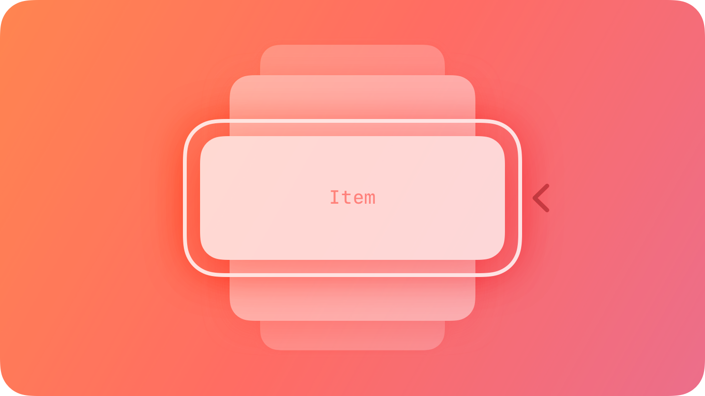
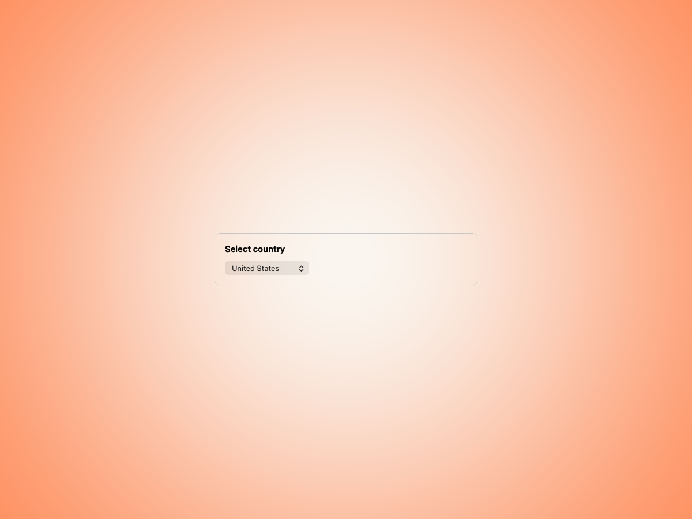
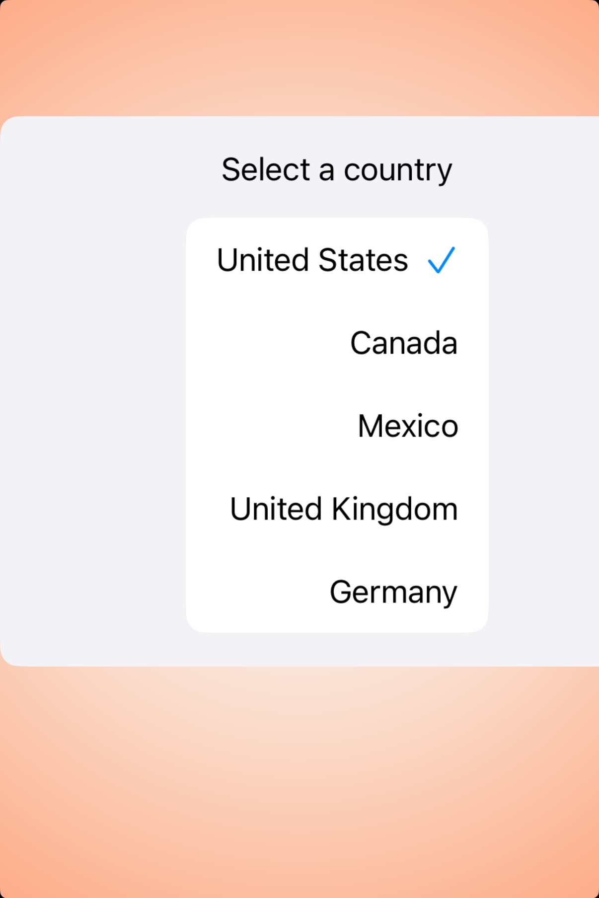
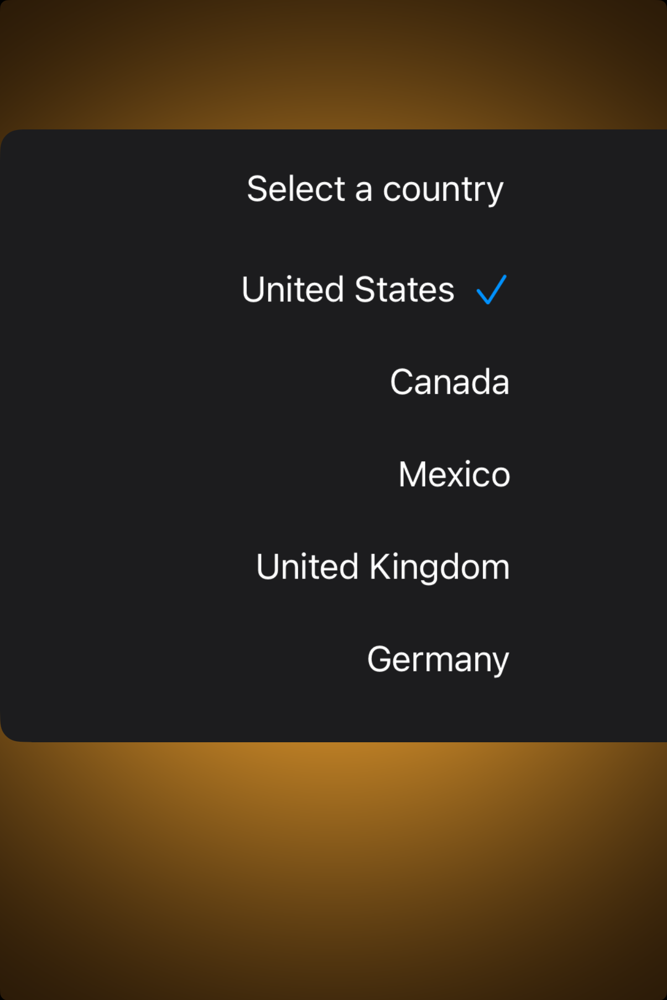

# Pickers — Visual validation

## HIG reference

## Rendered — macOS (light)

## Rendered — macOS (dark)

## Rendered — iOS (light)

## Rendered — iOS (dark)

## Verdict: PASS_WITH_NOTES

The picker row is still a good baseline study. Both platforms now show the
component in a calmer centered plate instead of the earlier edge-hugging
composition, and the anatomy reads clearly in both appearances. It remains
PASS_WITH_NOTES because the preview is still more of a stable study card than
the richer contextual surfaces Apple often shows around pickers.

### Evidence manifest
- **Manifest:** `../evidence/pickers.json`
- **Required captures:** PASS — all four files present and > 10 KB.
- **Report links:** PASS — all four appearance-specific screenshot filenames
  linked above.

### Light appearance observations
- macOS: the menu-style picker now sits in a smaller, more disciplined study
  card with visible ambient gutters.
- iOS: the picker list is centered cleanly and no longer feels shoved against
  the leading edge of the phone frame.

### Dark appearance observations
- macOS: the dark study keeps enough contrast between the control and the warm
  Amber backdrop.
- iOS: the selected-row treatment and checkmark anatomy remain readable with
  the darker card treatment.

### Deviations / notes
- The previews are clean and trustworthy now, but they are still isolated
  studies rather than embedded workflow examples.
- This row is ready to stay in PASS_WITH_NOTES until a later pass decides
  whether to broaden it into a more contextual picker showcase.

### Source citations
- Apple HIG — "Pickers" (see `apple-hig/pages/pickers.md` in the skill corpus).

### Remediation (if NEEDS_WORK)
N/A — notes only.
