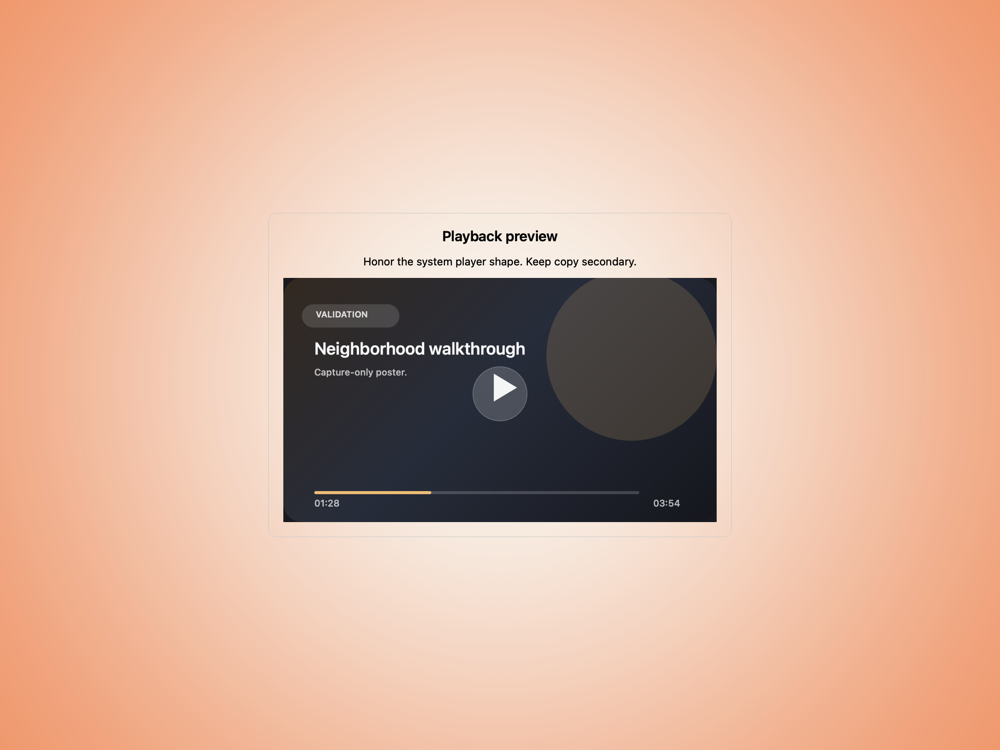
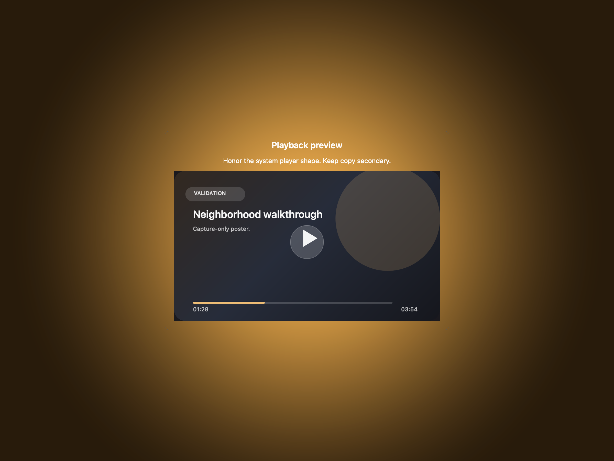
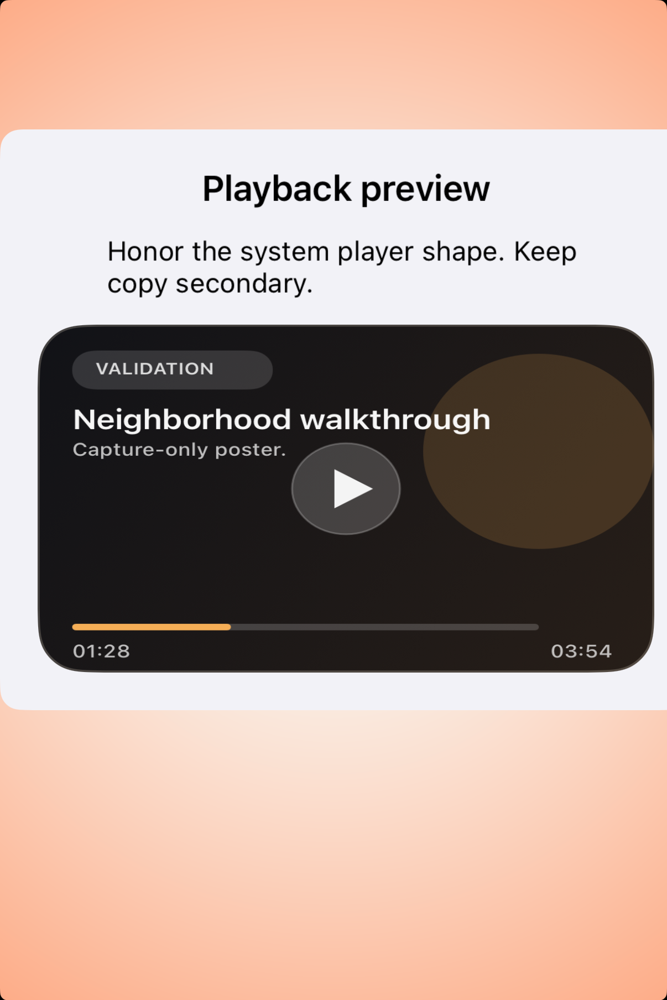
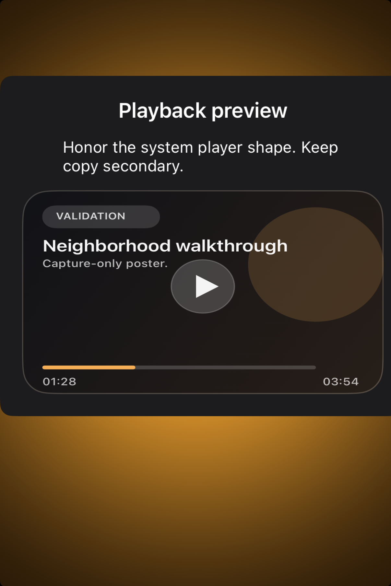

# Playing video -- Visual validation

## HIG reference

## Rendered -- macOS (light)

## Rendered -- macOS (dark)

## Rendered -- iOS (light)

## Rendered -- iOS (dark)

## Verdict: PASS_WITH_NOTES

`UI::VideoPlayer` now has a readable, opinionated validation study on both
platforms. The runtime path is native AVKit on iOS and macOS, but the evidence
path intentionally uses a deterministic poster preview during validation so the
screenshots communicate aspect ratio, hierarchy, and restraint instead of
whatever arbitrary pixels a static capture happens to catch. That tradeoff is
honest and useful, but it still counts as PASS_WITH_NOTES because the report is
not showing live playback compositing. The refreshed framing now keeps visible
gutters around the player card and preserves the amber isolation backdrop
instead of letting the study drift toward one edge.

### Liquid Glass check
- **Required for this slug:** No. Video is a content surface, not a glass
  presentation layer.
- **Observed:** Correct. The study keeps the player as a dark media frame with
  minimal surrounding chrome.

### Appearance observations

**macOS light / dark:**
The study now reads clearly: concise copy above, strong media rectangle below,
and a capture-only poster that preserves the expected AVKit silhouette. The
default taste is disciplined and avoids turning the player into a decorative
card-within-a-card exercise. The card is centered cleanly enough now that the
backdrop remains visible around it, which gives the desktop composition the
breathing room it was missing before.

**iOS light / dark:**
The iOS validation path matches the macOS evidence closely, which is a win for
consistency. The player stays the primary shape, the supporting copy no longer
overruns the study width, and the screenshot is stable enough to critique
layout instead of incidental video-frame content. The smaller card width also
keeps a believable amount of backdrop visible on all sides, which makes the
preview feel more like a default-taste component study and less like a full
screen mock.

### Deviations

1. **Validation uses a deterministic poster instead of live AVKit pixels. PASS_WITH_NOTES.**
   macOS offscreen capture and iOS UI-test screenshots are both poor sources of
   truth for live video playback. The harness now opts into a poster preview
   during validation (`HIG_SCREENSHOT_PATH` on macOS, `HIG_VALIDATION_CAPTURE`
   on iOS) so evidence remains stable and legible while runtime stays native.

2. **The report validates player shape and hierarchy, not transport behavior. PASS_WITH_NOTES.**
   Static PNG evidence cannot confirm scrubbing, buffering, captions, or actual
   playback transitions. Those behaviors still need runtime testing.

### Source citations
- Playing video: "Use the system video player to give people a familiar and
  convenient experience."
- Playing video: "Always display video content at its original aspect ratio."
- Playing video: "Provide additional information when it adds value."

### Remediation (if pursuing full PASS)
1. Add an AVKit-specific snapshot path that can capture live player chrome
   without depending on arbitrary playback frames.
2. Pair the static validation report with targeted runtime checks for playback
   controls and presentation behavior.
