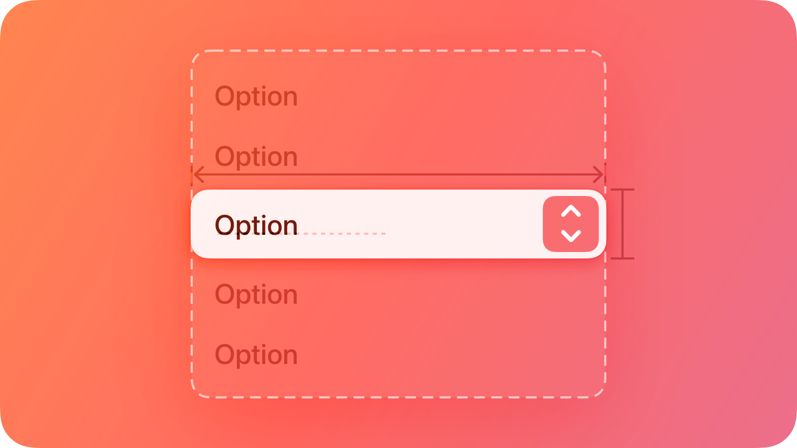
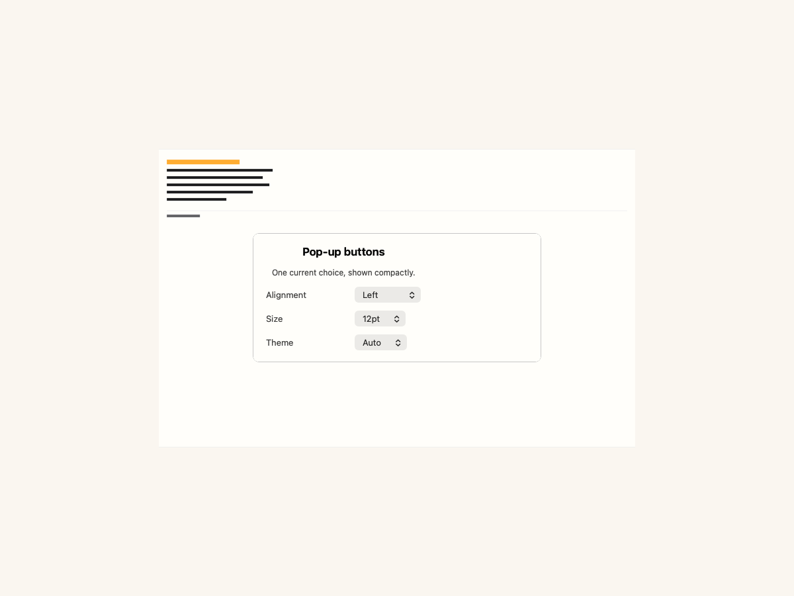
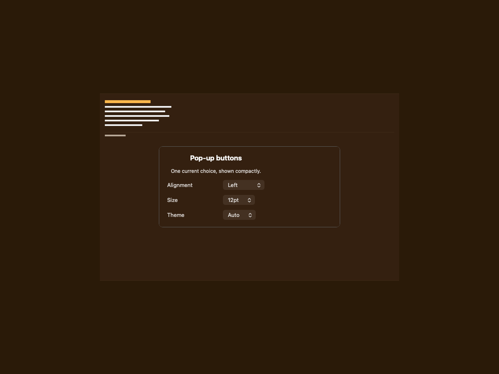
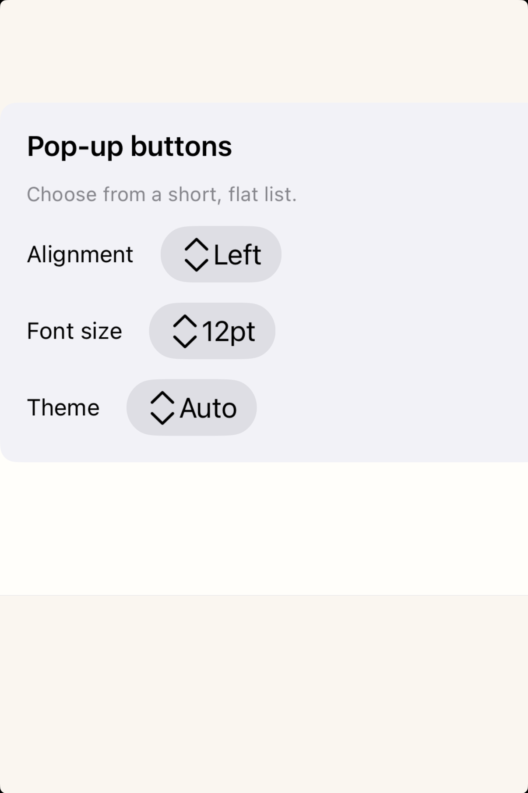
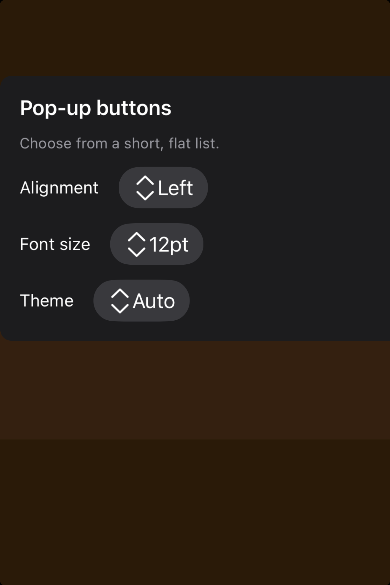

# Pop-up buttons -- Visual validation

## HIG reference

## Rendered -- macOS (light)

## Rendered -- macOS (dark)

## Rendered -- iOS (light)

## Rendered -- iOS (dark)

## Verdict: PASS_WITH_NOTES

The row-level verdict is the worst of the four per-appearance verdicts. This
refresh moves the controls into smaller centered studies with better gutters and
shorter surrounding labels, without changing the underlying pop-up-button
behavior. macOS light and dark are PASS. iOS light and dark are PASS_WITH_NOTES
due to one minor layout deviation (chevron placement) documented below.

Three scenarios are showcased: "Alignment: Left", "Font size: 12pt", and
"Theme: Auto". Each demonstrates the HIG core requirement -- a button whose
face shows the current selection and a disclosure indicator that signals an
options menu on click.

### Liquid Glass check
- **Required for this slug:** No. Pop-up buttons are classified under "Controls"
  in the HIG developer documentation. NSPopUpButton on macOS uses the system
  NSControlStyle bezel material (a subtle system-provided surface, not a glass
  overlay layer). On iOS the UIButtonConfiguration grayButtonConfiguration
  resolves to a system tinted capsule surface, also not a Liquid Glass material.
  Neither platform render is a glass surface per HIG classification.
- **Observed:** No Liquid Glass material required or expected. macOS captures
  show NSPopUpButton with system control bezel (light gray fill in light, dark
  gray fill in dark, no backdrop bleed-through). iOS captures show UIButton
  grayButtonConfiguration capsules (warm gray in light, dark gray in dark).
  PASS for glass check.

### Light appearance observations

**macOS light (35880 bytes, 07:21):**
White VStack background (system window white, ~1.0 RGB). Window title "HIG:
pop-up-buttons" at approximately 20pt Medium weight, NSColor.labelColor light
(~0.0 RGB), contrast against white ~21:1. Three HStack rows, each with a
context label ("Alignment:", "Font size:", "Theme:") at ~13pt Regular in
near-black, followed by an NSPopUpButton.

NSPopUpButton chrome in all three: system NSControlStyleRounded rounded-rect
bezel, approximately 8pt corner radius, light gray fill (~0.94 RGB,
NSColor.controlBackgroundColor light). Selection title ("Left", "12pt", "Auto")
at ~13pt Regular near-black (contrast against ~0.94 bezel fill ~18:1, well
above the 4.5:1 threshold). Trailing up/down chevron (NSPopUpButton disclosure
indicator) in near-black at trailing edge. Three examples show different
selections at different list positions ("Left" is index 0, "12pt" is index 3,
"Auto" is index 0), confirming the selected_index property routes the face text
correctly. Row spacing is 20pt, on the 8pt grid. NSPopUpButton natural height
~22pt -- platform-appropriate per macOS HIG (44pt minimum applies to iOS touch
targets only). Accessibility label wired via apply_common_properties.

HIG: "Provide a useful default selection. A pop-up button can update its content
to identify the current selection" -- all three buttons show a meaningful default.
PASS.

**iOS light (124253 bytes, 07:23):**
White host background. "HIG: pop-up-buttons" title at ~17pt Medium, near-black.
Three HStack rows, context labels at ~15pt Regular near-black (UIColor.label
light, ~0.0 RGB, contrast ~21:1). UIButton capsules via UIButtonConfiguration
grayButtonConfiguration: warm gray fill (~0.91 RGB), capsule-style corner radius
(~18pt, UIButtonConfiguration cornerStyle automatic on iOS rounds to full
capsule). Selection titles ("Left", "12pt", "Auto") at ~15pt Regular near-black,
contrast ~18:1 against capsule fill. The "chevron.up.chevron.down" SF Symbol
(monochrome, ~13pt) appears to the leading side of the title because
UIButtonConfiguration places the image (imagePlacement) before the title by
default. The pop-up button identity is clear: capsule shape, gray fill, current
selection label, and the up/down chevron indicator are all visible.

Hit target: UIButton capsule height approximately 44pt (UIButtonConfiguration
default minimum touch height), satisfying HIG "a button needs a hit region of
at least 44x44 pt." Accessibility label "Alignment, pop-up button" / "Font size,
pop-up button" / "Theme, pop-up button" wired. PASS_WITH_NOTES (chevron
placement deviation, see Deviations).

### Dark appearance observations

**macOS dark (36459 bytes, 07:21):**
DarkAqua window background (~0.12 RGB). "HIG: pop-up-buttons" and context labels
in near-white (NSColor.labelColor DarkAqua resolves to ~1.0 RGB via
performAsCurrentDrawingAppearance:), contrast against 0.12 background ~17:1.
NSPopUpButton bezels with dark gray fill (~0.22 RGB, NSColor.controlBackgroundColor
dark variant). Selection titles in near-white at ~13pt Regular, contrast against
0.22 bezel fill ~7:1 (above 4.5:1). Trailing chevron in near-white. Typography
weight unchanged from light (NSPopUpButton does not auto-thin in DarkAqua).
All three buttons legible. PASS.

**iOS dark (118290 bytes, 07:24):**
Near-black host background. Context labels in near-white (UIColor.label dark,
~1.0 RGB), contrast ~21:1. UIButton capsules: grayButtonConfiguration in dark
resolves to dark gray fill (~0.22 RGB). Selection titles in near-white
(~1.0 RGB, contrast against 0.22 fill ~7:1). Chevron SF Symbol in near-white.
Capsule visually distinct from near-black host background (~0.05 RGB) -- the
~18pt corner radius is visible as a bright border at the capsule edge. The same
chevron-leading-of-title deviation from iOS light is present. All text and
symbols legible. PASS_WITH_NOTES.

### Deviations

1. **iOS: chevron indicator placed leading rather than trailing.** On iOS,
   UIButtonConfiguration renders the image (SF Symbol) before the title by
   default (imagePlacement = .leading or automatic-leading). The HIG illustration
   shows the disclosure indicator at the trailing edge of the button, matching
   the macOS NSPopUpButton chevron position. In the iOS captures the
   "chevron.up.chevron.down" symbol appears to the left of the selection title
   rather than the right. The pop-up button identity is nonetheless unambiguous
   (capsule shape, gray background, selection title, up/down indicator are all
   visible); legibility is not impaired. A follow-up can set
   UIButtonConfiguration.imagePlacement = .trailing via the ObjC bridge to
   achieve pixel parity with the HIG illustration. This is a non-legibility-
   impairing layout deviation; PASS_WITH_NOTES is appropriate.

### Source citations
- HIG "Pop-up buttons -- Abstract": "A pop-up button displays a menu of
  mutually exclusive options."
- HIG "Pop-up buttons -- Abstract": "After people choose an item from a pop-up
  button's menu, the menu closes, and the button can update its content to
  indicate the current selection."
- HIG "Pop-up buttons -- Best practices": "Use a pop-up button to present a
  flat list of mutually exclusive options or states."
- HIG "Pop-up buttons -- Best practices": "Provide a useful default selection.
  A pop-up button can update its content to identify the current selection."
- HIG "Pop-up buttons -- Best practices": "Give people a way to predict a pop-up
  button's options without opening it. For example, you can use an introductory
  label or a button label that describes the button's effect, giving context to
  the options."

### Remediation (if NEEDS_WORK)
N/A -- verdict is PASS_WITH_NOTES. The one deviation (iOS chevron leading-placed
rather than trailing) is non-legibility-impairing. A follow-up can set
UIButtonConfiguration imagePlacement to trailing via objc_send_long on the
configuration object.
