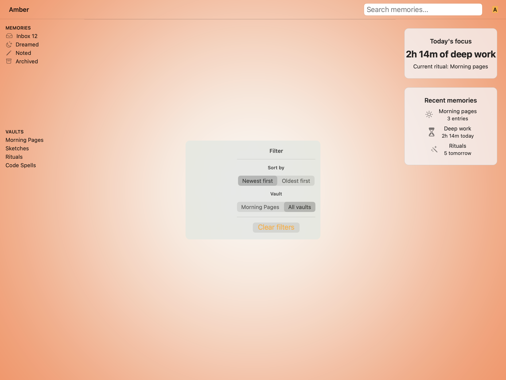
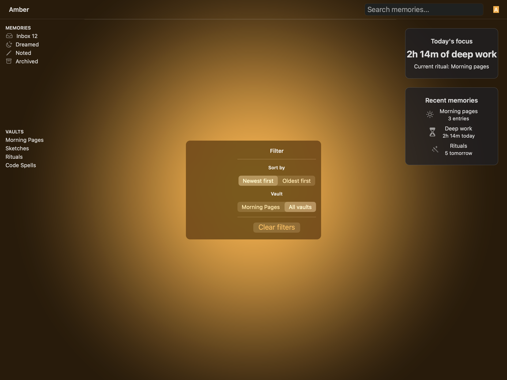
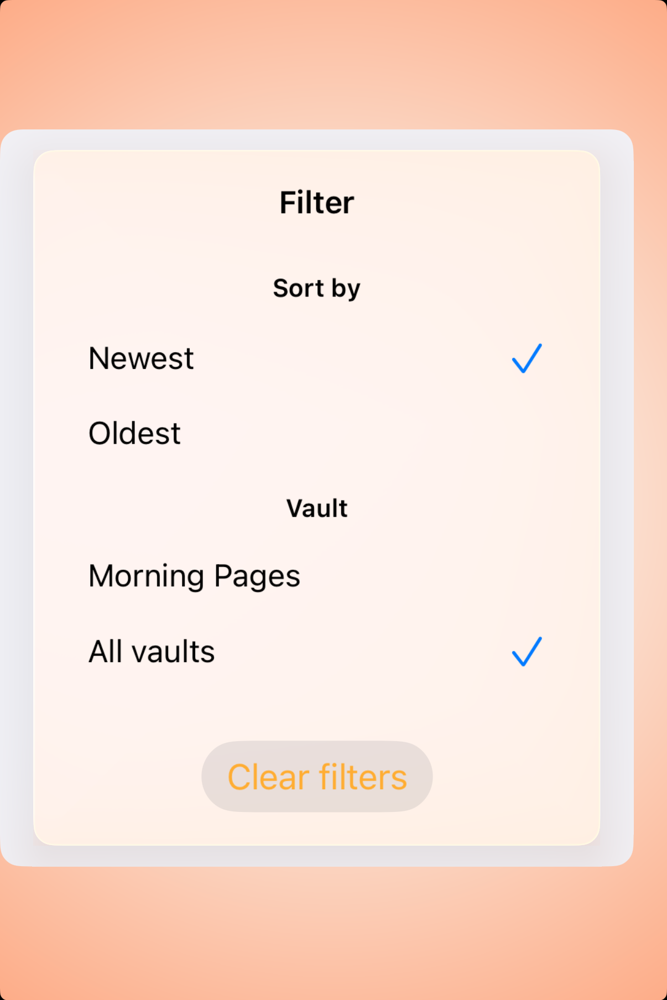
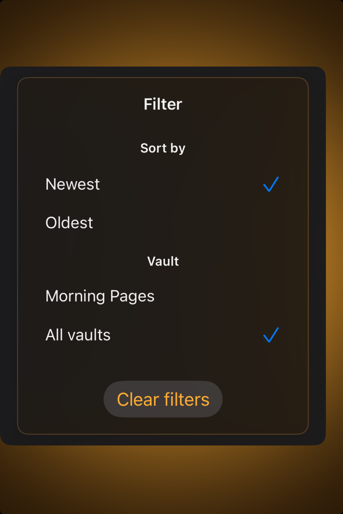

# Popovers — Visual validation

## HIG reference

## Rendered — macOS (light)

## Rendered — macOS (dark)

## Rendered — iOS (light)

## Rendered — iOS (dark)

## Verdict: PASS_WITH_NOTES

This row is back in a usable state. The iOS host now captures a centered,
fully in-frame popover instead of losing the surface off the leading edge, and
the simplified option rows read much more cleanly than the earlier segmented
control experiment. It remains PASS_WITH_NOTES because both platforms are
still showing a study-card interpretation of a popover rather than a more
anchored, truly transient presentation.

### Evidence manifest
- **Manifest:** `../evidence/popovers.json`
- **Required captures:** PASS — all four files present and > 10 KB.
- **Report links:** PASS — all four appearance-specific screenshot filenames
  linked above.

### Light appearance observations
- macOS: the popover remains readable and on-brand inside the Amber scene.
- iOS: the popover now sits cleanly within the frame with stable hierarchy and
  enough gutter to judge the content.

### Dark appearance observations
- macOS: the dark popover keeps the warm palette and readable contrast.
- iOS: the dark study is now centered and calm, with the selected rows and
  clear-filters action reading cleanly against the darker glass surface.

### Deviations / notes
- The iOS preview uses simplified static option rows to avoid segmented-control
  layout artifacts in compact width; this is visually better, but still more of
  a study composition than a fully anchored system popover.
- The row is trustworthy again for backlog purposes, but there is still room
  for a richer anchored-presentation pass later.

### Source citations
- Apple HIG — "Popovers" (see `apple-hig/pages/popovers.md` in the skill corpus).

### Remediation (if NEEDS_WORK)
N/A — notes only.
