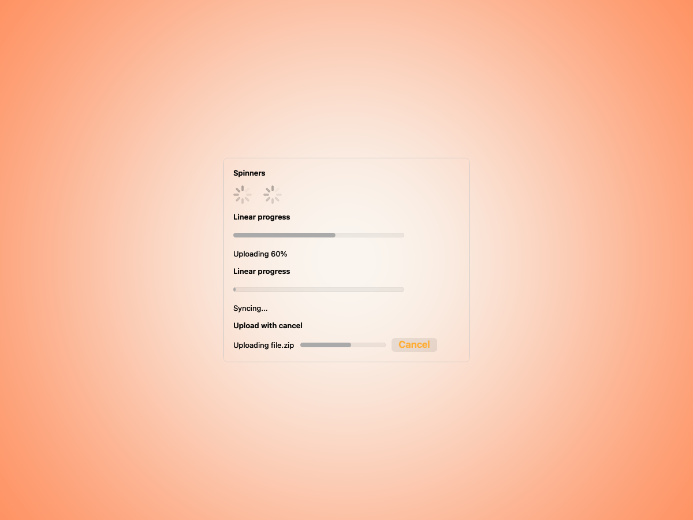
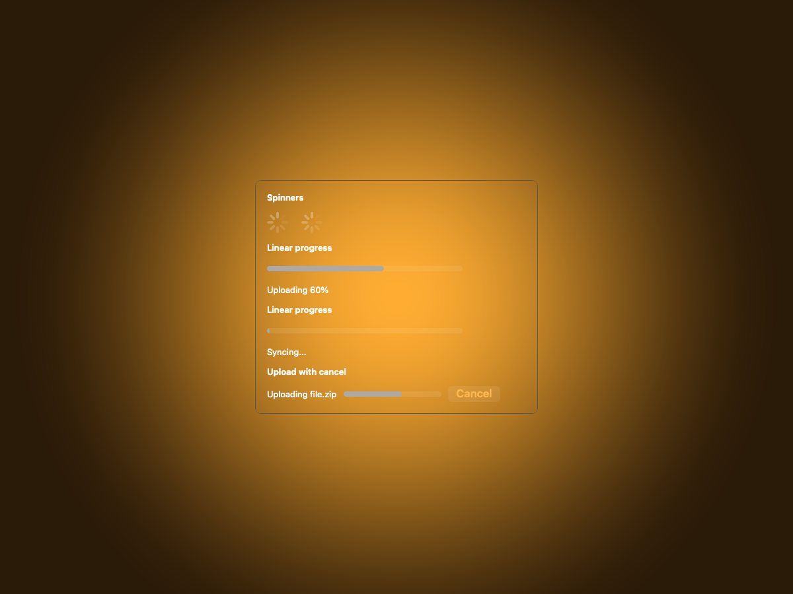
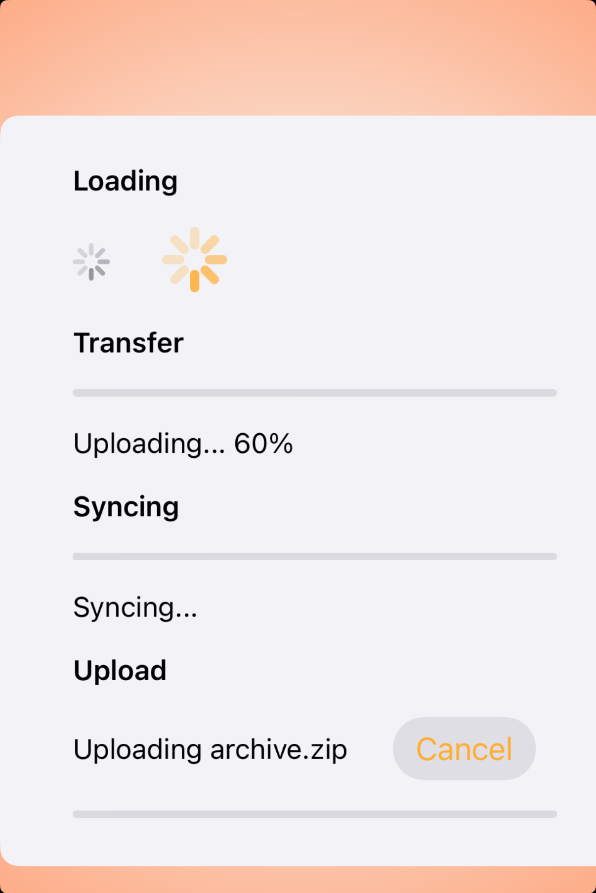
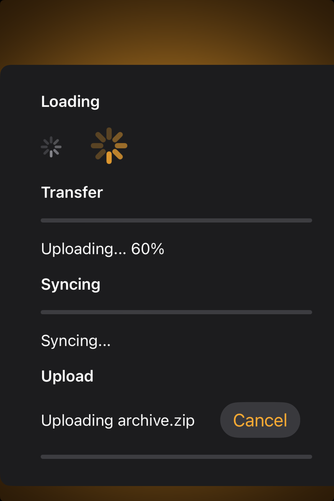

# Progress indicators -- Visual validation

## HIG reference

## Rendered -- macOS (light)

## Rendered -- macOS (dark)

## Rendered -- iOS (light)

## Rendered -- iOS (dark)

## Verdict: PASS_WITH_NOTES

This family looks a lot more disciplined now. The centered study card gives the
spinner and progress rows enough room to breathe, and the amber backdrop stays in a
supporting role.

### What improved
- Both platforms now frame the study as a single component plate instead of letting
  the progress controls drift in a wide empty scene.
- The determinate bar, spinner pair, and cancel affordance all stay readable at a
  glance.
- Dark-mode contrast is solid; the progress fill and cancel action still read clearly.

### Why this is still notes-only
- Static screenshots can only prove structure, not motion, so the indeterminate cases
  are still a validation approximation.
- The cancel/upload row is serviceable, but it still feels more like a showcase stack
  than a polished shipping workflow.

### Result
Keep this at `PASS_WITH_NOTES`. The taste is close; the remaining gap is mostly in the
behavior story and a little last-mile composition polish.
