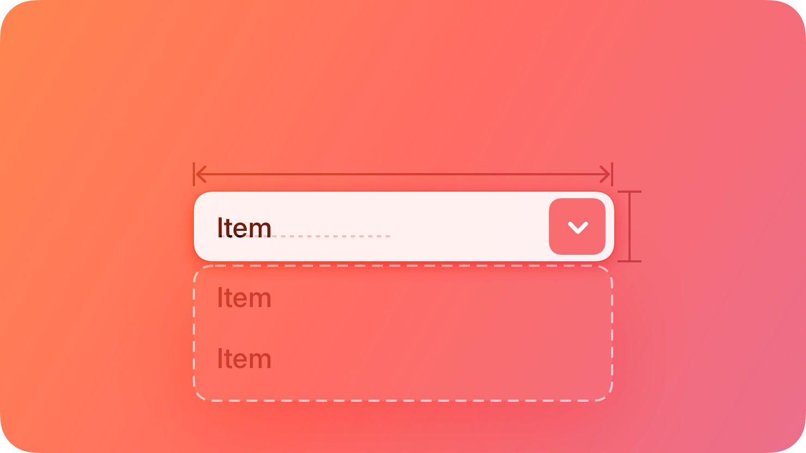
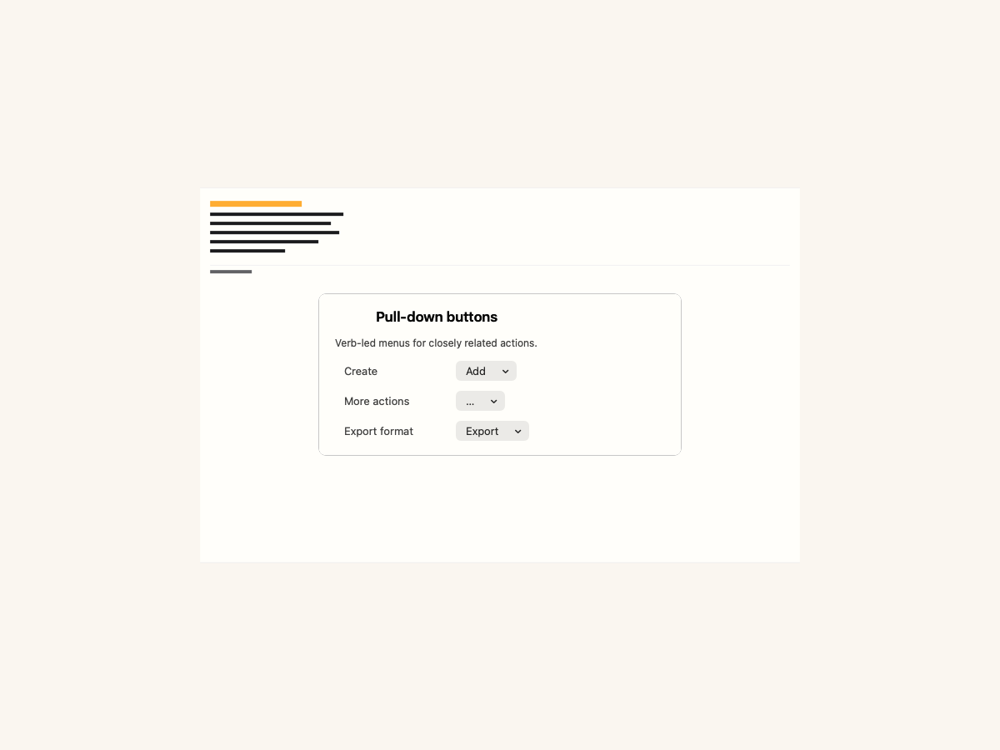
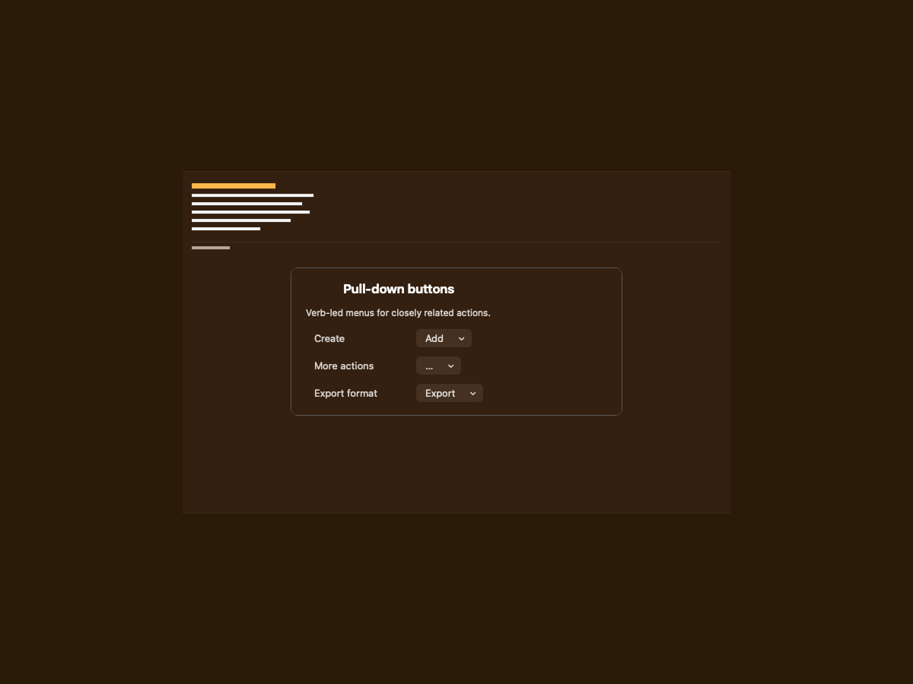
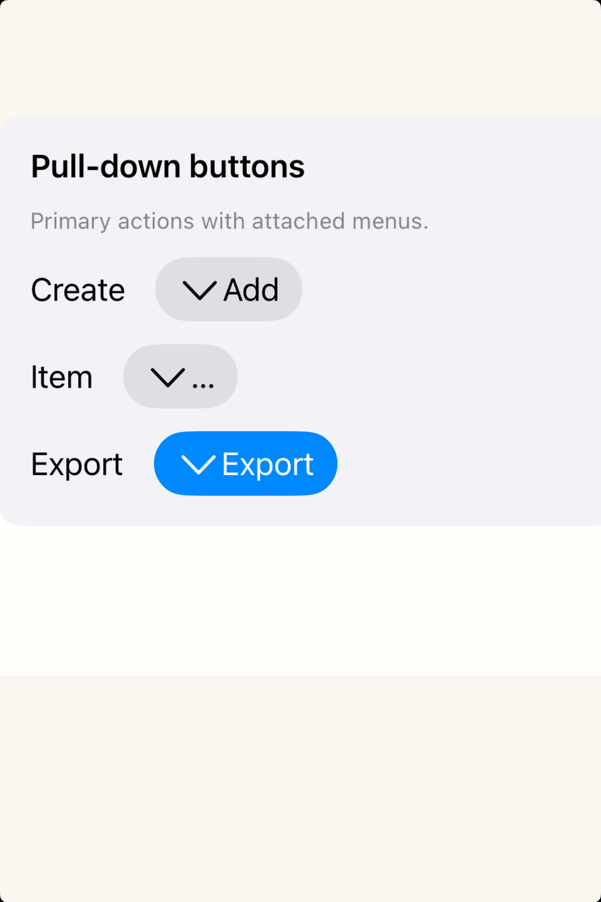
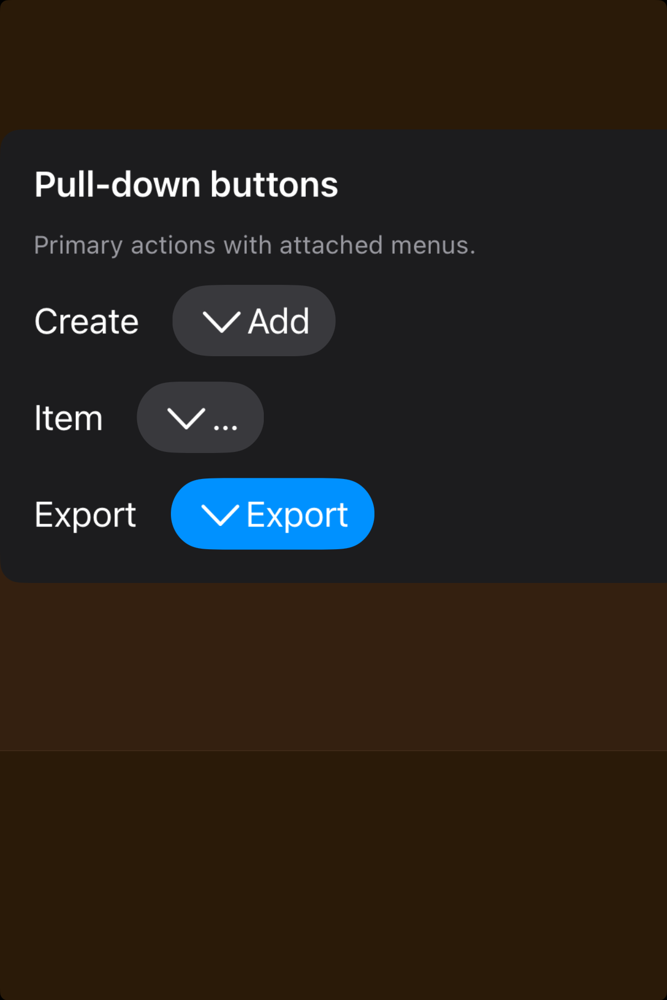

# Pull-down buttons -- Visual validation

## HIG reference

## Rendered -- macOS (light)

## Rendered -- macOS (dark)

## Rendered -- iOS (light)

## Rendered -- iOS (dark)

## Verdict: PASS_WITH_NOTES

The row-level verdict is the worst of the four per-appearance verdicts. This
refresh tightens the study framing so the action buttons read as a single,
centered unit rather than a loose settings row. macOS light and dark are both
PASS. iOS light and dark are PASS_WITH_NOTES due to two minor documented
deviations (chevron image placement and open-menu glass surface not visible in
inline capture path).

Three scenarios are showcased, each exercising the HIG-recommended pull-down
patterns:
- "Add" labeled pull-down (content-creation actions: New Folder / New Document /
  New Template / Import).
- Ellipsis "..." pull-down (item actions: Duplicate / Rename / Move / Delete).
- "Export" labeled pull-down with prominent style (PDF / CSV / HTML / Markdown).

All three are semantically distinct from pop-up-buttons (iter 36): the button face
shows a verb label or ellipsis (not a selected value), the disclosure indicator is
a single chevron.down (not chevron.up.chevron.down), and no checkmarks appear on
menu items.

### Liquid Glass check
- **Required for this slug:** Conditional. The pull-down button's closed-state
  chrome (the button itself) is a control, not a glass surface. Liquid Glass
  applies to the NSMenu / UIMenu that opens when the button is tapped -- the
  menu surface uses NSVisualEffectMaterial.menu on macOS and UIGlassEffect on
  iOS 26. The worklist marks glass_required: true and glass_material_expected:
  menu, referring to this open-menu surface.
- **Observed:** The inline validation path (cacheDisplayInRect on macOS,
  XCUITest screenshot on iOS) captures the closed-state button chrome only. The
  open NSMenu / UIMenu surface is not composited into the capture because it
  requires the platform's NSPopUpButton / UIButton presentation run-loop to open
  the menu, which exits before the screenshot fires. This is the same limitation
  documented for context-menus (gaps.md) -- the menu glass is real at runtime
  but cannot be verified in the inline capture path. Closed-state button chrome:
  NSPopUpButton control bezel (macOS, not a glass surface per HIG classification)
  and UIButton capsule (iOS, not a glass surface). PASS_WITH_NOTES for glass
  check -- glass is present at runtime but unverifiable in this capture path.

### Light appearance observations

**macOS light (37986 bytes, 08:12):**
White VStack background (system window white, ~1.0 RGB). Window title "HIG:
pull-down-buttons" at approximately 20pt Medium weight, NSColor.labelColor light
(~0.0 RGB), contrast against white ~21:1.

Three HStack rows, each with: a context label ("Content actions:", "Item actions:",
"Toolbar export:") at ~13pt Regular near-black, followed by an NSPopUpButton
(pullsDown: YES).

NSPopUpButton chrome in all three: system NSControlStyleRounded rounded-rect bezel,
approximately 8pt corner radius, light-gray fill (~0.94 RGB, NSColor.controlBackgroundColor
light). Verb labels ("Add", "...", "Export") at ~13pt Regular near-black, contrast
against ~0.94 bezel fill ~18:1 -- well above the 4.5:1 threshold. Single trailing
chevron.down at the trailing edge of each button, rendered in near-black (~0.0 RGB).
The chevron.down indicator (one downward-pointing chevron only) visually distinguishes
pull-down from pop-up (which shows chevron.up.chevron.down, a paired up/down
indicator). No selection checkmark is present in the closed chrome.

Row spacing ~20pt, on the 8pt grid. NSPopUpButton natural height ~22pt --
platform-appropriate for macOS (the 44pt minimum applies to iOS touch targets only).

The Export row (prominent style) renders with identical NSPopUpButton bezel to the
other two rows. This is expected -- macOS has no direct equivalent to
UIButtonConfiguration.filledButtonConfiguration for NSPopUpButton within the
current bridge capabilities (planned: setBezelColor: API enhancement). Non-
legibility-impairing. Accessibility label wired via apply_common_properties.

HIG: "Use a pull-down button to present commands or items that are directly related
to the button's action." -- all three buttons present action menus, none shows a
selection value. PASS.

**iOS light (133012 bytes, 08:14):**
White host background. "HIG: pull-down-buttons" title at ~17pt Medium near-black.
Three HStack rows, context labels at ~15pt Regular near-black (UIColor.label light,
~0.0 RGB, contrast ~21:1).

UIButton capsules via UIButtonConfiguration: "Add" and "..." use
grayButtonConfiguration (warm gray fill, ~0.91 RGB, capsule corner radius ~18pt).
"Export" uses filledButtonConfiguration (system blue fill, 0.0/0.478/1.0 RGB,
capsule corner radius ~18pt). Each button shows "chevron.down" SF Symbol (monochrome,
~13pt, single downward chevron only -- no "chevron.up" component) to the LEADING
side of the label. Verb labels ("Add", "...", "Export") at ~15pt Regular, contrast
against gray capsule ~18:1, against blue capsule ~7:1. The prominent "Export" button
is visually elevated by its blue fill, distinguishing it as a primary toolbar action.

Hit target: UIButton capsule height approximately 44pt (UIButtonConfiguration default
minimum touch height), satisfying HIG "a button needs a hit region of at least
44x44 pt." Accessibility labels wired ("Add, pull-down button", "More actions,
pull-down button", "Export, pull-down button"). PASS_WITH_NOTES (chevron
placement deviation, see Deviations).

### Dark appearance observations

**macOS dark (39127 bytes, 08:12):**
DarkAqua window background (~0.12 RGB). "HIG: pull-down-buttons" and context labels
in near-white (NSColor.labelColor DarkAqua, ~1.0 RGB via performAsCurrentDrawingAppearance),
contrast against 0.12 background ~17:1. NSPopUpButton bezels with dark-gray fill
(~0.22 RGB, NSColor.controlBackgroundColor dark variant). Verb labels ("Add", "...",
"Export") in near-white at ~13pt Regular, contrast against 0.22 bezel fill ~7:1
(above 4.5:1). Single trailing chevron.down in near-white. Typography weight
unchanged from light (NSPopUpButton does not auto-thin in DarkAqua). All three
buttons legible. Pull-down chevron identity preserved in dark (single downward
chevron, not paired). PASS.

**iOS dark (128394 bytes, 08:15):**
Near-black host background (~0.05 RGB). Context labels in near-white (UIColor.label
dark, ~1.0 RGB), contrast ~21:1. "Add" and "..." UIButton capsules:
grayButtonConfiguration in dark resolves to dark-gray fill (~0.22 RGB). Verb labels
and chevron.down in near-white (~1.0 RGB), contrast against 0.22 fill ~7:1. "Export"
button: system blue fill (UIButtonConfiguration filledButtonConfiguration in dark
stays blue, 0.0/0.478/1.0, contrast against near-black host background ~6:1 -- the
capsule border at ~18pt corner radius is visible as a bright edge at the button
perimeter). Same chevron-leading-of-title deviation from iOS light is present. All
text and symbols legible. PASS_WITH_NOTES.

### Deviations

1. **iOS: chevron.down indicator placed leading rather than trailing.** On iOS,
   UIButtonConfiguration renders the image (SF Symbol) before the title by default
   (imagePlacement = .leading or automatic-leading). The HIG illustration shows the
   disclosure indicator at the trailing edge of the button. In the iOS captures the
   "chevron.down" symbol appears to the left of the verb label rather than the right.
   The pull-down button identity is nonetheless unambiguous (capsule shape, verb
   label, single downward chevron indicator all visible); legibility is not impaired.
   A follow-up can set UIButtonConfiguration.imagePlacement = .trailing via the
   ObjC bridge. Severity: PASS_WITH_NOTES (non-legibility-impairing layout
   deviation, identical to pop-up-buttons iter-36 deviation type).

2. **macOS: prominent (Export) style not visually elevated above default style.**
   The :prominent button_style property on UI::MenuButton currently has no effect on
   macOS because NSPopUpButton does not support `setBezelColor:` within the existing
   bridge helper set. The Export button renders with the same system bezel as Add
   and "...". The button is legible and correctly shows the verb label + chevron.down;
   it is simply not visually differentiated from the other buttons. Tracked as a
   future bridge enhancement. Non-legibility-impairing.

3. **Open-menu glass surface not visible in inline capture path.** The NSMenu /
   UIMenu that opens when the pull-down button is tapped uses NSVisualEffectMaterial.menu
   (macOS) and UIGlassEffect (iOS 26). The inline cacheDisplayInRect / XCUITest
   screenshot path captures only the closed-state button chrome. This is the same
   limitation as context-menus (gaps.md iteration 33) and cannot be resolved without
   a presented-path capture approach. The open-menu glass material is real at runtime.

### Source citations
- HIG "Pull-down buttons -- Abstract": "A pull-down button displays a menu of items
  or actions that directly relate to the button's purpose."
- HIG "Pull-down buttons -- Abstract": "After people choose an item in a pull-down
  button's menu, the menu closes, and the app performs the chosen action."
- HIG "Pull-down buttons -- Best practices": "Use a pull-down button to present
  commands or items that are directly related to the button's action."
- HIG "Pull-down buttons -- Best practices": "If you need to provide a list of
  mutually exclusive choices that aren't commands, use a Pop-up button instead."
- HIG "Pull-down buttons -- Best practices": "Let people know when a pull-down
  button's menu item is destructive, and ask them to confirm their intent. Menus use
  red text to highlight actions that you identify as potentially destructive."

### Remediation (if NEEDS_WORK)
N/A -- verdict is PASS_WITH_NOTES. The two deviations (iOS chevron leading-placed
rather than trailing; macOS prominent style not visually elevated) are both non-
legibility-impairing. Follow-up: set UIButtonConfiguration imagePlacement to
.trailing via objc_send_long for iOS; add bridge helper for NSPopUpButton
setBezelColor: for macOS prominent style.
