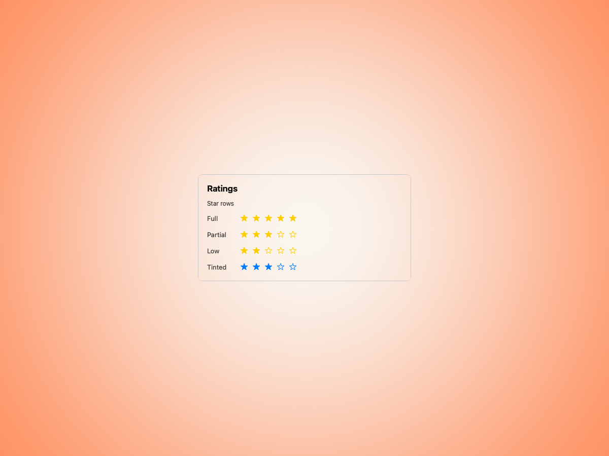
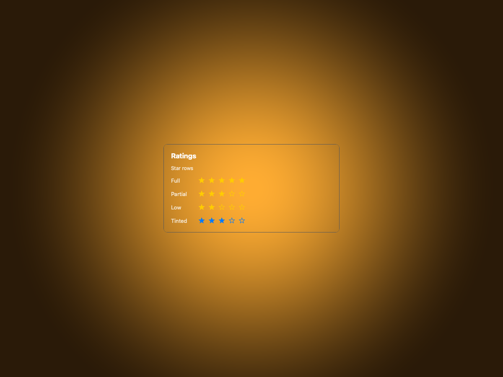
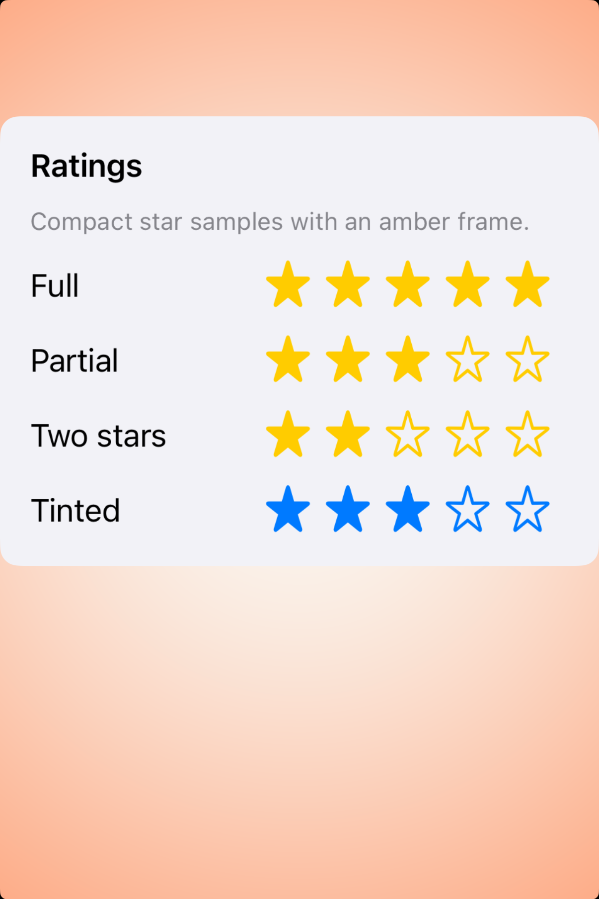
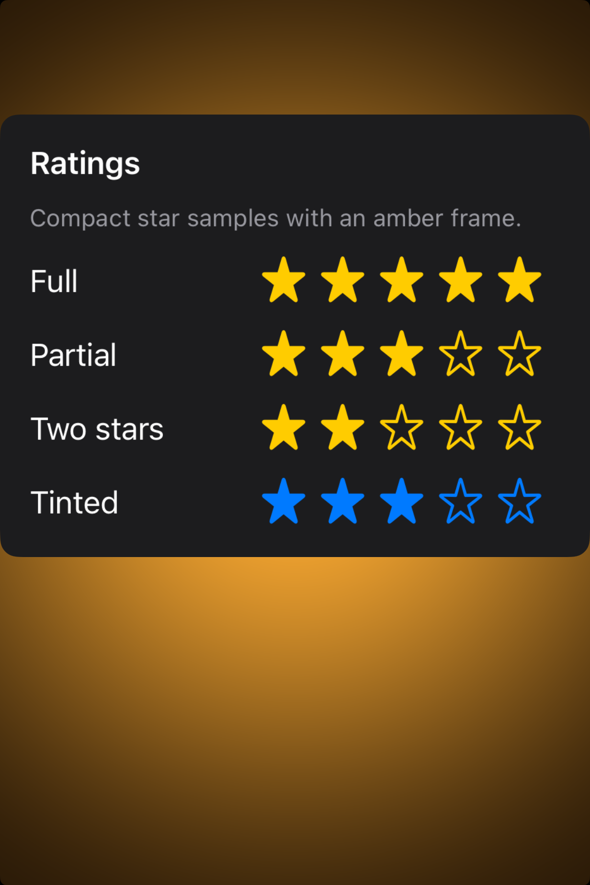

# Rating indicators -- Visual validation

## HIG reference

## Rendered -- macOS (light)

## Rendered -- macOS (dark)

## Rendered -- iOS (light)

## Rendered -- iOS (dark)

## Verdict: PASS_WITH_NOTES

The refreshed study is calmer and more deliberate on both hosts: a compact
centered plate, short row labels, and enough amber breathing room that the star
states read immediately. The anatomy is now clear without feeling like a raw
control dump.

### What improved
- macOS now uses a quieter ambient card with short labels (`Full`, `Partial`,
  `Low`, `Tinted`) and stable row spacing.
- iOS now mirrors that same compact study framing, keeping the synthetic star
  rows visually disciplined instead of loose in the viewport.

### Remaining notes
1. macOS still uses the `NSImageView`/SF Symbol fallback rather than live
   `NSLevelIndicator(style=rating)` in the capture path.
2. iOS remains an idiomatic approximation because HIG does not define a native
   rating-indicator component there.

These are acceptable notes rather than blockers, so the row stays promoted.
