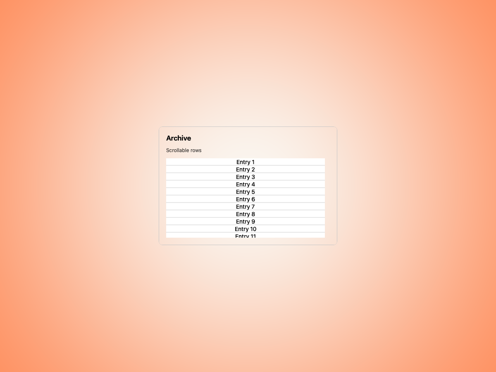
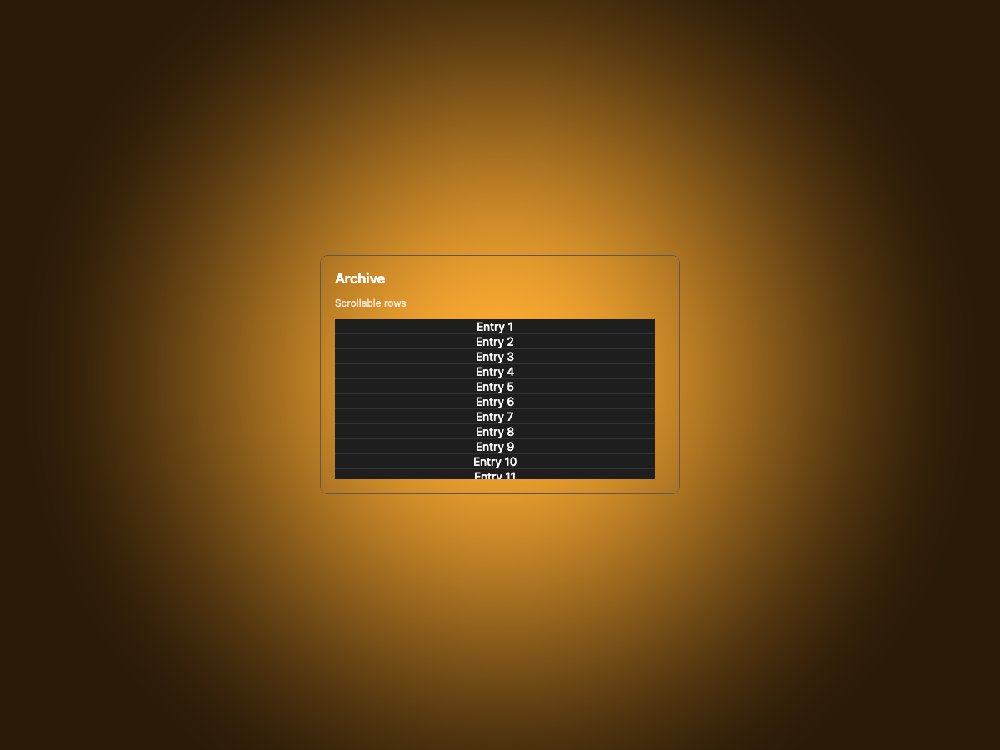
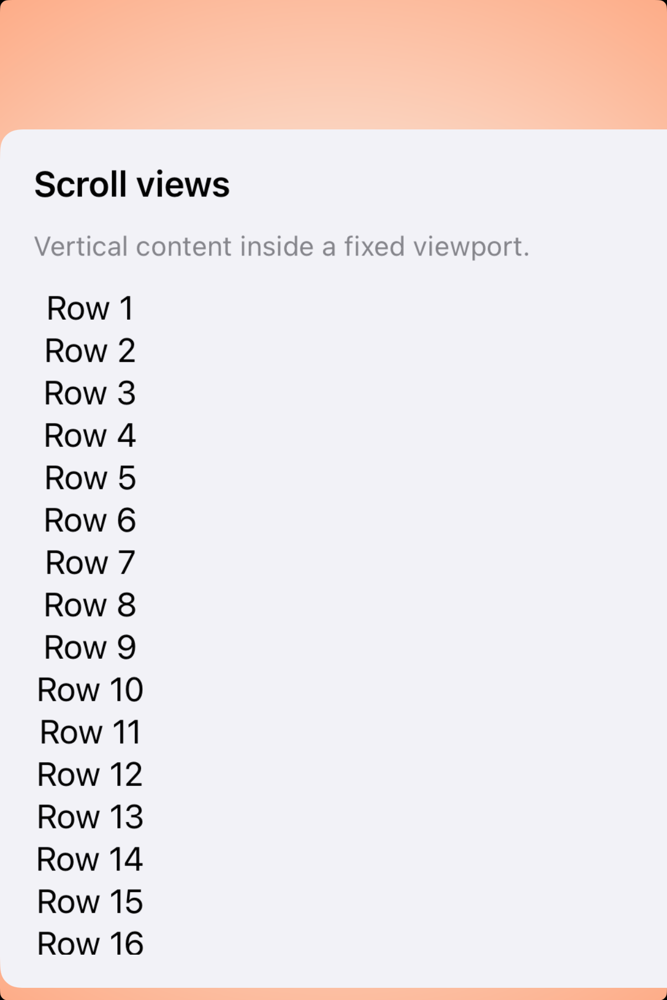
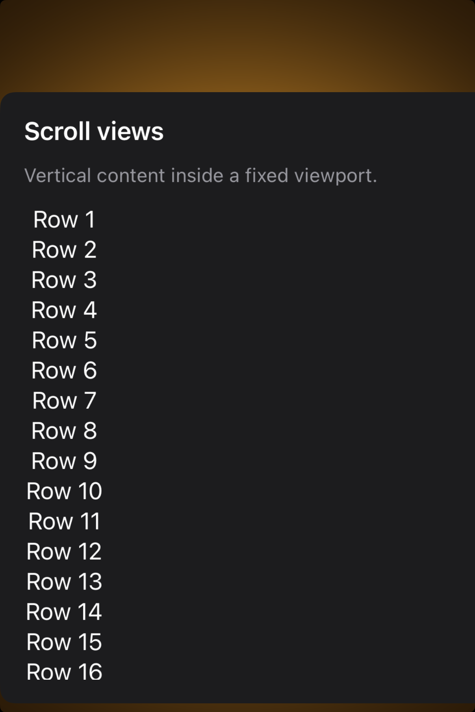

# Scroll views -- Visual validation

## HIG reference

## Rendered -- macOS (light)

## Rendered -- macOS (dark)

## Rendered -- iOS (light)

## Rendered -- iOS (dark)

## Verdict: PASS_WITH_NOTES

This refresh finally makes the scroll-view studies read like intentional
examples instead of generic long lists. Both hosts now place the viewport on a
centered study plate with visible amber gutters, and the iOS capture now shows
content extending beyond the lower edge so the scrolling boundary is apparent.

### What improved
- macOS now uses a compact `Archive` card with a fixed viewport and shorter row
  copy, so the clipped boundary is the focus.
- iOS now uses a longer row set inside the same fixed viewport, which makes the
  overflow visible in the static screenshot instead of implying that everything
  fits.

### Remaining notes
1. Static captures still do not show transient scroll indicators.
2. The study uses simple numbered rows rather than richer mixed content, so it
   demonstrates the container clearly but not the whole expressive range of a
   production scroll view.

Those notes are minor enough to keep the row promoted.
