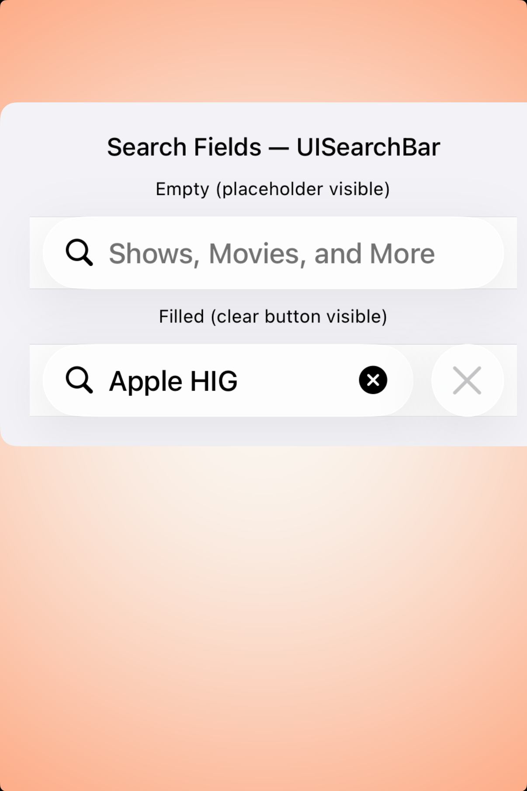

# Search fields — Visual validation

## HIG reference

## Rendered — macOS (light)

## Rendered — macOS (dark)

## Rendered — iOS (light)

## Rendered — iOS (dark)

## Verdict: PASS_WITH_NOTES

macOS now uses a centered study card with visible gutters around the control
pair, which makes spacing and control shape much easier to judge. The row
stays PASS_WITH_NOTES because the iOS capture is still pinned to the leading
edge of the host instead of floating inside a similarly disciplined plate.

### Evidence manifest
- **Manifest:** `../evidence/search-fields.json`
- **Required captures:** PASS — all four files present and > 10 KB.
- **Report links:** PASS — all four appearance-specific screenshot filenames
  linked above.

### Light appearance observations
- macOS: the new card framing gives the search fields room to breathe and
  makes the label-to-control spacing legible at a glance.
- iOS: the search bars themselves render correctly, but the host still crops
  the study too tightly against the leading edge.

### Dark appearance observations
- macOS: the dark study preserves the same centered gutters and reads as a
  compact, self-contained search preview.
- iOS: dark mode remains readable, but the card placement is still more like a
  raw host snapshot than a finished preview.

### Deviations / notes
- macOS framing is now in the right territory; the remaining note is about the
  iOS host composition, not the search-field anatomy itself.
- The row should graduate once the iPhone study gets the same centered gutters
  already used by the stronger maps and video previews.

### Source citations
- Apple HIG — "Search fields" (see `apple-hig/pages/search-fields.md` in the skill corpus).

### Remediation (if NEEDS_WORK)
N/A — notes only.
