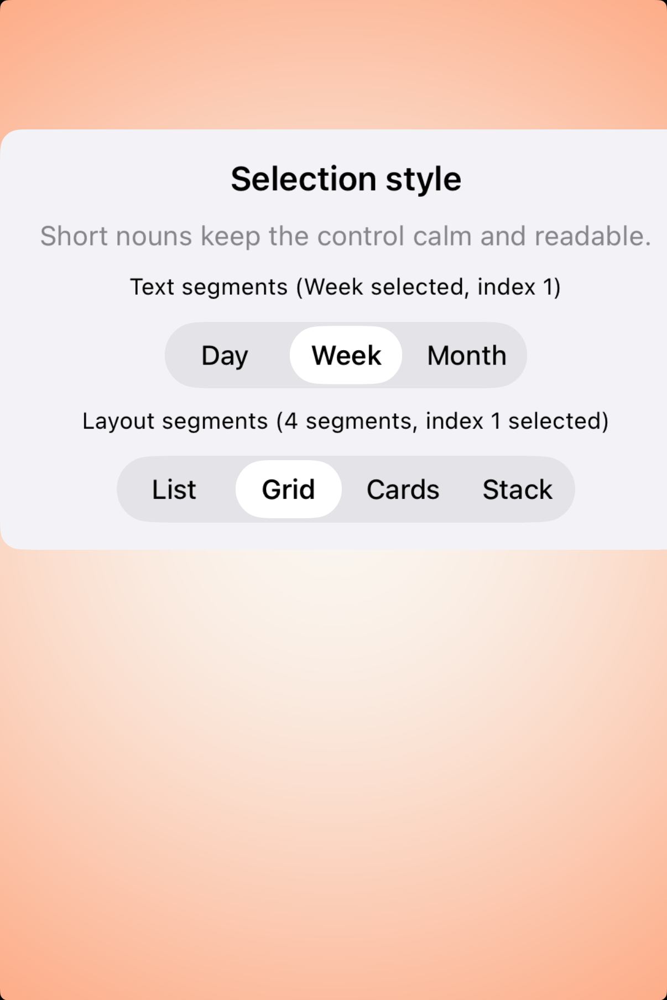

# Segmented controls -- Visual validation

## HIG reference

## Rendered -- macOS (light)

## Rendered -- macOS (dark)

## Rendered -- iOS (light)

## Rendered -- iOS (dark)

## Verdict: PASS_WITH_NOTES

The study is materially better now: both platforms present the control in a
centered, believable card instead of letting it drift or clip at the edge of
the frame. macOS now lives on the same calm ambient plate as the better recent
batches, while iOS still keeps a small notes-only caveat because the icon-style
row is text-backed rather than true SF Symbol imagery.

### Light appearance observations

- macOS light feels balanced and native, with enough surrounding space to make
  the selected segment read immediately.
- iOS light now stays inside the capture frame cleanly and no longer feels like
  the control is being shoved offscreen.

### Dark appearance observations

- macOS dark keeps the selection state clear without overemphasizing the blue
  accent.
- iOS dark preserves legibility and spacing, with the same remaining note about
  text-based icon labels.

### Deviations

1. The icon-oriented variant still uses symbol names as text labels instead of
   real SF Symbol image segments.

### Remediation (if NEEDS_WORK)

N/A -- notes only.
