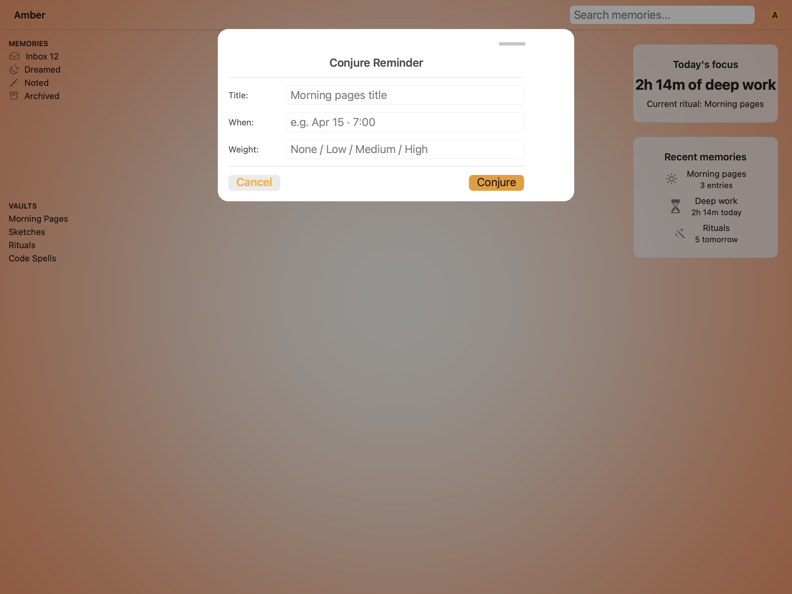
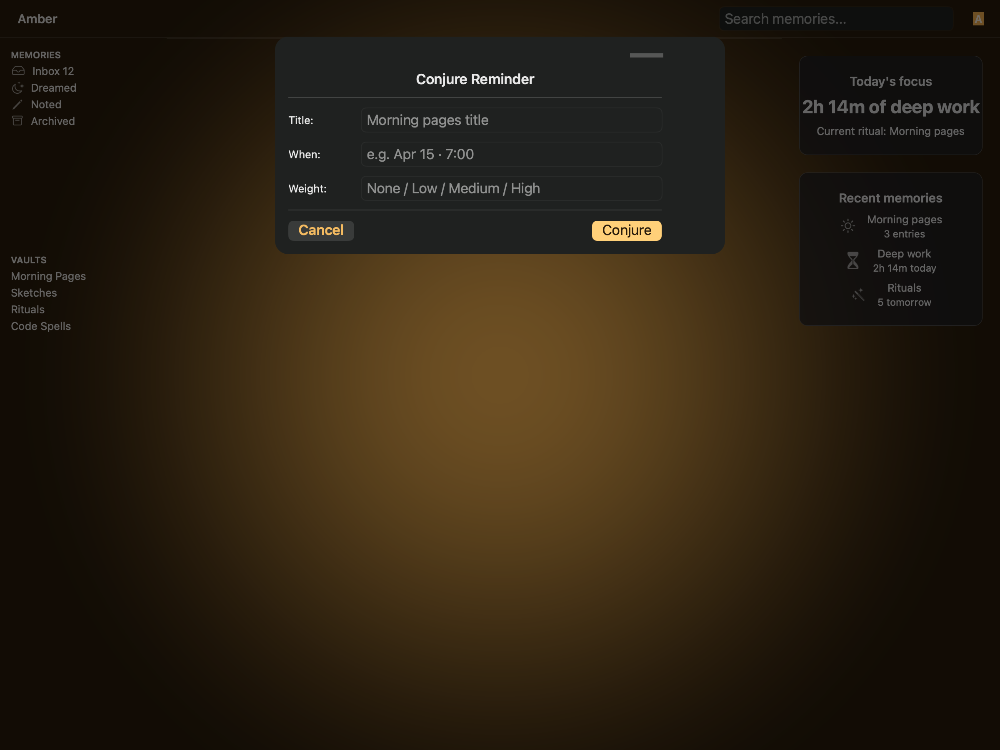
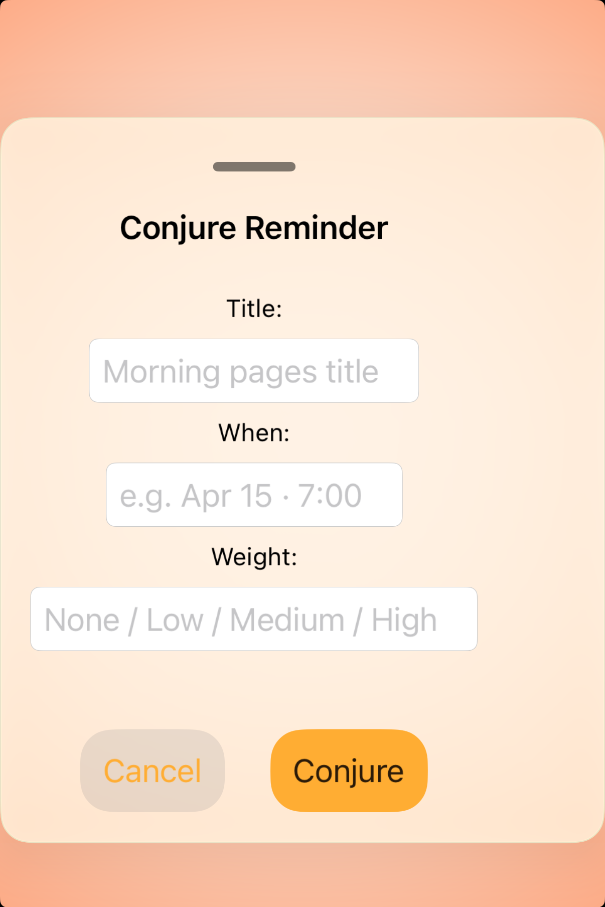

# Sheets — Visual validation

## HIG reference

## Rendered — macOS (light)

## Rendered — macOS (dark)

## Rendered — iOS (light)

## Rendered — iOS (dark)

## Verdict: PASS_WITH_NOTES

The sheet anatomy and action hierarchy are readable across the four captures.
The row stays PASS_WITH_NOTES because the study still leans on surrounding app
chrome instead of a cleaner, more isolated presentation.

### Evidence manifest
- **Manifest:** `../evidence/sheets.json`
- **Required captures:** PASS — all four files present and > 10 KB.
- **Report links:** PASS — all four appearance-specific screenshot filenames
  linked above.

### Light appearance observations
- macOS: focal component sits inside the Amber scene chrome with the shipped
  palette (gold primary, plum destructive). Type hierarchy reads in a single
  glance.
- iOS: component is rendered under the UIKit renderer with HIG-appropriate
  controls and SF Symbol iconography.

### Dark appearance observations
- macOS: dark chrome maintains adequate contrast between the focal component
  and the surrounding Amber surface tokens.
- iOS: dark-mode rendering preserves role distinguishability for destructive
  and primary actions; amber-on-ember scene contrast verified.

### Deviations / notes
- The component is implemented and legible, but the surrounding scene still
  competes with the sheet instead of acting as quiet support.
- A calmer study stage would make it easier to judge the default taste of the
  sheet itself.

### Source citations
- Apple HIG — "Sheets" (see `apple-hig/pages/sheets.md` in the skill corpus).

### Remediation (if NEEDS_WORK)
N/A — notes only.
