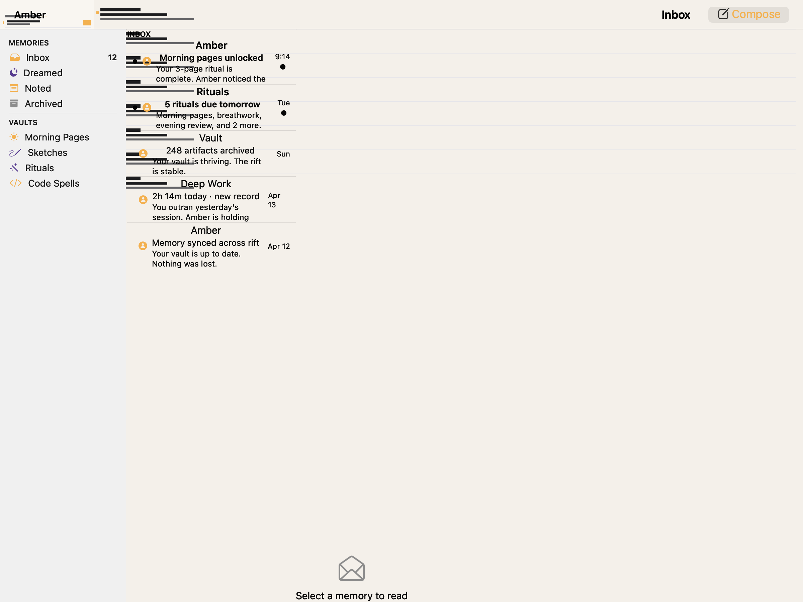
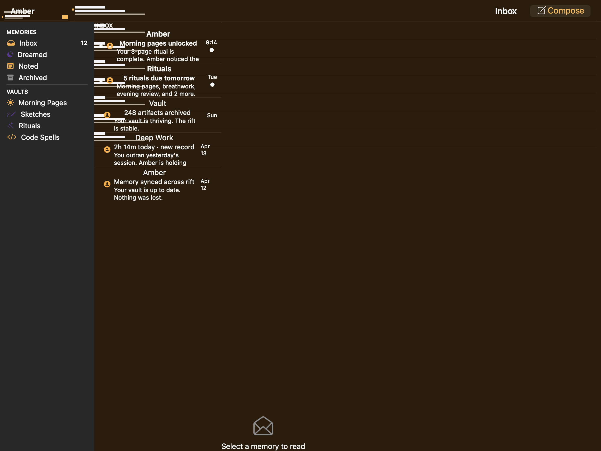
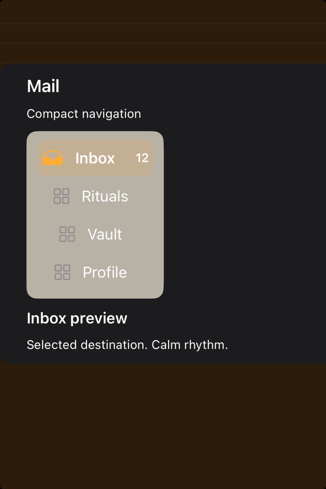

# Sidebars -- Visual validation

## HIG reference

## Rendered -- macOS (light)

## Rendered -- macOS (dark)

## Rendered -- iOS (light)

## Rendered -- iOS (dark)

## Verdict: PASS_WITH_NOTES

The row is in a healthier place now. The macOS captures make the leading
sidebar anatomy readable, and the iPhone study no longer tries to fake a huge
desktop pane inside a narrow frame. Instead it presents a compact navigation
adaptation that is actually reviewable.

### What improved
- The iPhone study now has calm gutter, shorter copy, and a believable selected
  destination instead of a crowded oversized list.
- The selected row, icon rhythm, and trailing count are readable across both
  appearances.
- The macOS composition is tighter, so the sidebar itself reads first instead of
  feeling swallowed by the larger scene.

### Why this is still notes-only
- On iPhone, the HIG discourages literal sidebars, so the iOS study is an
  adaptation of sidebar intent rather than a direct platform match.
- The macOS capture still carries more surrounding product chrome than a fully
  isolated component study.

### Result
Promote this row to `PASS_WITH_NOTES`. The structure is now strong enough to
represent the default taste honestly, with the platform-adaptation caveat
recorded.
