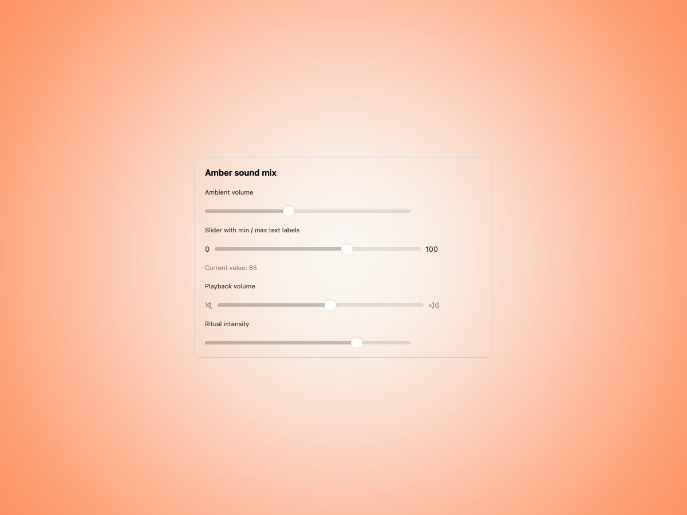
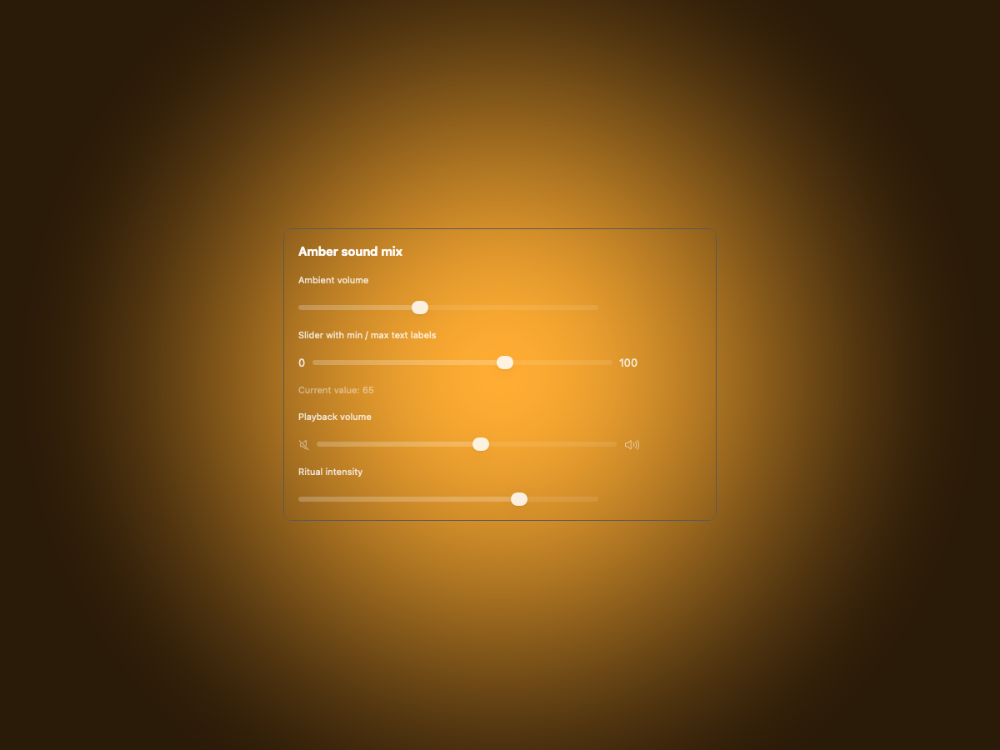
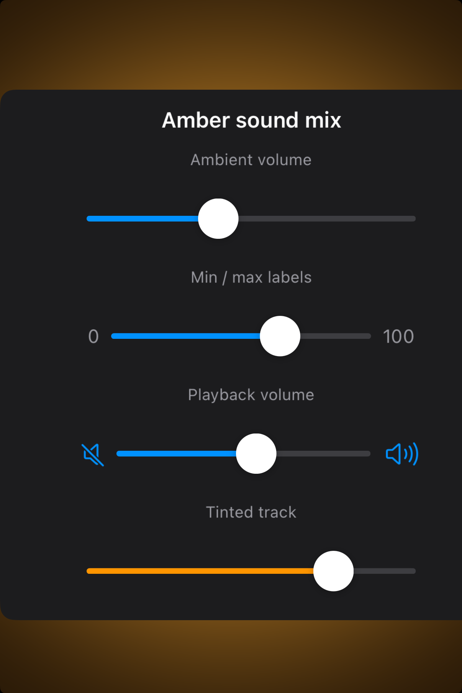

# Sliders — Visual validation

## HIG reference

## Rendered — macOS (light)

## Rendered — macOS (dark)

## Rendered — iOS (light)

## Rendered — iOS (dark)

## Verdict: PASS_WITH_NOTES

The slider row is materially better now. The UIKit renderer fix means the
captured surface finally respects the slider view’s width constraints, so the
tracks no longer spill off the right edge of the frame. The row stays at
PASS_WITH_NOTES because the iPhone study is still a dense four-variant plate,
which makes the typography quieter than ideal in order to fit everything in.

### Evidence manifest
- **Manifest:** `../evidence/sliders.json`
- **Required captures:** PASS — all four files present and > 10 KB.
- **Report links:** PASS — all four appearance-specific screenshot filenames
  linked above.

### Light appearance observations
- macOS: the slider family remains readable inside the centered Amber study
  plate with adequate breathing room.
- iOS: all four variants now stay in frame horizontally, with min/max labels
  and SF Symbol endpoints reading cleanly.

### Dark appearance observations
- macOS: the dark study preserves contrast and the focused plate keeps the
  control family easy to scan.
- iOS: dark mode now shows the full slider anatomy without the earlier
  right-edge clipping, including the tinted final track.

### Deviations / notes
- The iPhone preview still packs four variants into one card, so copy and
  spacing are more compressed than the stronger recent one-component studies.
- The renderer fix solved the structural sizing bug; remaining polish is
  compositional rather than functional.

### Source citations
- Apple HIG — "Sliders" (see `apple-hig/pages/sliders.md` in the skill corpus).

### Remediation (if NEEDS_WORK)
N/A — notes only.
