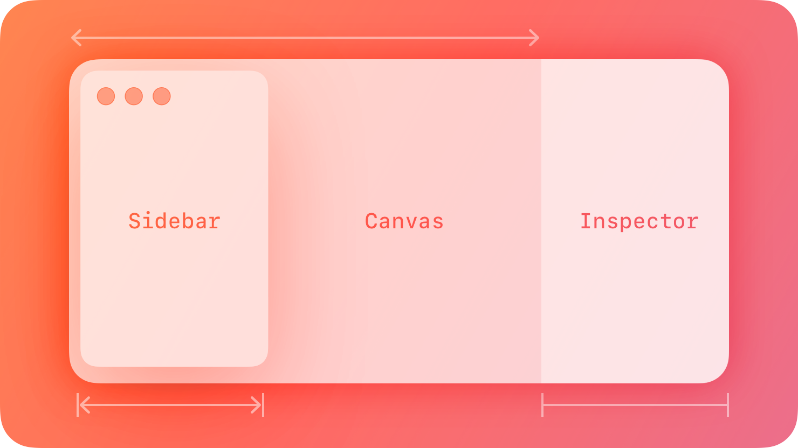
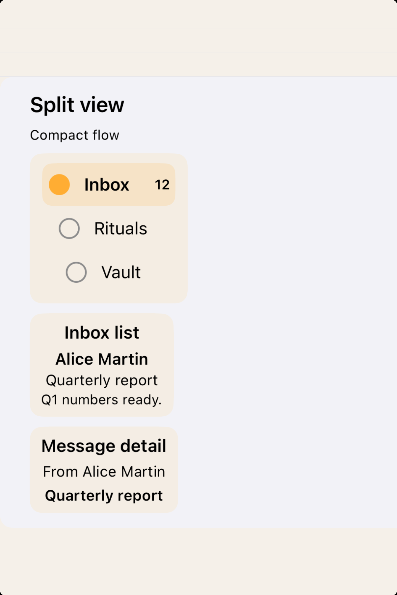
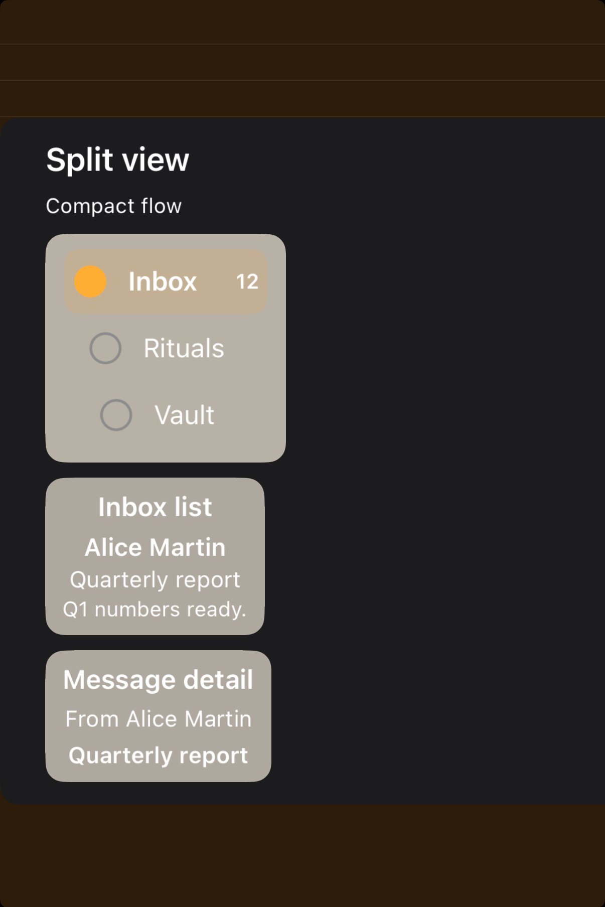

# Split views -- Visual validation

## HIG reference

## Rendered -- macOS (light)

## Rendered -- macOS (dark)

## Rendered -- iOS (light)

## Rendered -- iOS (dark)

## Verdict: PASS_WITH_NOTES

This now reads as a real split-view study instead of a broken compact-width
capture. The macOS side shows the pane relationship clearly, and the iPhone
study now explains compact collapse with intentional stacked surfaces instead of
letting content drift off-screen.

### What improved
- The iOS compact-flow study now fits fully inside the frame and keeps sidebar,
  list, and detail roles legible.
- macOS keeps the pane structure and divider story visible without as much noisy
  copy fighting the layout.
- Both platforms now communicate hierarchy of panes at a glance instead of
  relying on the reviewer to infer it from broken positioning.

### Why this is still notes-only
- The iPhone study is a compact adaptation, not a literal live regular-width
  split-view presentation.
- The macOS scene still leans product-like rather than fully isolated, so there
  is room to make the structural anatomy even cleaner later.

### Result
Promote this row to `PASS_WITH_NOTES`. The default composition is now stable and
honest enough to count as part of the library’s baseline taste.
