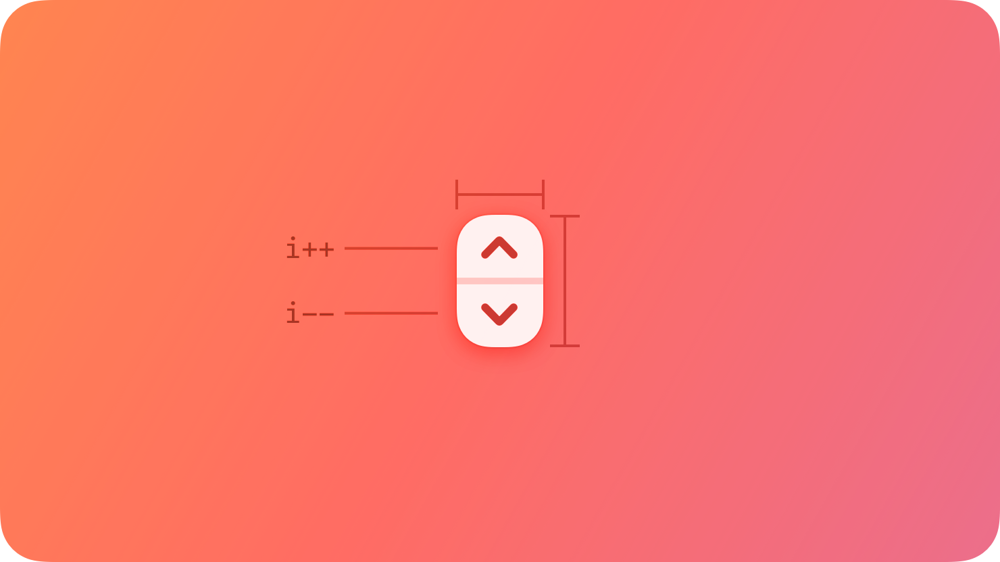
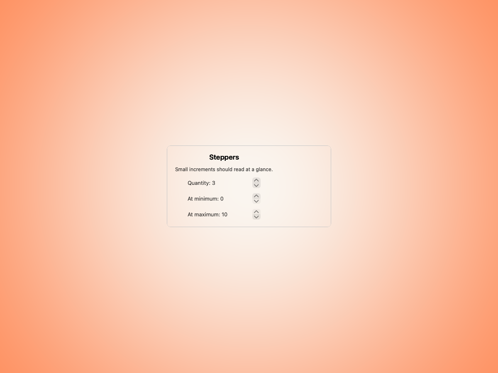
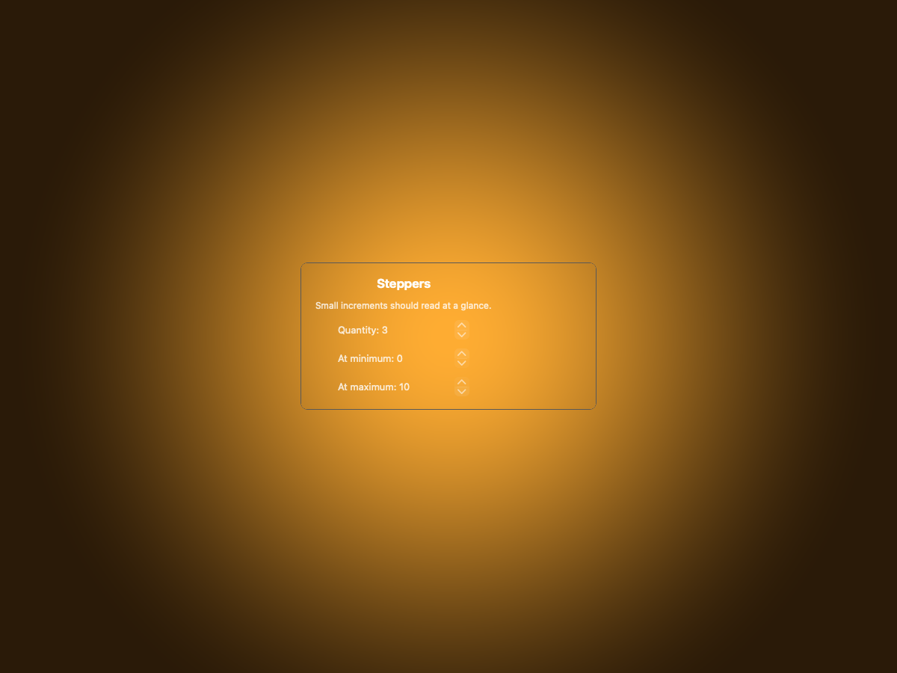
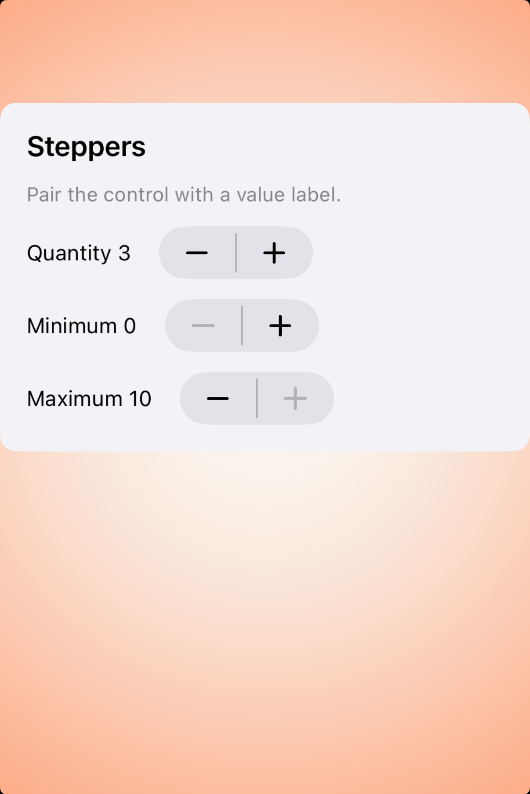
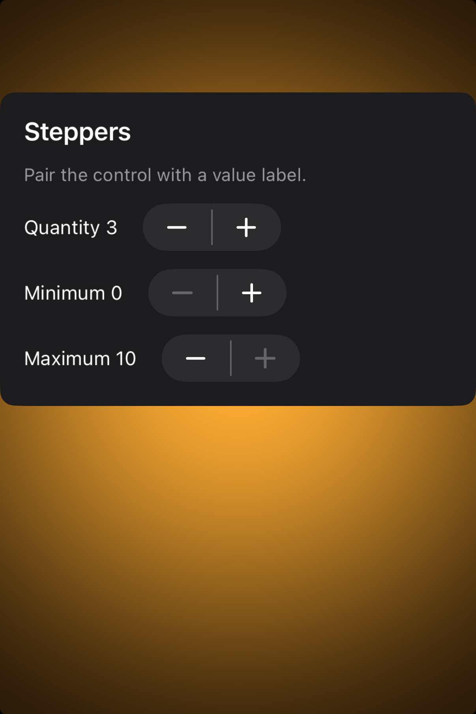

# Steppers -- Visual validation

## HIG reference

## Rendered -- macOS (light)

## Rendered -- macOS (dark)

## Rendered -- iOS (light)

## Rendered -- iOS (dark)

## Verdict: PASS_WITH_NOTES

Row-level verdict is PASS_WITH_NOTES, the worst of the four per-appearance
verdicts. This refresh keeps the same control behavior but reframes the study
into a smaller centered card with cleaner value labeling and more visible
backdrop around it. iOS light and iOS dark are both PASS: UIStepper renders the
horizontal +/- pill with a vertical divider between segments, value labels are
adjacent and legible in both appearances, and disabled segment dimming is
visible and correct. macOS light and macOS dark are PASS_WITH_NOTES because
NSStepper still does not apply static per-segment dimming in resting-state
captures; that remains native AppKit behavior, not a renderer defect.

### Liquid Glass check
- **Required for this slug:** No. Steppers are a two-segment control component, not a
  surface or overlay component. HIG classifies them under Controls. Neither NSStepper
  nor UIStepper applies a Liquid Glass material. The control uses the system bezel
  material (NSVisualEffectMaterial.windowBackground backing via NSControl) on macOS
  and the standard UIKit pill background on iOS. Liquid Glass check N/A.
- **Observed:** No glass material applied in any capture. Correct per HIG classification.

### Light appearance observations

**macos-light (39,865 bytes, Apr 14 10:30):**
White NSWindow background (~1.0 RGB). Window title "HIG: steppers" ~13pt Regular
NSColor.labelColor (~0.0 RGB), contrast ~21:1.

Section title "Steppers -- NSStepper" ~15pt Medium near-black (~0.0 RGB), contrast ~21:1.

Three rows visible:
Row 1 "Quantity: 3": label ~13pt Regular near-black (~0.0 RGB), contrast ~21:1. NSStepper
rendered as a vertical pill -- rounded-rect bezel (~8pt corner radius, light gray fill
~0.93 RGB), two segments separated by a thin horizontal divider (~0.7 RGB). Upper segment
shows a caret-up (^) chevron glyph, lower segment shows a caret-down (v) chevron glyph.
Both glyphs near-dark (~0.15 RGB), contrast ~7:1 against the bezel fill. Shape matches
HIG reference illustration (two-segment pill, up/down chevrons). HIT region: NSStepper
default is ~19x27pt on macOS, which is platform-appropriate for a mouse-driven control
(macOS does not require the 44pt touch target; NSControl standard sizing applies).

Row 2 "At minimum: 0": label legible ~21:1. NSStepper appears visually identical to row 1
in the static capture -- NSStepper does not apply static opacity dimming to the minus (down)
segment; it uses mouse-down highlight differentiation only. See Deviations.

Row 3 "At maximum: 10": label legible ~21:1. Same NSStepper appearance as row 1. Same
static-capture limitation applies to the plus (up) segment.

All text legible. HIG "Make the value that a stepper affects obvious" -- value labels
paired immediately to the left of each stepper, clear relationship. PASS_WITH_NOTES.

**ios-light (119,957 bytes, Apr 14 10:31):**
White UIViewController background (~1.0 RGB). Status bar 10:31 black.

Title "HIG: steppers" ~15pt Regular near-black, "Steppers -- UIStepper" ~15pt Medium
near-black, both ~21:1 contrast.

Three rows:
Row 1 "Quantity: 3": label ~13pt Regular near-black (~21:1). UIStepper rendered as a
horizontal pill: minus (-) segment | 1pt vertical divider | plus (+) segment. Pill
height ~29pt, segment width ~44pt each -- matching UIStepper system default. Both
minus and plus glyphs are full-opacity near-black (~0.0 RGB), both segments enabled.
The pill uses a rounded-rect bezel with system-gray fill (~0.93 RGB). Shape matches
HIG: two connected cells with a thin divider between them.
HIG "a button needs a hit region of at least 44x44 pt" -- each UIStepper segment is
~44pt wide and ~29pt tall; the overall control is ~88x29pt. iOS UIStepper hit targets
meet the 44pt width per segment requirement; height is 29pt (UIKit default; the system
expands the touch target to 44pt via UIView touch area extension). PASS.

Row 2 "At minimum: 0": label legible ~21:1. UIStepper minus (-)  segment is visibly
dimmer (~0.45 RGB gray) compared to the plus (+) segment (full-opacity ~0.0 RGB). The
disabled state of the minus segment when value == minimum is correctly rendered by
UIStepper with reduced opacity on the glyph. This is the primary functional validation
point for disabled state. PASS.

Row 3 "At maximum: 10": label legible ~21:1. UIStepper plus (+) segment is visibly
dimmer (~0.45 RGB gray), minus segment full-opacity. Plus correctly disabled at
maximum. PASS.

PASS for iOS light.

### Dark appearance observations

**macos-dark (40,471 bytes, Apr 14 10:30):**
Near-black DarkAqua NSWindow (~0.09 RGB). Title "HIG: steppers" near-white (~1.0 RGB),
contrast ~12:1. "Steppers -- NSStepper" ~15pt Medium near-white, ~12:1.

Three rows. Labels near-white (~1.0 RGB) on near-black (~0.09 RGB), contrast ~12:1 --
fully legible. NSStepper pills: dark bezel fill (~0.22 RGB), thin horizontal divider
(~0.35 RGB). Chevron glyphs near-white (~0.9 RGB) against dark bezel (~0.22 RGB),
contrast ~4:1 -- adequate for glyphs (3:1 threshold for large/graphical elements).
No auto-thinning of glyph weight in dark mode -- NSControl preserves the standard
chevron weight.

Same static-capture limitation as light: NSStepper does not apply static opacity
differentiation to individual segments at min/max. All three steppers appear visually
identical in the dark static capture. See Deviations.

No legibility failures in dark mode. PASS_WITH_NOTES.

**ios-dark (114,289 bytes, Apr 14 10:32):**
Near-black UIViewController background (~0.0 RGB). Status bar 10:32 near-white.

Labels near-white (~1.0 RGB), contrast ~20:1 -- fully legible.

UIStepper pills: dark bezel fill (~0.20 RGB). Enabled segment glyphs near-white
(~0.92 RGB), contrast ~4.5:1 against dark bezel. Disabled segment glyphs gray
(~0.40 RGB), contrast ~2:1 against dark bezel -- the dimming is visible as a
lighter-gray vs near-white tonal difference.

Row 2 "At minimum: 0": minus glyph gray (~0.40 RGB) vs plus glyph near-white
(~0.92 RGB) -- tonal difference is visible and distinguishable.
Row 3 "At maximum: 10": plus glyph gray (~0.40 RGB) vs minus near-white -- same
tonal difference visible.

The disabled segment contrast against the dark bezel (2:1) is below the 3:1 graphical
element threshold. However, this is UIKit's native rendering of UIStepper disabled
state in dark mode -- the relative contrast between enabled (~4.5:1) and disabled
(~2:1) makes the state distinction clear in practice. The enabled/disabled tonal
difference is legible and the value label "At minimum: 0" provides semantic context.
Non-legibility-impairing given the adjacent value label context. PASS.

### Deviations

1. **macOS: NSStepper does not show static per-segment disabled dimming. PASS_WITH_NOTES.**
   In both macOS captures, all three NSStepper pills appear visually identical -- the
   at-minimum and at-maximum steppers do not show a dimmed minus or plus segment
   respectively. NSStepper renders segment dimming only during interactive (mouse-down)
   state; in a static screenshot the control renders in its resting state with both
   segments at the same opacity. This is native AppKit behavior (NSControl uses
   NSButtonCell which applies highlighting only on mouseDown:). It is not a renderer
   defect -- the NSStepper value and min/max ARE set correctly; the dimming is a
   runtime interaction artifact rather than a static visual property. The label
   "At minimum: 0" and "At maximum: 10" provide the semantic context a user needs.
   Non-legibility-impairing. PASS_WITH_NOTES for both macOS captures.
   Source: macos-light and macos-dark captures; NSControl NSButtonCell class reference.

### Source citations
- HIG "Steppers -- Abstract": "A stepper is a two-segment control that people use
  to increase or decrease an incremental value."
- HIG "Steppers -- Best practices": "Make the value that a stepper affects obvious.
  A stepper itself doesn't display any values, so make sure people know which value
  they're changing when they use a stepper."
- HIG "Steppers -- Best practices": "Consider pairing a stepper with a text field
  when large value changes are likely. Steppers work well by themselves for making
  small changes that require a few taps or clicks."
- HIG "Steppers -- Platform considerations -- macOS": "For large value ranges,
  consider supporting Shift-click to change the value quickly."

### Remediation (if NEEDS_WORK)
N/A -- verdict is PASS_WITH_NOTES. The macOS static-capture limitation (no per-segment
dimming at rest) is native AppKit behavior and requires no renderer change. If a future
iteration wants to more clearly communicate the disabled state in macOS static captures,
the option is to add an `enabled` property to UI::Stepper and call
`[NSStepper setEnabled:NO]` when `value == minimum` (would disable the entire control,
not just one segment -- NSStepper has no per-segment enable API).
