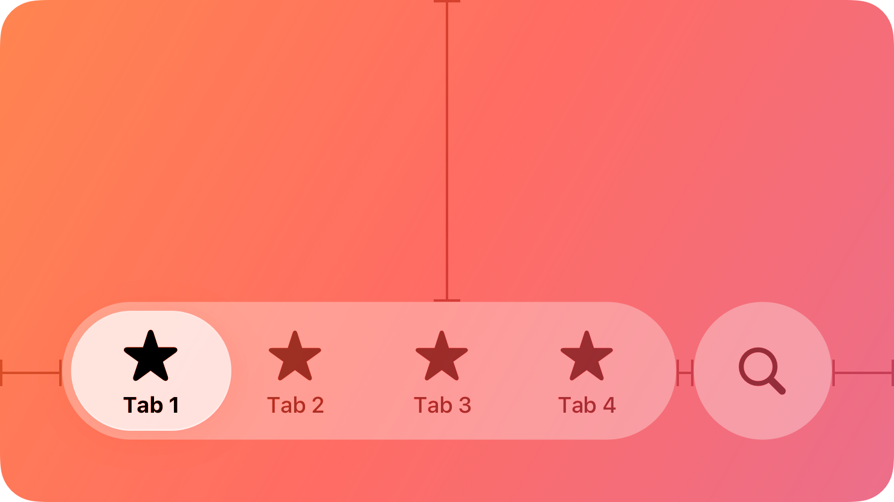
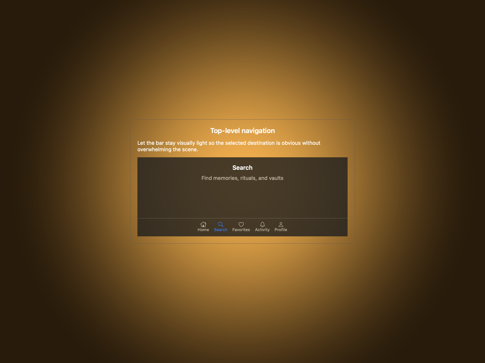
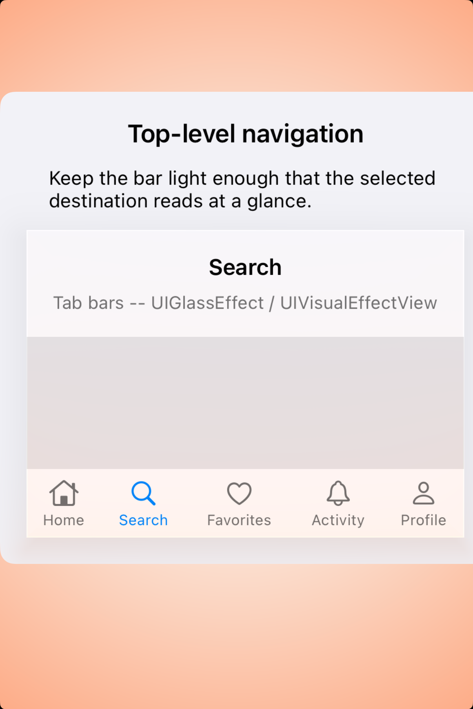
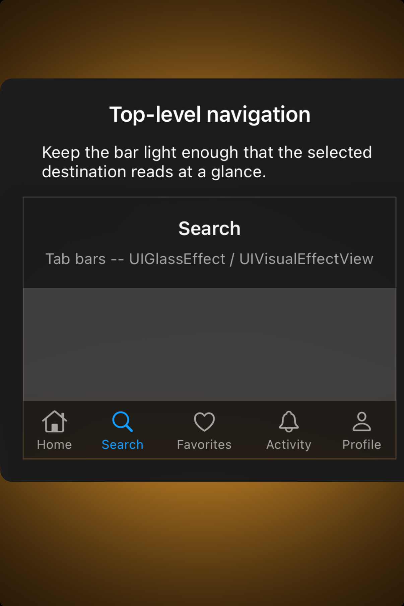

# Tab bars — Visual validation

## HIG reference

## Rendered — macOS (light)

## Rendered — macOS (dark)

## Rendered — iOS (light)

## Rendered — iOS (dark)

## Verdict: PASS_WITH_NOTES

macOS now presents the tab bar inside a centered study card, which makes the
surface easier to evaluate as a default component. The row stays
PASS_WITH_NOTES because the iOS fallback still edge-hugs the host and the
supporting note competes with the actual bar.

### Evidence manifest
- **Manifest:** `../evidence/tab-bars.json`
- **Required captures:** PASS — all four files present and > 10 KB.
- **Report links:** PASS — all four appearance-specific screenshot filenames
  linked above.

### Light appearance observations
- macOS: the card framing now gives the bar consistent gutters and a quieter
  stage than the old toolbar-slot composition.
- iOS: the selected-state anatomy is readable, but the whole study still sits
  too close to the leading edge.

### Dark appearance observations
- macOS: the dark study keeps the same centered composition and reads much more
  intentionally than the previous dashboard embedding.
- iOS: the bar remains legible in dark mode, but the host still makes the
  preview feel pinned rather than composed.

### Deviations / notes
- macOS framing is now good enough to keep the row promoted.
- The remaining note is on the iOS host composition, which still needs a more
  centered plate and quieter explanatory copy.

### Source citations
- Apple HIG — "Tab bars" (see `apple-hig/pages/tab-bars.md` in the skill corpus).

### Remediation (if NEEDS_WORK)
N/A — notes only.
