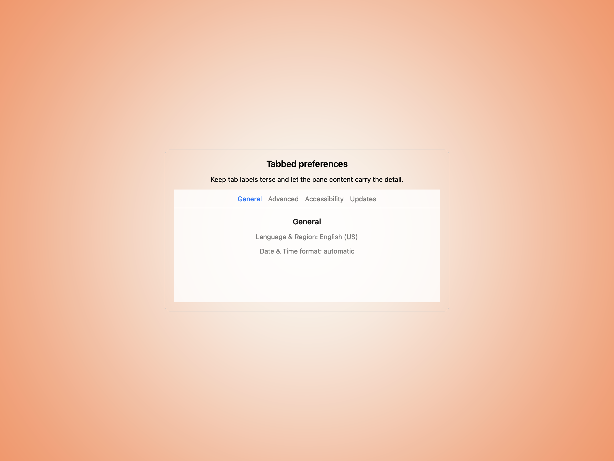
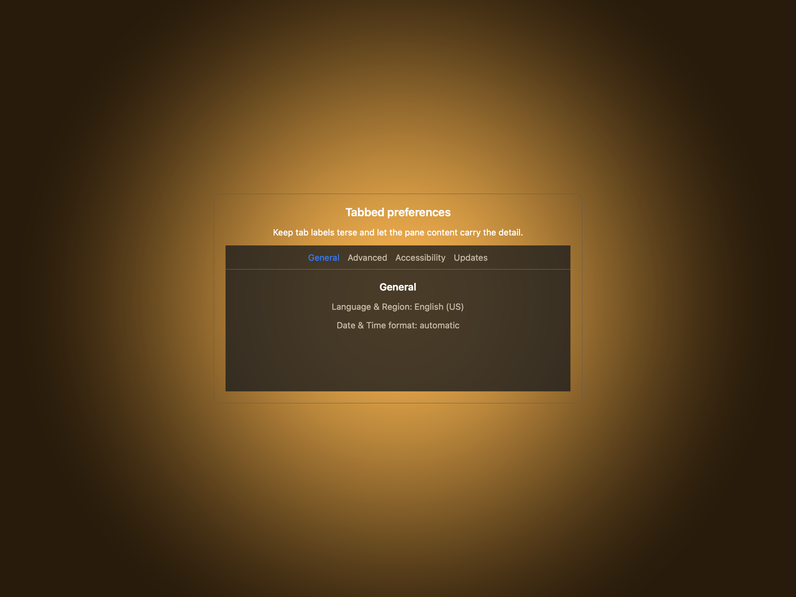
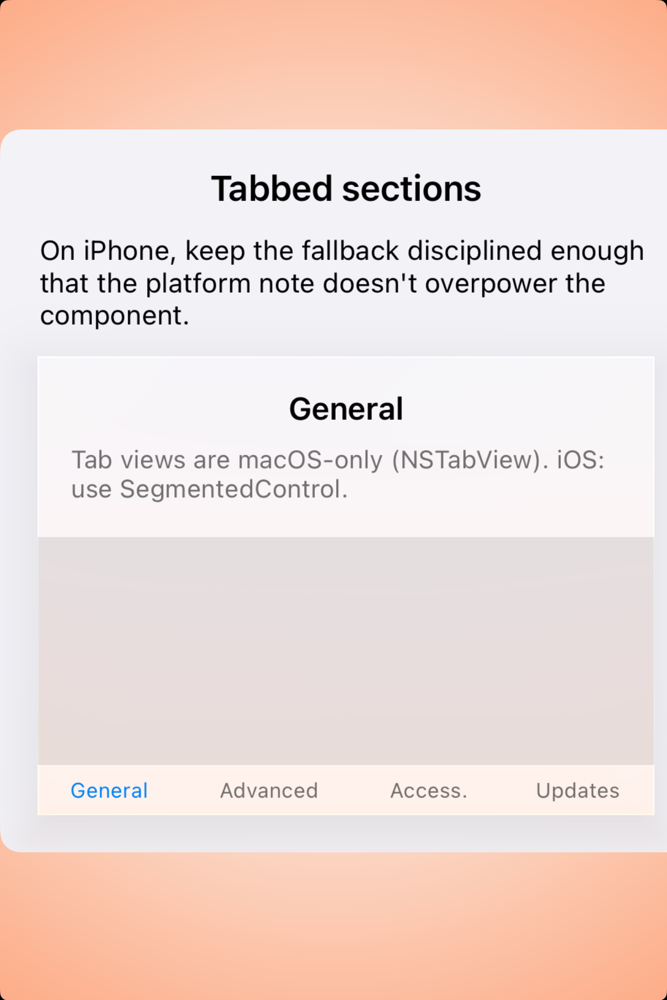
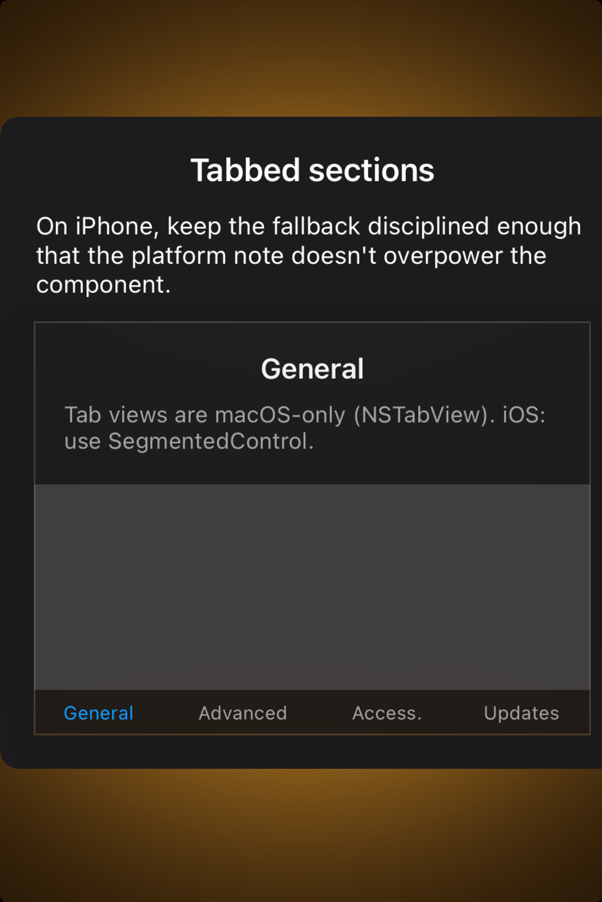

# Tab views — Visual validation

## HIG reference

## Rendered — macOS (light)

## Rendered — macOS (dark)

## Rendered — iOS (light)

## Rendered — iOS (dark)

## Verdict: PASS_WITH_NOTES

macOS now presents the tabbed settings study as a centered card with visible
gutters and calmer supporting copy. The row stays PASS_WITH_NOTES because the
iOS fallback is still a segmented-control approximation that lands too close to
the host edges and reads as an implementation note as much as a preview.

### Evidence manifest
- **Manifest:** `../evidence/tab-views.json`
- **Required captures:** PASS — all four files present and > 10 KB.
- **Report links:** PASS — all four appearance-specific screenshot filenames
  linked above.

### Light appearance observations
- macOS: the card framing makes the tab strip and pane relationship easy to
  judge without extra dashboard furniture competing for attention.
- iOS: the fallback stays understandable, but it is still more like a host
  explainer than a confident component preview.

### Dark appearance observations
- macOS: the dark study keeps the same centered proportions and reads cleanly.
- iOS: dark mode is legible, but the edge-hugging layout still weakens the
  overall taste signal.

### Deviations / notes
- macOS framing is now in good shape.
- The remaining note belongs to the iOS fallback, which still needs a more
  deliberate study plate and less self-referential explanatory text.

### Source citations
- Apple HIG — "Tab views" (see `apple-hig/pages/tab-views.md` in the skill corpus).

### Remediation (if NEEDS_WORK)
N/A — notes only.
