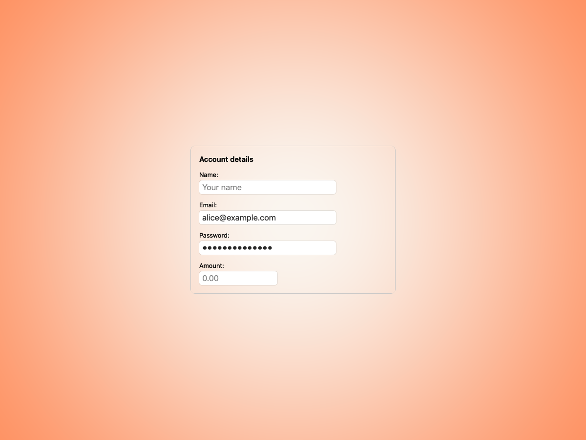
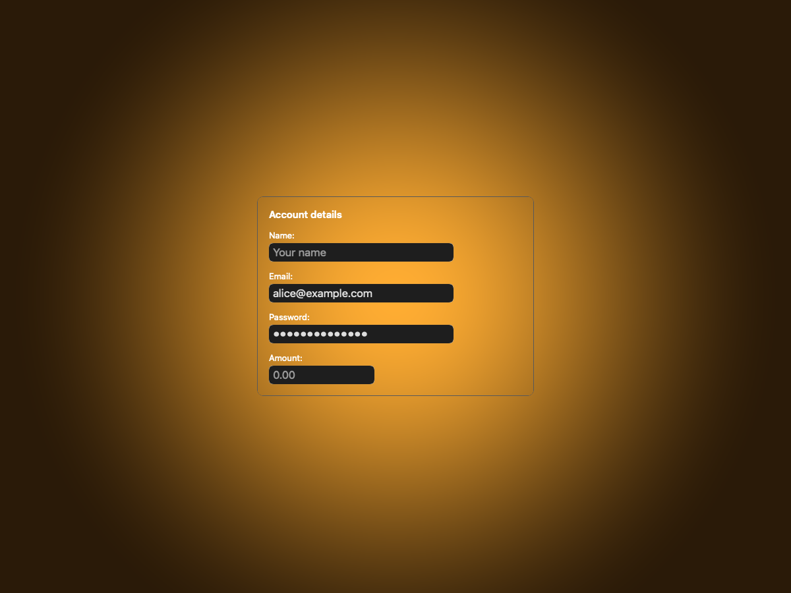
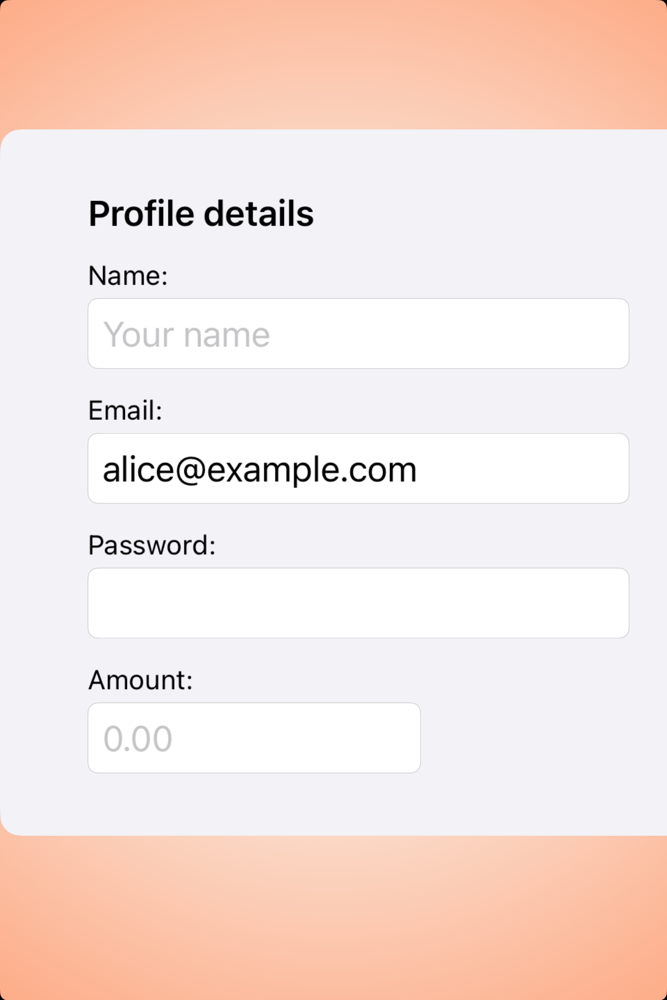
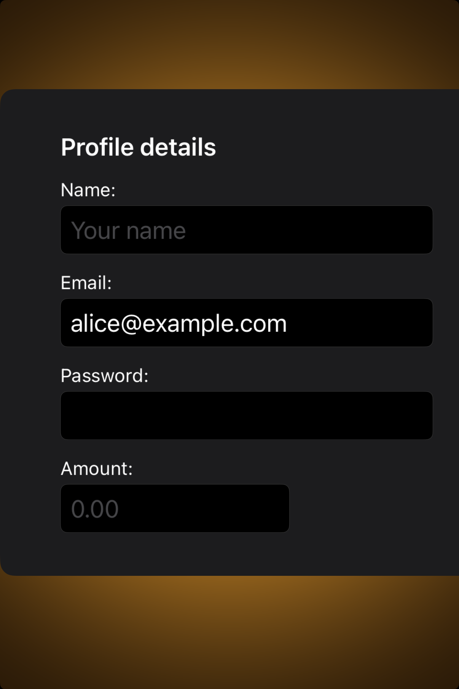

# Text fields -- Visual validation

## HIG reference

## Rendered -- macOS (light)

## Rendered -- macOS (dark)

## Rendered -- iOS (light)

## Rendered -- iOS (dark)

## Verdict: PASS_WITH_NOTES

The form study is clean and current. It now has the right amount of surrounding gutter,
the fields line up well, and the layout reads like a deliberate default rather than a
rushed demo.

### What improved
- Both platforms keep enough gutter for the form to breathe.
- Labels and field widths are aligned in a way that feels intentional.
- Light and dark appearances are both easy to scan.

### Why this is still notes-only
- The iOS secure field still reads as empty in the static screenshot, which is a
  capture limitation rather than a layout problem.
- The study is good, but it still sits a touch closer to a curated sample than a full
  production form surface.

### Result
This is a solid baseline and should remain `PASS_WITH_NOTES` until the host can present
secure-field state and surrounding form chrome more naturally in capture.
