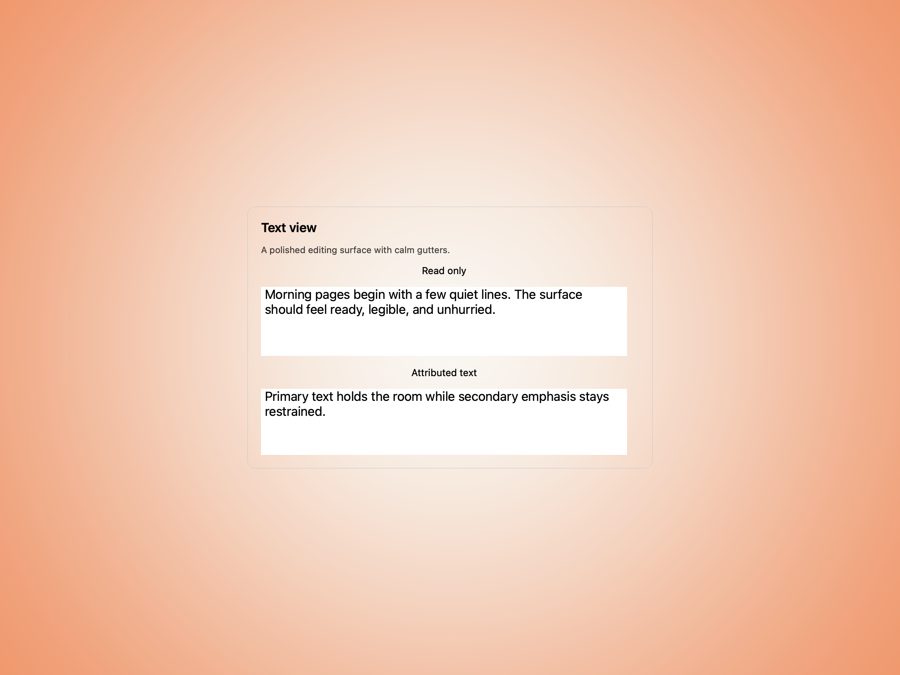
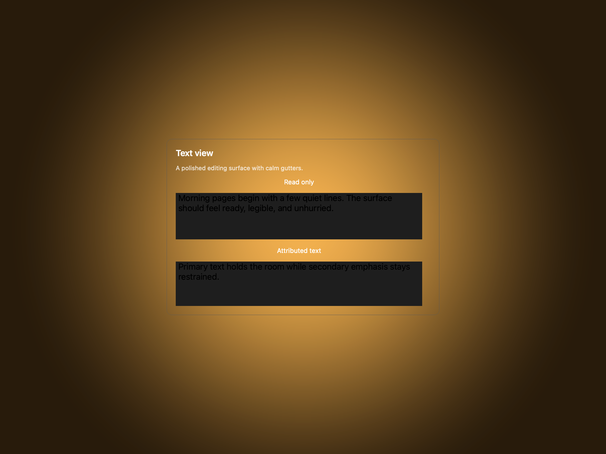
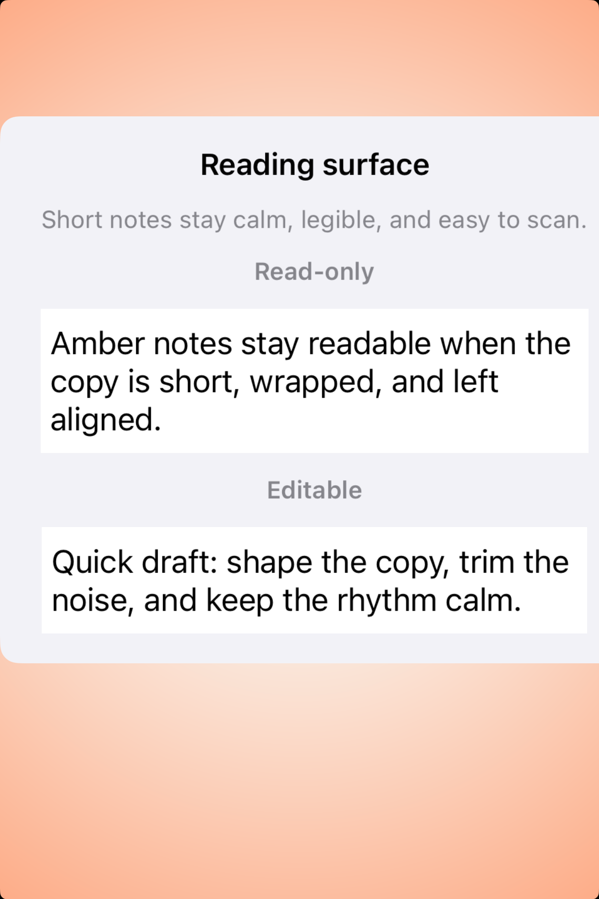
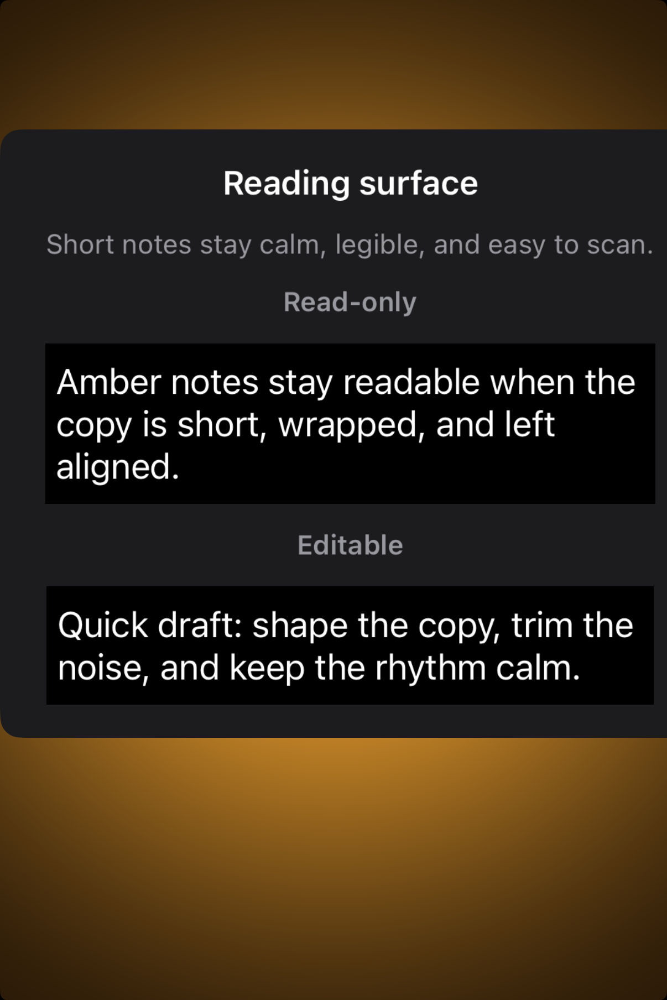

# Text views -- Visual validation

## HIG reference

## Rendered -- macOS (light)

## Rendered -- macOS (dark)

## Rendered -- iOS (light)

## Rendered -- iOS (dark)

## Verdict: PASS_WITH_NOTES

This batch fixed the one thing that would have made the row hard to trust:
macOS once again shows actual text content instead of a near-empty shell, and
iOS keeps the reading surface compact and legible inside the card.

### What improved
- macOS now renders both text surfaces with visible content and calm spacing.
- iOS presents a clean two-state study instead of a tall, half-clipped demo.
- Both platforms read like native editing surfaces rather than debug captures.

### Why this is still notes-only
- The study is intentionally simplified: it validates the default surface,
  spacing, and legibility, not a full editing workflow with selection chrome.
- The iOS sample uses a compact read/edit presentation rather than a richer
  document-style composition.

### Result
Promote this row to `PASS_WITH_NOTES`. The default text-view surface now feels
clean and dependable on both platforms.
