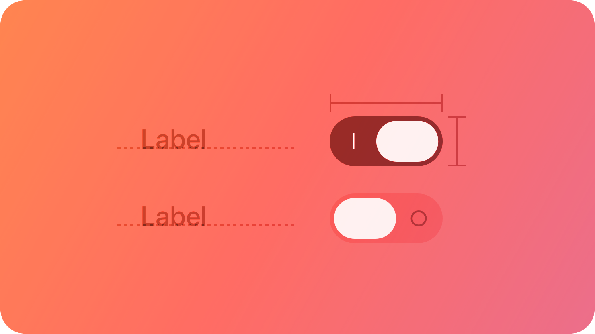
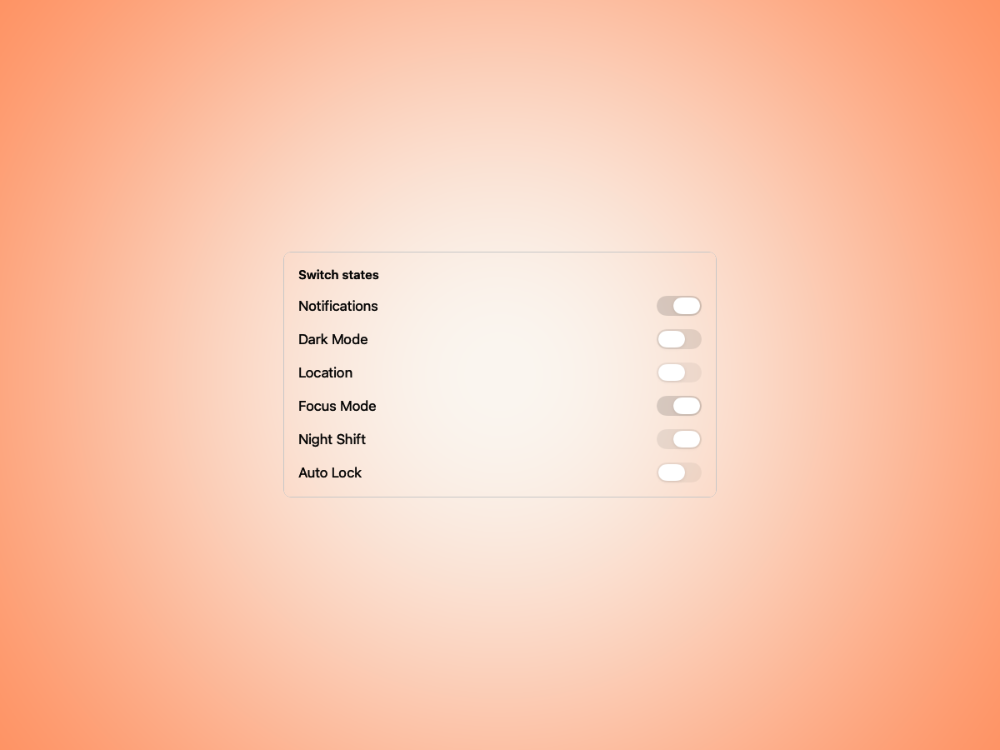
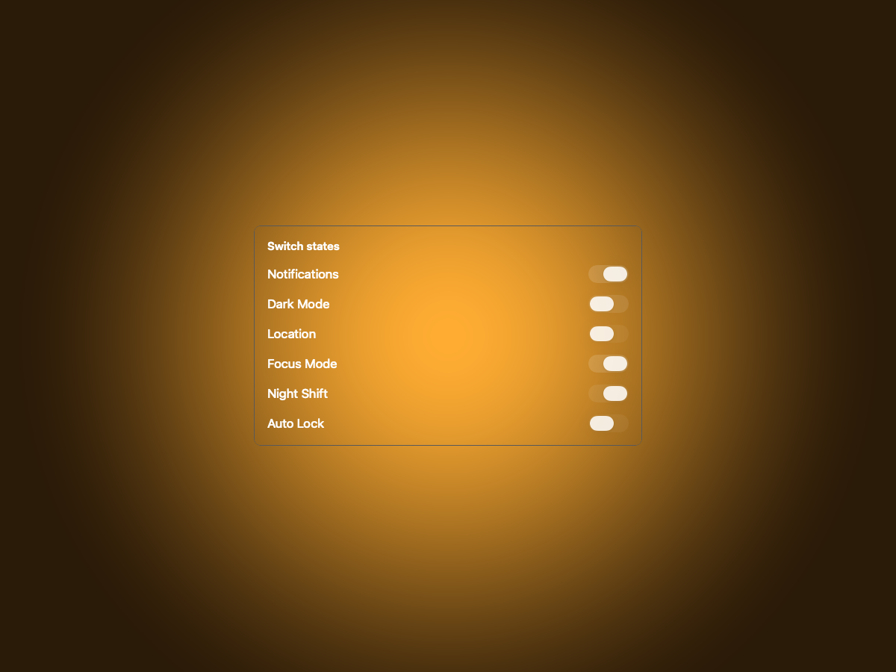
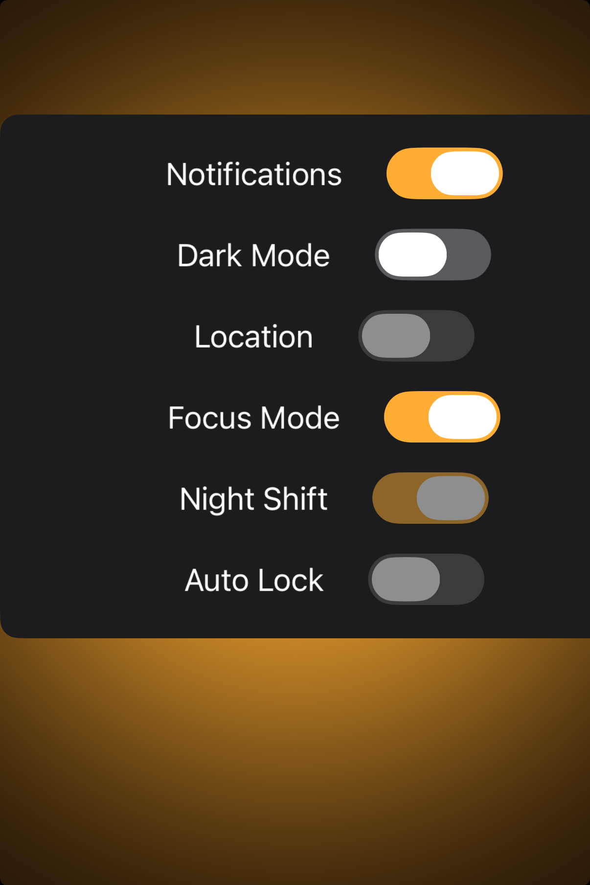

# Toggles — Visual validation

## HIG reference

## Rendered — macOS (light)

## Rendered — macOS (dark)

## Rendered — iOS (light)

## Rendered — iOS (dark)

## Verdict: PASS_WITH_NOTES

The toggle row now reads as a stable component study instead of a full-bleed
dump. The role states are clear on both platforms, the study card framing is
calm, and the warm Amber palette stays out of the way of the switch anatomy.
It remains PASS_WITH_NOTES because this is still a compact family plate rather
than a more contextual settings-flow example.

### Evidence manifest
- **Manifest:** `../evidence/toggles.json`
- **Required captures:** PASS — all four files present and > 10 KB.
- **Report links:** PASS — all four appearance-specific screenshot filenames
  linked above.

### Light appearance observations
- macOS: the centered study card gives the switch family enough breathing room
  to compare states quickly.
- iOS: the toggle labels and on/off states are fully visible within the card,
  with no edge pressure from the phone frame.

### Dark appearance observations
- macOS: the dark study preserves contrast and keeps the toggle states easy to
  scan.
- iOS: the darker card maintains clean switch silhouettes and readable label
  hierarchy.

### Deviations / notes
- The control work itself is solid; the remaining gap is contextual richness,
  not anatomy.
- This is a trustworthy PASS_WITH_NOTES row and no longer needs to be treated
  as stale evidence.

### Source citations
- Apple HIG — "Toggles" (see `apple-hig/pages/toggles.md` in the skill corpus).

### Remediation (if NEEDS_WORK)
N/A — notes only.
