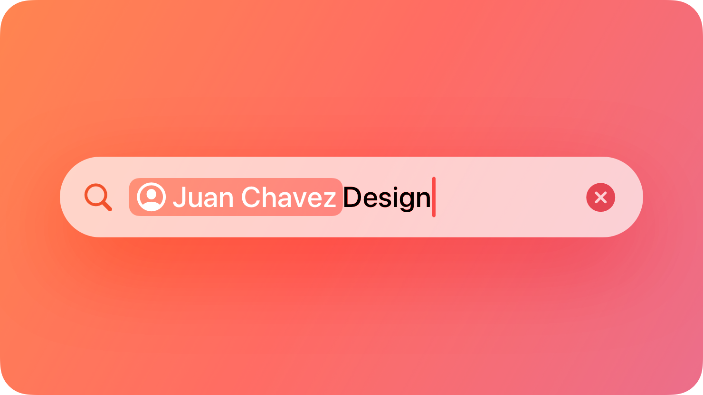
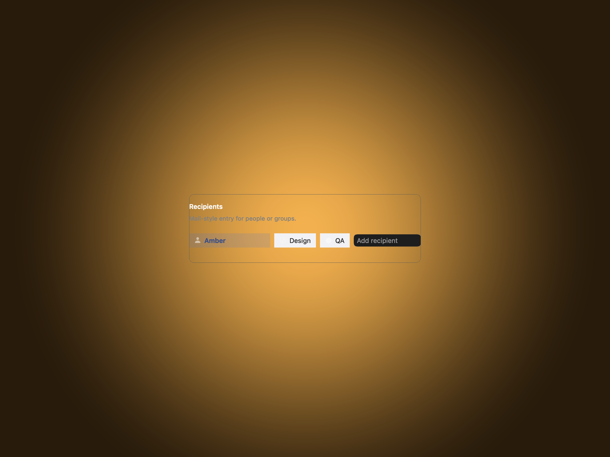
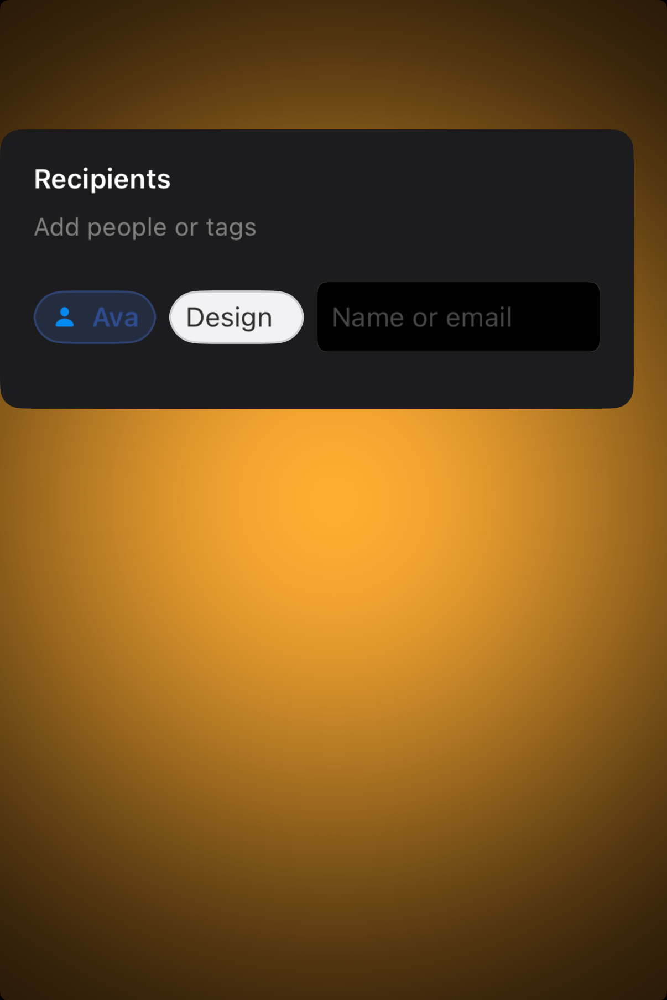

# Token fields -- Visual validation

## HIG reference

## Rendered -- macOS (light)

## Rendered -- macOS (dark)

## Rendered -- iOS (light)

## Rendered -- iOS (dark)

## Verdict: PASS_WITH_NOTES

The study now reads as a real token-entry control instead of a broken row of
chips. The token labels are legible on both platforms, the insertion field is
clear, and the composition finally has enough gutter for the amber backdrop to
support the component instead of swallowing it.

### What improved

- The chip tray now renders as one calm entry surface instead of collapsing
  into clipped pills and an over-compressed text field.
- macOS presents the strongest Mail-like read: compact tokens, a clear input,
  and enough space around the card for the backdrop to show through.
- iOS is now framed honestly, with shorter study content that fits the viewport
  without pushing the whole component off the screen.

### Why this is still notes-only

1. The component is still a shared fallback rather than a native `NSTokenField`
   bridge on macOS.
2. The iOS study uses a simplified token set to keep the compact layout clean,
   so it proves the default taste more than it proves dense real-world data.

### Result

Promote this row to `PASS_WITH_NOTES`. The default taste is now functional and
calm enough to count as a clean baseline, with the native-bridge caveat kept
explicit.
