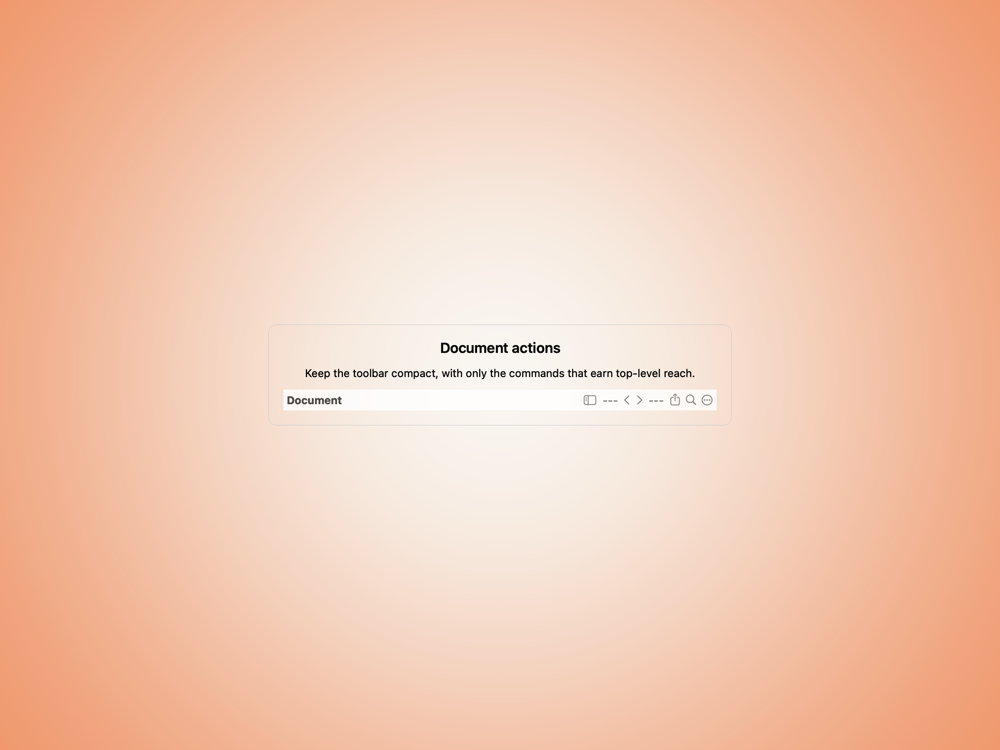
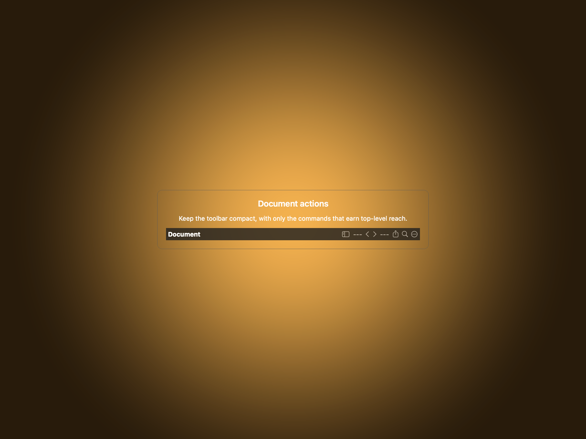
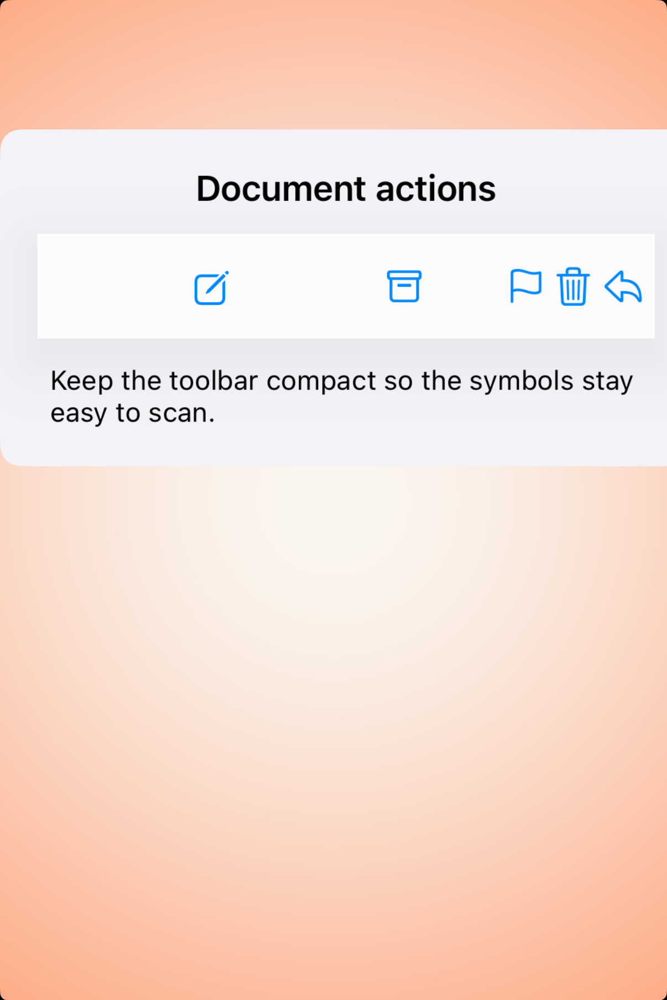

# Toolbars — Visual validation

## HIG reference

## Rendered — macOS (light)

## Rendered — macOS (dark)

## Rendered — iOS (light)

## Rendered — iOS (dark)

## Verdict: PASS_WITH_NOTES

The toolbar study is now centered and easier to judge on macOS, with the
command row presented as a single focal element. The row stays PASS_WITH_NOTES
because the iOS capture is still pinned high and left inside the host instead
of floating in a balanced plate.

### Evidence manifest
- **Manifest:** `../evidence/toolbars.json`
- **Required captures:** PASS — all four files present and > 10 KB.
- **Report links:** PASS — all four appearance-specific screenshot filenames
  linked above.

### Light appearance observations
- macOS: the updated card framing finally lets the toolbar read as the thing
  under review instead of a tiny ornament inside another toolbar.
- iOS: symbol spacing is readable, but the host still crowds the study against
  the top-left edge.

### Dark appearance observations
- macOS: the dark study keeps the same centered, legible composition.
- iOS: the dark toolbar remains serviceable, but the framing still feels like
  a host capture rather than a composed preview.

### Deviations / notes
- macOS framing is now healthy.
- The remaining note is the iOS host composition, which still needs the same
  centered-gutter treatment used by the best recent studies.

### Source citations
- Apple HIG — "Toolbars" (see `apple-hig/pages/toolbars.md` in the skill corpus).

### Remediation (if NEEDS_WORK)
N/A — notes only.
