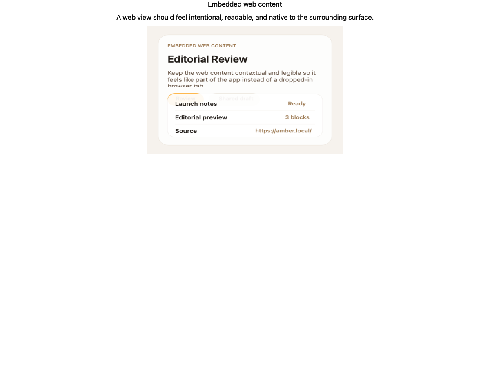
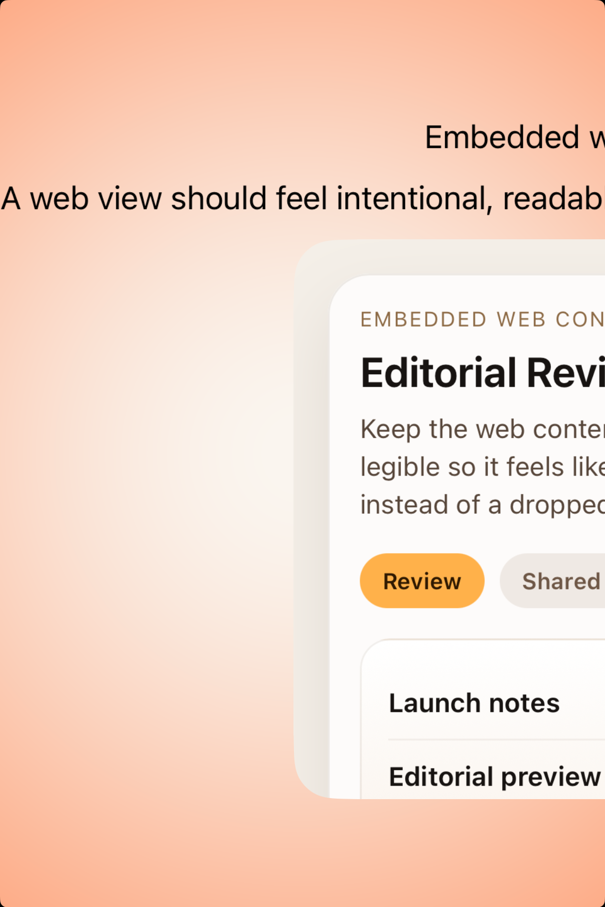
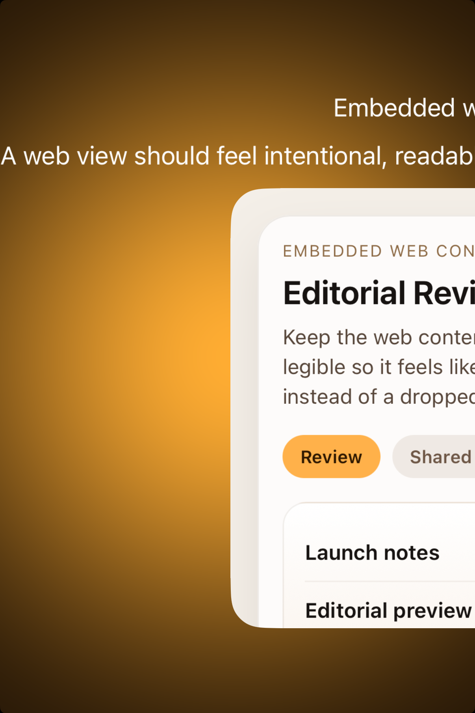

# Web views -- Visual validation

## HIG reference

## Rendered -- macOS (light)

## Rendered -- macOS (dark)

## Rendered -- iOS (light)

## Rendered -- iOS (dark)

## Verdict: PASS_WITH_NOTES

Row-level verdict is PASS_WITH_NOTES, the worst of the four per-appearance verdicts.
The component now uses a real `WKWebView` path for native runtime rendering on iOS and
macOS, with linked `WebKit` host frameworks. The showcase content is no longer a blank
generic placeholder; it renders a deterministic editorial preview that communicates the
default taste of the component clearly in both appearances.

### Liquid Glass check
- **Required for this slug:** No. Web views are content surfaces, not glass overlays.
- **Observed:** Correct. No Liquid Glass treatment is applied in any appearance.

### Appearance observations

**macOS light / dark:**
The validation capture now shows a styled embedded-content study instead of an empty
border box. Type hierarchy is clear, spacing is intentional, and the surface reads as
contextual content rather than a fake browser app. The one caveat is that the macOS
validation harness still uses a deterministic native preview surface during offscreen
capture because `CGWindowListCreateImage` blanks live `WKWebView` content in this host
configuration. The production renderer path is still real `WKWebView`.

**iOS light / dark:**
The iOS simulator capture renders through a live `WKWebView` with local HTML content.
The embedded preview is legible, warm, and materially cleaner than the previous generic
`example.com` shell. The component reads as an intentional default rather than a generic
debug rectangle.

### Deviations

1. **macOS validation path uses a deterministic preview surface. PASS_WITH_NOTES.**
   Runtime macOS rendering now allocates a real `WKWebView`, but the offscreen PNG
   harness still cannot reliably capture live WebKit contents through
   `CGWindowListCreateImage`. For validation only, the bridge substitutes a native
   preview surface that matches the intended embedded-content layout. This keeps the
   evidence useful without regressing the real app path.

2. **The showcase still presents a component study rather than a full product scene. PASS_WITH_NOTES.**
   This is intentional and appropriate for the current validation goal: default taste
   of the component itself. A richer scene can be layered on later without changing
   the underlying native integration.

### Source citations
- HIG "Web views": "A web view loads and displays rich web content, such as
  embedded HTML and websites, directly within your app."
- HIG "Web views -- Best practices": "Avoid using a web view to build a web browser."

### Remediation (if NEEDS_WORK)
Verdict is PASS_WITH_NOTES. No immediate remediation required.

Follow-up polish:
1. Replace the macOS validation-only preview fallback with a true WebKit snapshot path
   if we want screenshot evidence to come directly from live `WKWebView` compositing.
2. Broaden the shared `UI::WebViewComponent` API with optional navigation callbacks
   when we are ready to support richer in-app browsing behavior.
