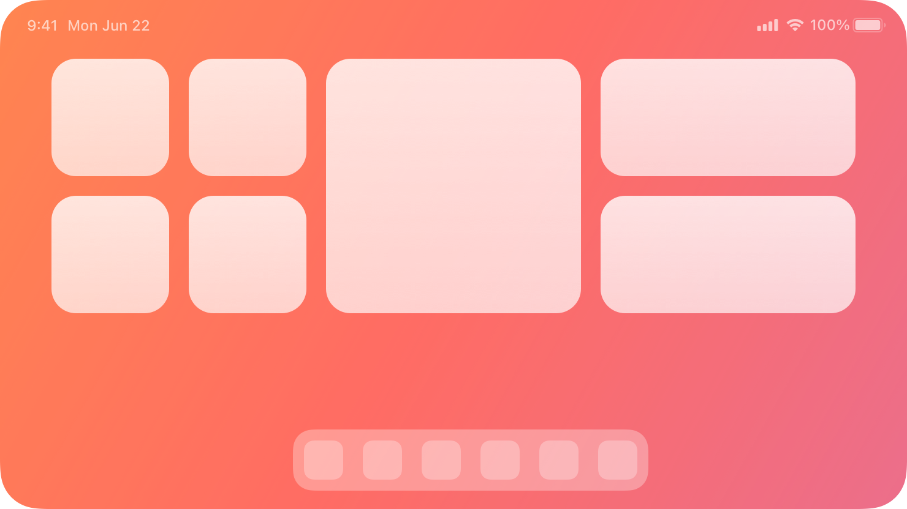

# Widgets -- Validation note

## HIG reference

## Verdict: SKIPPED

`UI::Widgets` is now an export-oriented WidgetKit metadata surface, not an
in-app view. The shard can describe widget declarations, families, and
placement intent, but widget rendering and placement remain system-owned.

### What is implemented

- widget catalog metadata
- per-widget summary and identity
- placement and family declarations
- timeline intent and refresh policy metadata
- deterministic WidgetKit scaffold export

### Why validation stays skipped

Widgets are rendered by the system on the Home Screen, Lock Screen, or desktop.
The correct proof for this row is export metadata and extension wiring, not a
pretend in-app screenshot.
