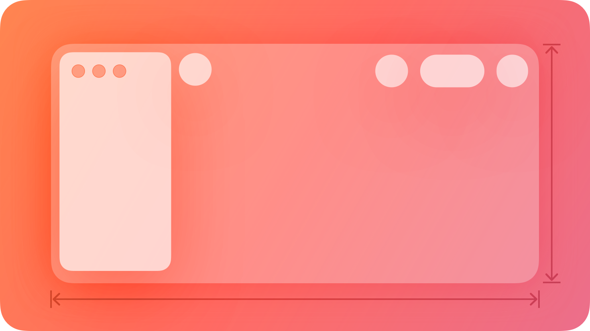

# Windows -- Validation note

## HIG reference

## Verdict: SKIPPED

`UI::Windows` is a configuration service for top-level shell intent, not a
drawable in-app component. The bridge can now apply that intent to the current
host window or controller scene, but the HIG windows family is still OS-owned
window chrome, so screenshot validation is not the right proof shape for this
row.

### What is implemented

- top-level window title
- optional subtitle
- preferred, minimum, and maximum sizing
- titlebar style intent for macOS
- toolbar / full-screen / resizable flags for host integration

### Why validation stays skipped

The shard now applies practical window intent to the active host window, but it
still does not own the actual OS chrome and should not fake that ownership
with a pretend card. This row stays `window-chrome-not-view`.
